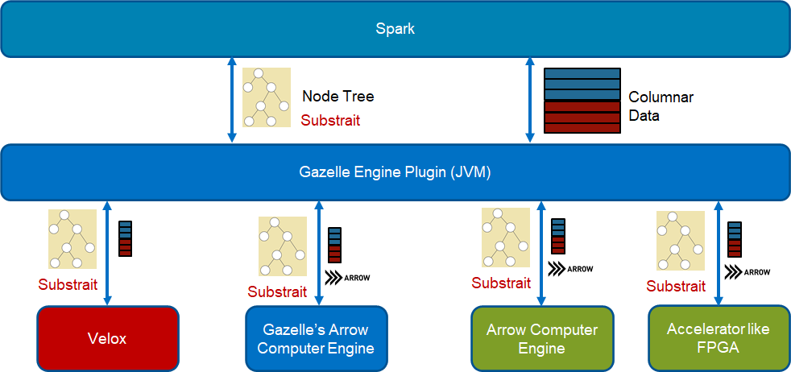

##### \* LEGAL NOTICE: Your use of this software and any required dependent software (the "Software Package") is subject to the terms and conditions of the software license agreements for the Software Package, which may also include notices, disclaimers, or license terms for third party or open source software included in or with the Software Package, and your use indicates your acceptance of all such terms. Please refer to the "TPP.txt" or other similarly-named text file included with the Software Package for additional details.

##### \* Optimized Analytics Package for Spark* Platform is under Apache 2.0 (https://www.apache.org/licenses/LICENSE-2.0).

# Introduction

This is a derived project from Gazelle-plugin. The JVM code and native code in Gazelle-plugin is tightly coupled. Which make it very hard to utilize other native SQL libraries. The main goal of this project is to decouple Spark JVM and JNI layer from native SQL execution engine. So we can easily enable different native SQL libraries but share all the common JVM code like fallback logic. 
##### The basic rule of the native offloading is that we would reuse spark's whole control flow and as many JVM code as possible but offload the compute intensive data processing part to native code.

The overview chart is like below. Spark physical plan is transformed to substrait plan. Substrait is to create a well defined cross-language specification for data compute operations. More details can be found from https://substrait.io/. Then substrait plan is passed to native through JNI call. In native the operator chain should be built and start to run. We use Spark3.0's columnar API as the data interface, so the native library should return Columnar Batch to Spark. We may need to wrap the columnar batch for each native backend. Gazelle engine's c++ code use Apache Arrow data format as its basic data format, so the returned data to Spark JVM is ArrowColumnarBatch.

There are several native libraries we may offload. Currently we are working on the Gazelle's C++ library and Velox as native backend. Velox is a C++ database acceleration library which provides reusable, extensible, and high-performance data processing components. More details can be found from https://github.com/facebookincubator/velox/. We can also easily use Arrow Computer Engine or any accelerator libraries as backend.

##### Before we enable Gazelle's C++ code as backend, we will continue Gazelle's development.

One big issue we noted during our Gazelle-plugin development is that we can't easily and exactly reproduce a Spark stage. Once we meet some bugs during Spark run, Gazelle-plugin doesn't dump enough info to reproduce it natively. Mainly because we use very complex extended Gandiva tree to pass the query plan. With well defined substrait and some helper functions, we can easily reproduce the whole stage, which makes debug, profile and optimize the native code much more easier. It also make the accelerators enabling much more easier even without touching Spark code.

# Plan Build

To convert Spark's physical plan into Substrait plan, we defined a substrait transformer operator which is a wrapper of the tree of operators to be executed natively. The operator's doTransform function return the final substrait tree. doExecutorColumnar function execute the native node and return columnarBatch. Each operator has its own transformerExec which transforms this operator's plan node into a substrait plan node by transform function. The validate function is designed to check if native library support the operator. The whole process is very like Spark's whole stage code generation flow.

The generated substrait plan can be single operator or a tree of operators depending on if the native library has the support. Once an operator isn't supported in native, we will fallback it to Vanilla Spark. In this way the data should be converted to unsafe row format by Columanr2Row operator. Later if the following operators can be support in native, we can add Row2Columnar operator to convert unsafe row format into native columnar format. The native implementation of the two operators can be much faster than Spark's stock ones. We have implemented them in Gazelle-plugin and will port to here later.

# Execution Flow

A simple example of execution flow is as below chart. The transformer operator transforms Spark's physical plan into Substrait. In native the operators are called according to the plan. The last native operator should return an batch which is passed to JVM. We reuse Spark's current shuffle logic but convert data into columnar format. The data split logic should be implemented natively and called by columnar shuffle operator. From Gazelle-plugin's experience the operation is expensive. 

# Issues to Solve

The code is still not completely cleaned now. The work is still WIP.

Not all the operators and functions are added. Our initial plan is to pass TPCH Q6, Q1 and Q14. Then whole TPCH, then TPCDS.

Operator stat info is pretty useful to understand Spark's execution status. With this design we can only collect info for transform operator which is a combination of operators. We need to find ways to send native operators' stat info to Spark driver.

Memory management is an essential feature in Spark. It's even more important to Spark Native runtime. Unlike JVM, not all OOM error can be captured which leads to ugly segment fault error in strange places like JNI call. We need to register each (large) memory allocation in executor's memory management service. Spark can control the memory used in each task. We implemented this in Gazelle-plugin. We will port the function to Gazelle-jni but need to define a set of APIs the native library can call back.

Spark's RDD cache is columnar batch based. In Gazelle-plugin, we use the arrow record batch directly without any memcpy. We can build the same functionality in Gazelle-JNI.

pyspark support needs to be ported as well. If input data format is Arrow, we can send the data to pyspark directly. No memcpy

UDF support. We need to create the interface which use columnar batch as inptu. So customer can port their current UDF to columnar batch based. If it's Arrow record batch based, user can utilize Arrow's JAVA or C++ API to implement their UDF, debug without Spark, then register to Spark.

Ideally if all native library can return arrow record batch, we can share much features in Spark's JVM. Spark already have Apache arrow dependency, we can make arrow format as Spark's basic columnar format. The problem is that native library may not be 100% compitable with Arrow format, then there will be a transform between their native format and Arrow, usually it's not cheap.

# How to use OAP: Gazelle-Jni

### Build the Environment

There are two ways to build the env for compiling OAP: Gazelle-Jni
1. Building by Conda Environment
2. Building by Yourself

- ### Building by Conda (Recommended)

If you already have a working Hadoop Spark Cluster, we provide a Conda package which will automatically install dependencies needed by OAP, you can refer to [OAP-Installation-Guide](./docs/OAP-Installation-Guide.md) for more information.

- ### Building by yourself

If you prefer to build from the source code on your hand, please follow the steps in [Installation Guide](./docs/GazelleJniInstallation.md) to set up your environment.

### Compile and use Gazelle Jni

Once your env being successfully deployed, please refer to [Gazelle Jni Usage](./docs/GazelleJniUsage.md) to compile and use Gazelle Jni in Spark.

### Notes for Building Gazelle-Jni with Velox

After Gazelle-Jni being successfully deployed in your environment, if you would like to build Gazelle-Jni with **Velox** computing, please checkout to branch [velox_dev](https://github.com/oap-project/gazelle-jni/tree/velox_dev) and follow the steps in [Build with Velox](./docs/Velox.md) to install the needed libraries, compile Velox and try out the TPC-H Q6 test.

# Contact

rui.mo@intel.com; binwei.yang@intel.com
