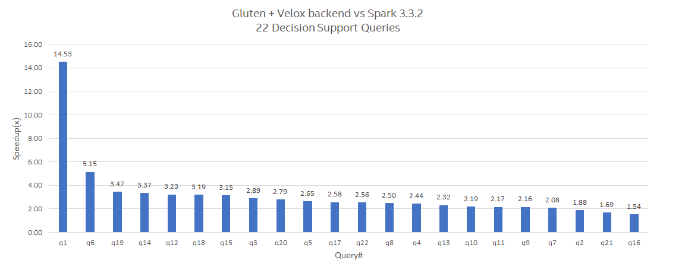
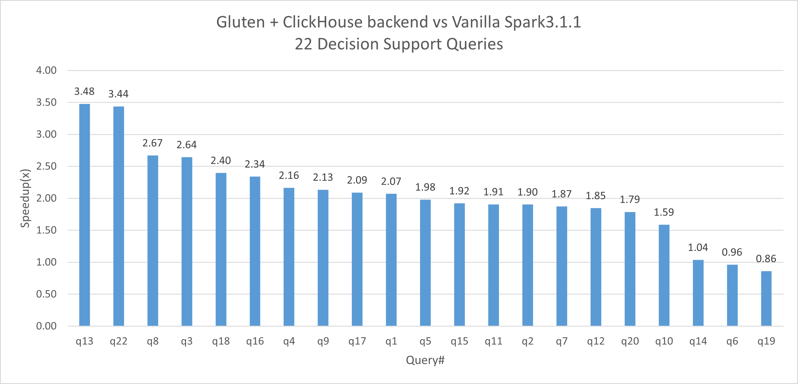

# Gluten: Plugin to Double SparkSQL's Performance
*<b>This plugin is still under active development now, and doesn't have a stable release. Welcome to evaluate it. If you encounter any issues or have any suggestions, please submit to our issue list. We'd love to hear your feedback.</b>*

# 1 Introduction

## 1.1 Problem Statement

Apache Spark is a stable, mature project that has been under development for many years. The project has been proven to be one of the best frameworks to scale out for processing petabyte-scale datasets. However, the Spark community has had to address performance challenges that require various optimizations over time. As a key optimization in Spark 2.0, Whole Stage Code Generation is introduced to replace Volcano Model, which achieves 2x speedup. Henceforth, most optimizations are at query plan level. Single operator's performance almost stops growing.

<p align="center">

</p>

On the other side, SQL engines have been researched for many years. There are a few products or libraries like Clickhouse, Arrow and Velox, etc. By using features like native implementation, columnar data format and vectorized data processing, these libraries can outperform Spark's JVM based SQL engine. However, these libraries are running on single node.

## 1.2 Gluten's Solution

“Gluten” is Latin for glue. Main goal of project Gluten is to “glue" the SparkSQL and native libraries. So we can take use of and benefit from the high scalability of Spark SQL framework, as well as the high performance of native libraries.

The basic rule of Gluten's design is that we would reuse spark's whole control flow and as many JVM code as possible but offload the compute-intensive data processing part to native code. Here is what Gluten does:
* Transform Spark’s whole stage physical plan to Substrait plan and send to native
* Offload performance-critical data processing to native library
* Define clear JNI interfaces for native libraries
* Switch available native backends easily
* Reuse Spark’s distributed control flow
* Manage data sharing between JVM and native
* Extend support to native accelerators

## 1.3 Target User

Gluten targets to the Spark administrators and Spark users who want to improve their spark cluster's performance fundamentally. Gluten is a plugin to Spark. It's designed to offload the SQL engine to native without any dataframe API or SQL query changes. SparkSQL users can run their current Spark job on Gluten seamlessly, no code changes are needed. However, as a plugin, Gluten needs some configurations to enable it when you start Spark context. All configurations are listed [here](https://github.com/oap-project/gluten/blob/main/docs/Configuration.md).

## 1.4 References

You may click below links for more related information.
- [Gluten Intro Video at Data AI Summit 2022](https://www.youtube.com/watch?v=0Q6gHT_N-1U)
- [Gluten Intro Article at Medium.com](https://medium.com/intel-analytics-software/accelerate-spark-sql-queries-with-gluten-9000b65d1b4e)
- [Gluten Intro Article at Kyligence.io(in Chinese)](https://cn.kyligence.io/blog/gluten-spark/)
- [Velox Intro from Meta](https://engineering.fb.com/2023/03/09/open-source/velox-open-source-execution-engine/)


# 2 Architecture

The overview chart is like below. Spark physical plan is transformed to substrait plan. Substrait is to create a well defined cross-language specification for data compute operations. More details can be found from https://substrait.io/. Then substrait plan is passed to native through JNI call. In native the operator chain should be built and start to run. We use the columnar API of Spark (since Spark-3.0) as the data interface, so the native library should return Columnar Batch to Spark. We may need to wrap the columnar batch for each native backend. Gluten's c++ code use Apache Arrow data format as its basic data format, so the returned data to Spark JVM is ArrowColumnarBatch.
<p align="center">

</p>
There are several native libraries we may offload. Currently we are working on Clickhouse and Velox as native backend. Velox is a C++ database acceleration library which provides reusable, extensible, and high-performance data processing components. More details can be found from https://github.com/facebookincubator/velox/. Gluten can also be easily extended to any other accelerator libraries as backend.

There are several key components in Gluten:
* Query plan conversion which convert Spark's physical plan into substrait plan in each stage.
* Unified memory management in Spark is used to control the native memory allocation as well
* Columnar shuffle is used to shuffle columnar data directly. The shuffle service still reuses the one in Spark core. The exchange operator is reimplemented to support columnar data format
* For unsupported operators or functions Gluten fallback the operator to Vanilla Spark. There are C2R and R2C converter to convert the columnar data and Spark's internal row data. Both C2R and R2C are implemented natively as well
* Metrics are very important to get insight of Spark's execution, identify the issues or bottlenecks. Gluten collects the metrics from native library and shows in Spark UI.
* Shim layer is used to support multiple releases of Spark. Gluten only plans to support the latest 2-3 spark stable releases, with no plans to support older spark releases. Currently, only Spark-3.2 & Spark-3.3 are supported.

# 3 Usage

Gluten is still under active development. There are two ways to use Gluten.

# 3.1 Use Prebuilt jar

One Way is to use released binary jar. Here is a simple example. Currently, only centos7/8 and ubuntu20.04/22.04 are well supported.

```
spark-shell \
 --master yarn --deploy-mode client \
 --conf spark.plugins=io.glutenproject.GlutenPlugin \
 --conf spark.memory.offHeap.enabled=true \
 --conf spark.memory.offHeap.size=20g \
 --conf spark.shuffle.manager=org.apache.spark.shuffle.sort.ColumnarShuffleManager \
 --jars https://github.com/oap-project/gluten/releases/download/v1.0.0/gluten-velox-bundle-spark3.2_2.12-ubuntu_20.04-1.0.0.jar
```

# 3.2 Custom Build

Alternatively, you can build gluten from source, then do some configurations to enable Gluten plugin for Spark. Here is a simple example. Please refer to the corresponding backend part below for more details.

```
export gluten_jvm_jar = /PATH/TO/GLUTEN/backends-velox/target/<gluten-jar>
spark-shell 
  --master yarn --deploy-mode client \
  --conf spark.plugins=io.glutenproject.GlutenPlugin \
  --conf spark.memory.offHeap.enabled=true \
  --conf spark.memory.offHeap.size=20g \
  --conf spark.driver.extraClassPath=${gluten_jvm_jar} \
  --conf spark.executor.extraClassPath=${gluten_jvm_jar} \
  --conf spark.shuffle.manager=org.apache.spark.shuffle.sort.ColumnarShuffleManager
  ...
```

### 3.2.1 Build and install Gluten with Velox backend


If you would like to build and try Gluten with **Velox** backend, please follow the steps in [Build with Velox](./docs/get-started/Velox.md) to build and install the necessary libraries, compile Velox and try out the TPC-H workload.

### 3.2.2 Build and install Gluten with ClickHouse backend


If you would like to build and try  Gluten with **ClickHouse** backend, please follow the steps in [Build with ClickHouse Backend](./docs/get-started/ClickHouse.md). ClickHouse backend is developed by [Kyligence](https://kyligence.io/), please visit https://github.com/Kyligence/ClickHouse for more infomation.

### 3.2.3 Build script parameters

[Gluten Usage](./docs/get-started/GlutenUsage.md) listed the parameters and their default value of build command for your reference

# 4 Contribution

Contributing code to Gluten project is welcome!

## 4.1 Community

Currently, we communicate with developers/users in a wechat group (Chinese only) and a Spark channel in Velox Slack group. Contact us if you would like to join in. Refer to Contact info below.

## 4.2 Bug Reports

Feel free to submit any bug or enhancement requirement to github issue list. Be sure to follow the template to clearly describe your issue. For contributing code, please submit an issue firstly and mention that issue in your PR.

## 4.3 Documentation

Currently, all gluten documents are held at [docs](https://github.com/oap-project/gluten/tree/main/docs). Gluten is still under active development, and the documents may not reflect the latest designs. Please feel free to contact us for getting more design details or sharing your design ideas.

[CppCodingStyle.md](https://github.com/oap-project/gluten/tree/main/docs/developers/CppCodingStyle.md) is provided for the purpose of helping developers keep good & consistent coding style while contributing code. Please propose a PR without any hesitation if you have any good idea for better coding style.

# 5 Performance

We use Decision Support Benchmark1 (TPC-H like) to evaluate Gluten's performance.
Decision Support Benchmark1 is a query set modified from [TPC-H benchmark](http://tpc.org/tpch/default5.asp). Because some features are not fully supported, there are some changes during the testing. We use Parquet file format for Velox testing & MergeTree file format for Clickhouse testing compared to Parquet file format as baseline. Please check [Decision Support Benchmark1](./backends-velox/workload/tpch) has the script and queries as the examples to run the performance testing for Velox backend.

The testing environment is using single node with 2TB datasize and using Spark3.3.2 for both baseline and Gluten. The Decision Support Benchmark1 result shows an overall speedup of 2.71x and up to 14.53x speedup in a single query with Gluten and Velox backend. Spark3.2 performance is pretty close. Performance data is tested in Jun. 2023. Contact us if you'd like to know the latest performance number


The testing environment is using a 8-nodes AWS cluster with 1TB datasize and using Spark3.1.1 for both baseline and Gluten. The Decision Support Benchmark1 result shows an average speedup of 2.12x and up to 3.48x speedup with Gluten and Clickhouse backend.



# 6 License

Gluten is under Apache 2.0 license (https://www.apache.org/licenses/LICENSE-2.0).

# 7 Contact

Gluten was initiated by Intel and Kyligence in 2022. Several companies such as Intel, Kyligence, BIGO, Meituan, Alibaba Cloud, NetEase, Baidu and others, are actively participating in the development of Gluten. If you are interested in Gluten project, please contact below email address for further discussion.

rui.mo@intel.com; binwei.yang@intel.com; weiting.chen@intel.com;
chang.chen@kyligence.io; zhichao.zhang@kyligence.io; neng.liu@kyligence.io;
zuochunwei@meituan.com;yangchuan.zy@alibaba-inc.com;xiyu.zk@alibaba-inc.com;joey.ljy@alibaba-inc.com

#

 &nbsp; &nbsp; &nbsp; &nbsp; &nbsp; &nbsp;<br>
 &nbsp; &nbsp; &nbsp;  &nbsp; &nbsp; &nbsp; 

#

Intel, the Intel logo, Arc, Intel Atom, Intel Core, Iris, OpenVINO, the OpenVINO logo, Pentium, VTune, and Xeon are trademarks of Intel Corporation or its subsidiaries.
* Other names and brands may be claimed as the property of others.

(C) Intel Corporation


##### \* LEGAL NOTICE: Your use of this software and any required dependent software (the "Software Package") is subject to the terms and conditions of the software license agreements for the Software Package, which may also include notices, disclaimers, or license terms for third party or open source software included in or with the Software Package, and your use indicates your acceptance of all such terms. Please refer to the "TPP.txt" or other similarly-named text file included with the Software Package for additional details.

