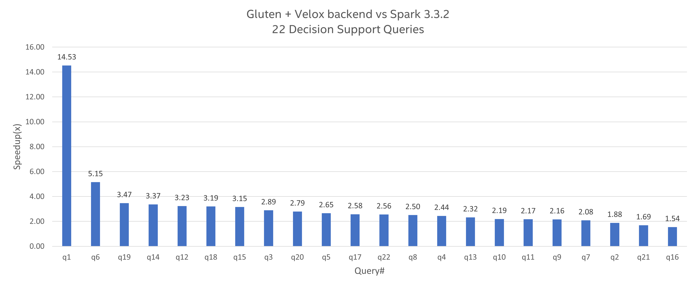

## Apache Gluten (Incubating): A Middle Layer for Offloading JVM-based SQL Engines' Execution to Native Engines

[](https://www.bestpractices.dev/projects/8452)

# 1. Introduction
## Background
Apache Spark is a mature and stable project that has been under continuous development for many years. It is one of the most widely used frameworks for scaling out the processing of petabyte-scale datasets.
Over time, the Spark community has had to address significant performance challenges, which required a variety of optimizations. A major milestone came with Spark 2.0, where Whole-Stage Code Generation
replaced the Volcano Model, delivering up to a 2× speedup. Since then, most subsequent improvements have focused on the query plan level, while the performance of individual operators has almost stopped improving.

<p align="center">

</p>

In recent years, several native SQL engines have been developed, such as ClickHouse and Velox. With features like native execution, columnar data formats, and vectorized
data processing, these engines can outperform Spark’s JVM-based SQL engine. However, they currently don't directly support Spark SQL execution.

## Design Overview
“Gluten” is Latin for "glue". The main goal of the Gluten project is to glue native engines to SparkSQL. Thus, we can benefit from the high performance of native engines and the high scalability enabled by the Spark ecosystem.

The basic design principle is to reuse Spark’s control flow, while offloading compute-intensive data processing to the native side. More specifically:

* Transform Spark’s physical plan to Substrait plan, then transform it to native engine's plan.
* Offload performance-critical data processing to native engine.
* Define clear JNI interfaces for native SQL engines.
* Allow easy switching between available native backends.
* Reuse Spark’s distributed control flow.
* Manage data sharing between JVM and native.
* Provide extensibility to support more native engines.

## Target Users
Gluten's target users include anyone who wants to fundamentally accelerate SparkSQL. As a plugin to Spark, Gluten requires no changes to the DataFrame API or SQL queries; users only need to configure it correctly.

# 2. Architecture
The overview chart is shown below. [Substrait](https://substrait.io/) provides a well-defined, cross-language specification for data compute operations. Spark’s physical plan is transformed into a Substrait plan,
which is then passed to the native side through a JNI call. On the native side, a chain of native operators is constructed and offloaded to the native engine. Gluten returns the results as a ColumnarBatch,
and Spark’s Columnar API (introduced in Spark 3.0) is used during execution. Gluten adopts the Apache Arrow data format as its underlying representation.
<p align="center">

</p>
Currently, Gluten supports only ClickHouse and Velox backends. Velox is a C++ database acceleration library which provides reusable, extensible and high-performance data processing components. More details can be
found from https://github.com/facebookincubator/velox/. Gluten is also designed to be extensible, allowing support for additional backends in the future.

Gluten's key components:
* **Query Plan Conversion**: Converts Spark's physical plan to Substrait plan.
* **Unified Memory Management**: Manages native memory allocation.
* **Columnar Shuffle**: Handles shuffling of Gluten's columnar data. The shuffle service of Spark core is reused, while a columnar exchange operator is implemented to support Gluten's columnar data format.
* **Fallback Mechanism**: Provides fallback to vanilla Spark for unsupported operators. Gluten's ColumnarToRow (C2R) and RowToColumnar (R2C) convert data between Gluten's columnar format and Spark's internal row format to support fallback transitions.
* **Metrics**: Collected from Gluten native engine to help monitor execution, identify bugs, and diagnose performance bottlenecks. The metrics are displayed in Spark UI.
* **Shim Layer**: Ensures compatibility with multiple Spark versions. Spark's latest 3-4 releases are supported. Currently, Spark-3.2, 3.3, 3.4 and 3.5 are officially supported.

# 3. User Guide
Below is a basic configuration to enable Gluten in Spark.

```
export GLUTEN_JAR=/PATH/TO/GLUTEN_JAR
spark-shell \
  --master yarn --deploy-mode client \
  --conf spark.plugins=org.apache.gluten.GlutenPlugin \
  --conf spark.memory.offHeap.enabled=true \
  --conf spark.memory.offHeap.size=20g \
  --conf spark.driver.extraClassPath=${GLUTEN_JAR} \
  --conf spark.executor.extraClassPath=${GLUTEN_JAR} \
  --conf spark.shuffle.manager=org.apache.spark.shuffle.sort.ColumnarShuffleManager
  ...
```

There are two ways to acquire Gluten jar for the above configuration.

### Use Released JAR
Please download the tar package [here](https://downloads.apache.org/incubator/gluten/), then extract Gluten JAR from it.
Additionally, Gluten provides nightly builds based on the main branch for early testing. The nightly build JARs are available at [Apache Gluten Nightlies](https://nightlies.apache.org/gluten/).
They have been verified on Centos 7/8/9, Ubuntu 20.04/22.04.

### Build From Source
For **Velox** backend, please refer to [Velox.md](./docs/get-started/Velox.md) and [build-guide.md](./docs/get-started/build-guide.md).

For **ClickHouse** backend, please refer to [ClickHouse.md](./docs/get-started/ClickHouse.md). ClickHouse backend is developed by [Kyligence](https://kyligence.io/). See https://github.com/Kyligence/ClickHouse for more information.

The Gluten JAR will be generated under `/PATH/TO/GLUTEN/package/target/` after the build.

### Configurations
Common configurations used by Gluten are listed in [Configuration.md](./docs/Configuration.md). Velox specific configurations are listed in [velox-configuration.md](./docs/velox-configuration.md).

The Gluten Velox backend honors some Spark configurations, ignores others, and many are transparent to it. See [velox-spark-configuration.md](./docs/velox-spark-configuration.md) for details, and [velox-parquet-write-configuration.md](./docs/velox-parquet-write-configuration.md) for Parquet write configurations.

# 4. Resources
- Gluten website: https://gluten.apache.org/
- [Gluten Intro Video at Data AI Summit 2022](https://www.youtube.com/watch?v=0Q6gHT_N-1U)
- [Gluten Intro Article at Medium.com](https://medium.com/intel-analytics-software/accelerate-spark-sql-queries-with-gluten-9000b65d1b4e)
- [Gluten Intro Article at Kyligence.io (in Chinese)](https://cn.kyligence.io/blog/gluten-spark/)
- [Velox Intro from Meta](https://engineering.fb.com/2023/03/09/open-source/velox-open-source-execution-engine/)

# 5. Contribution
Welcome to contribute to the Gluten project! See [CONTRIBUTING.md](CONTRIBUTING.md) for guidelines on how to make contributions.

# 6. Community
Gluten successfully became an Apache Incubator project in March 2024. Here are several ways to connect with the community.

### GitHub
Welcome to report issues or start discussions in GitHub. Please search the GitHub issue list before creating a new one to avoid duplication.

### Mailing List
For any technical discussions, please send an email to [dev@gluten.apache.org](mailto:dev@gluten.apache.org). You can browse [archives](https://lists.apache.org/list.html?dev@gluten.apache.org)
to view historical discussions. Click [here](mailto:dev-subscribe@gluten.apache.org) to subscribe to the mailing list.

### Slack Channel (English)
Click [here](https://github.com/apache/incubator-gluten/discussions/8429) to request an invitation to the ASF Slack workspace, where you can join the "incubator-gluten" channel.

The ASF Slack login entry: https://the-asf.slack.com/.

### WeChat Group (Chinese)
Please contact weitingchen at apache.org or zhangzc at apache.org to request an invitation to the WeChat group. It is for Chinese-language communication.

# 7. Performance
[TPC-H](./tools/workload/tpch) is used as a benchmark to evaluate Gluten's performance. Please note that the results below do not reflect the latest performance.

### Velox Backend
The Gluten Velox backend demonstrated an overall speedup of 2.71x, with up to a 14.53x speedup observed in a single query.



<sub>Tested in Jun. 2023. Test environment: single node with 2TB data, using Spark 3.3.2 as the baseline and with Gluten integrated into the same Spark version.</sub>

### ClickHouse Backend
ClickHouse backend demonstrated an average speedup of 2.12x, with up to 3.48x speedup observed in a single query.


<sub>Test environment: a 8-nodes AWS cluster with 1TB data, using Spark 3.1.1 as the baseline and with Gluten integrated into the same Spark version.</sub>

# 8. Qualification Tool
The [Qualification Tool](./tools/qualification-tool/README.md) is a utility to analyze Spark event log files and assess the compatibility and performance of SQL workloads with Gluten. This tool helps users understand how their workloads can benefit from Gluten.

# 9. License
Gluten is licensed under [Apache 2.0 license](https://www.apache.org/licenses/LICENSE-2.0).

# 10. Acknowledgements
Gluten was initiated by Intel and Kyligence in 2022. Several other companies are also actively contributing to its development, including BIGO, Meituan, Alibaba Cloud, NetEase, Baidu, Microsoft, IBM, Google, etc.

<a href="https://github.com/apache/incubator-gluten/graphs/contributors">
  
</a>

<sub>\* LEGAL NOTICE: Your use of this software and any required dependent software (the "Software Package") is subject to the terms and conditions of the software license agreements for the Software Package,
which may also include notices, disclaimers, or license terms for third party or open source software included in or with the Software Package, and your use indicates your acceptance of all such terms.
Please refer to the "TPP.txt" or other similarly-named text file included with the Software Package for additional details.</sub>
