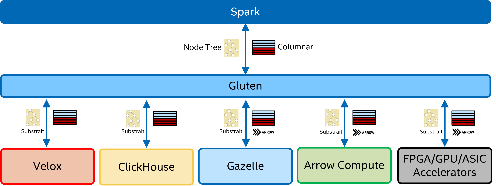

##### \* LEGAL NOTICE: Your use of this software and any required dependent software (the "Software Package") is subject to the terms and conditions of the software license agreements for the Software Package, which may also include notices, disclaimers, or license terms for third party or open source software included in or with the Software Package, and your use indicates your acceptance of all such terms. Please refer to the "TPP.txt" or other similarly-named text file included with the Software Package for additional details.

##### \* Optimized Analytics Package for Spark* Platform is under Apache 2.0 (https://www.apache.org/licenses/LICENSE-2.0).

# Introduction

This is a derived project from Gazelle-plugin. The JVM code and native code in Gazelle-plugin is tightly coupled. Which make it very hard to utilize other native SQL libraries. The main goal of this project is to decouple Spark JVM and JNI layer from native SQL execution engine. So we can easily enable different native SQL libraries but share all the common JVM code like fallback logic. 
##### The basic rule of the native offloading is that we would reuse spark's whole control flow and as many JVM code as possible but offload the compute intensive data processing part to native code.

The overview chart is like below. Spark physical plan is transformed to substrait plan. Substrait is to create a well defined cross-language specification for data compute operations. More details can be found from https://substrait.io/. Then substrait plan is passed to native through JNI call. In native the operator chain should be built and start to run. We use Spark3.0's columnar API as the data interface, so the native library should return Columnar Batch to Spark. We may need to wrap the columnar batch for each native backend. Gazelle engine's c++ code use Apache Arrow data format as its basic data format, so the returned data to Spark JVM is ArrowColumnarBatch.

There are several native libraries we may offload. Currently we are working on the Gazelle's C++ library and Velox as native backend. Velox is a C++ database acceleration library which provides reusable, extensible, and high-performance data processing components. More details can be found from https://github.com/facebookincubator/velox/. We can also easily use Arrow Computer Engine or any accelerator libraries as backend.

##### Before we enable Gazelle's C++ code as backend, we will continue Gazelle's development.

One big issue we noted during our Gazelle-plugin development is that we can't easily and exactly reproduce a Spark stage. Once we meet some bugs during Spark run, Gazelle-plugin doesn't dump enough info to reproduce it natively. Mainly because we use very complex extended Gandiva tree to pass the query plan. With well defined substrait and some helper functions, we can easily reproduce the whole stage, which makes debug, profile and optimize the native code much more easier. It also make the accelerators enabling much more easier even without touching Spark code.

# Plan Build

To convert Spark's physical plan into Substrait plan, we defined a substrait transformer operator which is a wrapper of the tree of operators to be executed natively. The operator's doTransform function return the final substrait tree. doExecutorColumnar function execute the native node and return columnarBatch. Each operator has its own transformerExec which transforms this operator's plan node into a substrait plan node by transform function. The validate function is designed to check if native library support the operator. The whole process is very like Spark's whole stage code generation flow.

The generated substrait plan can be single operator or a tree of operators depending on if the native library has the support. Once an operator isn't supported in native, we will fallback it to Vanilla Spark. In this way the data should be converted to unsafe row format by Columanr2Row operator. Later if the following operators can be support in native, we can add Row2Columnar operator to convert unsafe row format into native columnar format. The native implementation of the two operators can be much faster than Spark's stock ones. We have implemented them in Gazelle-plugin and will port to here later.

# Execution Flow

A simple example of execution flow is as below chart. The transformer operator transforms Spark's physical plan into Substrait. In native the operators are called according to the plan. The last native operator should return an batch which is passed to JVM. We reuse Spark's current shuffle logic but convert data into columnar format. The data split logic should be implemented natively and called by columnar shuffle operator. From Gazelle-plugin's experience the operation is expensive. 

# Issues to Solve and status

The code is still not completely cleaned now. The work is still WIP.

Not all the operators and functions are added. 22 queries of TPCH can pass. We are working on TPCDS queries. <b> We haven't pass Spark UTs, the work is just started and expected to finish in Q4 2022. So any other queries except H/DS may run into issues. Feel free to submit it to our issue list.</b>

Not all data type is supported now. Refere to Velox and Clickhouse to check the supported data types.

Operator stat info is pretty useful to understand Spark's execution status. Velox metrics are already added to Spark metric list for Velox backend. More info about Velox's stat can be found here: https://facebookincubator.github.io/velox/develop/debugging/print-plan-with-stats.html

Memory management is an essential feature in Spark. It's even more important to Spark Native runtime. Unlike JVM, not all OOM error can be captured which leads to ugly segment fault error in strange places like JNI call. We need to register each (large) memory allocation in executor's memory management service. Spark can control the memory used in each task. We have implemented the memory pool which apply for block of memory from Spark's memory management before real allocation. Memory allocation in Velox backend is already tracked.

Spark's RDD cache is columnar batch based. In Gazelle-plugin, we use the arrow record batch directly without any memcpy. We can build the same functionality in Gluten.

Pyspark support needs to be ported as well. If input data format is Arrow, we can send the data to pyspark directly. No memcpy

UDF support. We need to create the interface which use columnar batch as input. So customer can port their current UDF to columnar batch based. If it's Arrow record batch based, user can utilize Arrow's JAVA or C++ API to implement their UDF, debug without Spark, then register to Spark.

Ideally if all native library can return arrow record batch, we can share much features in Spark's JVM. Spark already have Apache arrow dependency, we can make arrow format as Spark's basic columnar format. The problem is that native library may not be 100% compitable with Arrow format, then there will be a transform between their native format and Arrow, usually it's not cheap.

# How to use Gluten

### Build the Environment

Gluten can only support single Spark version now. In Gluten main branch, Spark3.2.x is the only version to be supported currently. If you would like to try TPCH queries on Spark3.1.x, you may find [Gluten with Spark3.1.1](https://github.com/oap-project/gluten/tree/spark311) to give a try, but it is no longer to be supported or maintained.
We are working on a shim layer to support multiple Spark version in the future.

You can build the environment by yourself.

### Build Gluten with Velox backend

After Gluten being successfully deployed in your environment, if you would like to build Gluten with **Velox** computing, please follow the steps in [Build with Velox](./docs/Velox.md) to install the needed libraries, compile Velox and try out the TPC-H Q6 and Q1 test.

### Build Gluten with Arrow backend

If you would like to build Gluten with **Arrow** backend, please follow the steps in [Build with Arrow Backend](./docs/ArrowBackend.md).

### Build Gluten with ClickHouse backend

If you would like to build Gluten with **ClickHouse** backend, please follow the steps in [Build with ClickHouse Backend](./docs/ClickHouse.md). ClickHouse backend is devleoped by [Kyligence](https://kyligence.io/), please visit https://github.com/Kyligence/ClickHouse for more infomation.

### Build script parameters

[Gluten Usage](./docs/GlutenUsage.md) listed the parameters and their default value of build command for your reference

# Performance

We use Decision Support Benchmark1(TPC-H Like) to evaluate the performance for Gluten project.
* Decision Support Benchmark1 is a query set modified from [TPC-H benchmark](http://tpc.org/tpch/default5.asp). Because some features are not fully supported, there are some changes during the testing. Firstly we change column data type like Decimal to Double and Date to String. Secondly we use Parquet file format for Velox testing & MergeTree file format for Clickhouse testing compared to Parquet file format as baseline. Thirdly we modify the SQLs to use double and string data type for both Gluten and baseline, please check [Decision Support Benchmark1](./backends-velox/workload/tpch) has the script and queries as the examples to run the performance testing for Velox backend.

The testing environment is using single node with 2TB datasize and using Spark3.1.1 for both baseline and Gluten. The Decision Support Benchmark1 result shows an average speedup of 2.07x and up to 8.1X speedup in a single query with Gluten and Velox backend. Spark3.2 performance is pretty close.

The testing environment is using a 8-nodes AWS cluster with 1TB datasize and using Spark3.1.1 for both baseline and Gluten. The Decision Support Benchmark1 result shows an average speedup of 2.12x and up to 3.48x speedup with Gluten and Clickhouse backend.

# Reference

Please check below links for more related information.
- [Gluten Intro Video at Data AI Summit 2022](https://databricks.com/dataaisummit/session/gazelle-jni-middle-layer-offload-spark-sql-native-engines-execution)
- [Gluten Intro Article at Medium.com](https://medium.com/intel-analytics-software/accelerate-spark-sql-queries-with-gluten-9000b65d1b4e)
- [Gluten Intro Article at Kyligence.io(in Chinese)](https://cn.kyligence.io/blog/gluten-spark/)

# Contact

rui.mo@intel.com; binwei.yang@intel.com; weiting.chen@intel.com;
chang.chen@kyligence.io; zhichao.zhang@kyligence.io; neng.liu@kyligence.io
