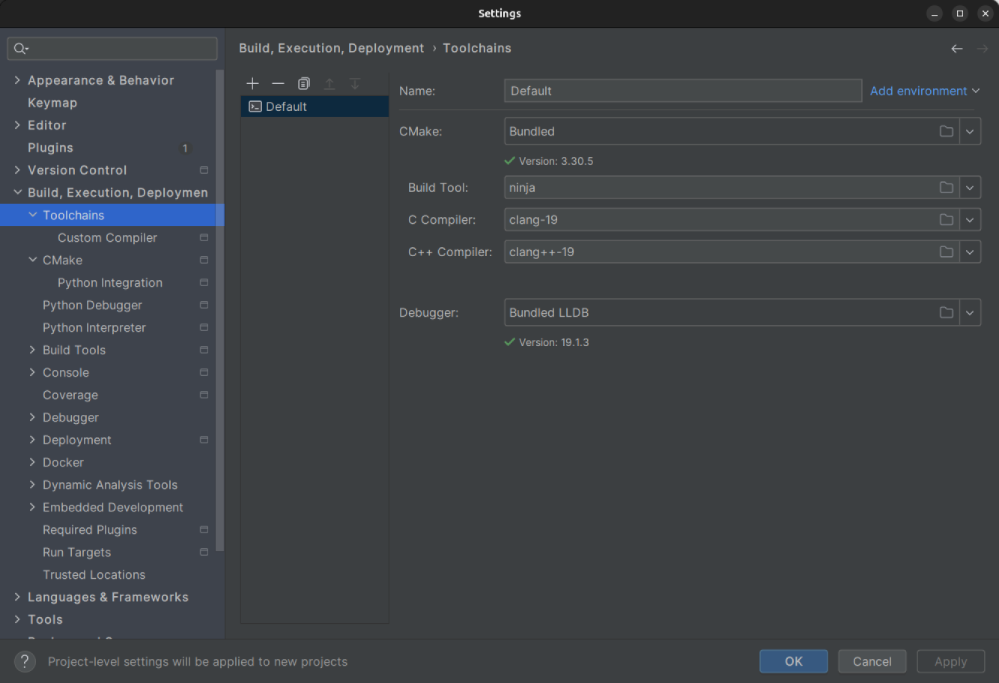
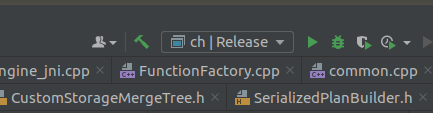

## ClickHouse Backend

ClickHouse is a column-oriented database management system (DBMS) for online analytical processing of queries (OLAP), which supports best in the industry query performance, while significantly reducing storage requirements through its innovative use of columnar storage and compression.
We port ClickHouse ( based on version **22.3** ) as a library, called 'libch.so', and Gluten loads this library through JNI as the native engine. In this way, we don't need to deploy a standalone ClickHouse Cluster, Spark uses Gluten as SparkPlugin to read and write ClickHouse MergeTree data.

### Architecture

The architecture of the ClickHouse backend is shown below:


1. On Spark driver, Spark uses Gluten SparkPlugin to transform the physical plan to the Substrait plan, and then pass the Substrait plan to ClickHouse backend through JNI call on executors.
2. Based on Spark DataSource V2 interface, implementing a ClickHouse Catalog to support operating the ClickHouse tables, and then using Delta to save some metadata about ClickHouse like the MergeTree parts information, and also provide ACID transactions.
3. When querying from a ClickHouse table, it will fetch MergeTree parts information from Delta metadata and assign these parts into Spark partitions according to some strategies.
4. When writing data into a ClickHouse table, it will use ClickHouse library to write MergeTree parts data and collect these MergeTree parts information after writing successfully, and then save these MergeTree parts information into Delta metadata. ( **The feature of writing MergeTree parts is coming soon.** )
5. On Spark executors, each executor will load the 'libch.so' through JNI when starting, and then call the operators according to the Substrait plan which is passed from Spark Driver, like reading data from the MergeTree parts, writing the MergeTree parts, filtering data, aggregating data and so on.
6. Currently, the ClickHouse backend only supports reading the MergeTree parts from local storage, it needs to use a high-performance shared file system to share a root bucket on every node of the cluster from the object storage, like JuiceFS.


### Development environment setup

In general, we use IDEA for Gluten development and CLion for ClickHouse backend development on **Ubuntu 20**.

#### Prerequisites

- GCC 9.0 or higher version
```
    sudo apt install gcc-9 g++-9 gcc-10 g++-10 gcc-11 g++-11

    sudo update-alternatives --install /usr/bin/gcc gcc /usr/bin/gcc-11 110 --slave /usr/bin/g++ g++ /usr/bin/g++-11 --slave /usr/bin/gcov gcov /usr/bin/gcov-11
    sudo update-alternatives --install /usr/bin/gcc gcc /usr/bin/gcc-10 100 --slave /usr/bin/g++ g++ /usr/bin/g++-10 --slave /usr/bin/gcov gcov /usr/bin/gcov-10
    sudo update-alternatives --install /usr/bin/gcc gcc /usr/bin/gcc-9 90 --slave /usr/bin/g++ g++ /usr/bin/g++-9 --slave /usr/bin/gcov gcov /usr/bin/gcov-9

    sudo update-alternatives --config gcc  # then choose the right version
    gcc --version  # check the version of the gcc

```

- Clang 12.0 or higher version ( Please refer to [How-to-Build-ClickHouse-on-Linux](https://clickhouse.com/docs/en/development/build/) )

    Install Clang 12.0 by apt manually.
```
    wget -O - https://apt.llvm.org/llvm-snapshot.gpg.key|sudo apt-key add -

    sudo vi /etc/apt/sources.list

    ### add these sources into sources.list
    # for 12
    deb http://apt.llvm.org/focal/ llvm-toolchain-focal main
    deb-src http://apt.llvm.org/focal/ llvm-toolchain-focal main

    sudo apt update
    sudo apt install -y clang-12 lldb-12 lld-12 clang-12-doc llvm-12-doc llvm-12-examples clang-tools-12 libclang-12-dev clang-format-12 libfuzzer-12-dev libc++-12-dev libc++abi-12-dev libllvm-12-ocaml-dev

    sudo update-alternatives --install /usr/bin/clang clang /usr/bin/clang-12 100 --slave /usr/bin/clang++ clang++ /usr/bin/clang++-12

    sudo update-alternatives --config clang  # choose the clang-12
    clang --version  # check the version of the clang
```
- cmake 3.20 or higher version ( Please refer to [How-to-Build-ClickHouse-on-Linux](https://clickhouse.com/docs/en/development/build/) )
- ninja-build 1.8.2
- Java 8
- Maven 3.6.3 or higher version
- Spark 3.2.2
- Intel Optimized Arrow 8.0.0 ( Please refer to [Intel-Optimized-Arrow-Installation](./ArrowInstallation.md) )


#### Setup Gluten development environment

- Clone Gluten code
```
    git clone https://github.com/oap-project/gluten.git
```
- Open Gluten code in IDEA

#### Setup ClickHouse backend development environment

- Clone ClickHouse backend code
```
    git clone -b clickhouse_backend https://github.com/Kyligence/ClickHouse.git
    git submodule update --init --recursive
```
- Open ClickHouse backend code in CLion
- Configure the ClickHouse backend project
    - Choose File -> Settings -> Build, Execution, Deployment -> Toolchains, and then choose Bundled CMake, clang-12 as C Compiler, clang++-12 as C++ Compiler:

        

    - Choose File -> Settings -> Build, Execution, Deployment -> CMake:

        

        And then add these options into CMake options:
```
            -G "Unix Makefiles" -D WERROR=OFF -D ENABLE_PROTOBUF=1 -D ENABLE_JEMALLOC=0
```
- Build 'ch' target with Debug mode or Release mode:

    

    - If it builds with Debug mode successfully, there is a library file called 'libchd.so' in path 'cmake-build-debug/utils/local-engine/'.
    - If it builds with Release mode successfully, there is a library file called 'libch.so' in path 'cmake-build-release/utils/local-engine/'.

### Compile ClickHouse backend
First need to enter the root directory of the Gluten project.
run`sudo ./tools/clickhouse/install_ubuntu.sh`,Install the software required for compilation.  
Create a build directory, such as /tmp/build_clickhouse, run `./tools/clickhouse/build_clickhouse.sh --src = /path /to/clickhouse --build_dir=/tmp/build_clickhouse`.  
Target file is `/tmp/build_clickhouse/utils/local-engine/libch.so`.   

### Compile Gluten with ClickHouse backend

The prerequisites are the same as the one above mentioned. Compile Gluten with ClickHouse backend through maven:
```
    git clone https://github.com/oap-project/gluten.git
    cd gluten/
    export MAVEN_OPTS="-Xmx8g -XX:ReservedCodeCacheSize=2g"
    mvn clean install -Pbackends-clickhouse -Phadoop-2.7.4 -Pspark-3.2 -Dhadoop.version=2.8.5 -DskipTests -Dcheckstyle.skip
    ls -al backends-clickhouse/target/gluten-XXXXX-jar-with-dependencies.jar
```


### Test on local

#### Deploy Spark 3.2.2
```
tar zxf spark-3.2.2-bin-hadoop2.7.tgz
cd spark-3.2.2-bin-hadoop2.7
rm -f jars/protobuf-java-2.5.0.jar
#download protobuf-java-3.13.0.jar, delta-core_2.12-1.2.1.jar and delta-storage-1.2.1.jar
wget https://repo1.maven.org/maven2/com/google/protobuf/protobuf-java/3.13.0/protobuf-java-3.13.0.jar -P ./jars -O protobuf-java-3.13.0.jar
wget https://repo1.maven.org/maven2/io/delta/delta-core_2.12/1.2.1/delta-core_2.12-1.2.1.jar -P ./jars -O delta-core_2.12-1.2.1.jar
wget https://repo1.maven.org/maven2/io/delta/delta-storage/1.2.1/delta-storage-1.2.1.jar -P ./jars -O delta-storage-1.2.1.jar
cp gluten-XXXXX-jar-with-dependencies.jar jars/
```

#### Data preparation

Currently, the feature of writing ClickHouse MergeTree parts by Spark is developing, so it needs to use command 'clickhouse-local' to generate MergeTree parts data manually. We provide a python script to call the command 'clickhouse-local' to convert parquet data to MergeTree parts:
```

#install ClickHouse community version
sudo apt-get install -y apt-transport-https ca-certificates dirmngr
sudo apt-key adv --keyserver hkp://keyserver.ubuntu.com:80 --recv 8919F6BD2B48D754
echo "deb https://packages.clickhouse.com/deb stable main" | sudo tee /etc/apt/sources.list.d/clickhouse.list
sudo apt-get update
sudo apt install -y --allow-downgrades clickhouse-server=22.5.1.2079 clickhouse-client=22.5.1.2079 clickhouse-common-static=22.5.1.2079

#generate MergeTree parts
mkdir -p /path_clickhouse_database/table_path/
python3 /path_to_clickhouse_backend_src/utils/local-engine/tool/parquet_to_mergetree.py --path=/tmp --source=/path_to_parquet_data/tpch-data-sf100/lineitem --dst=/path_clickhouse_database/table_path/lineitem
```

##### **This python script will convert one parquet data file to one MergeTree parts.**


#### Run Spark Thriftserver on local
```
cd spark-3.2.2-bin-hadoop2.7
./sbin/start-thriftserver.sh \
  --master local[3] \
  --driver-memory 10g \
  --conf spark.serializer=org.apache.spark.serializer.JavaSerializer \
  --conf spark.sql.sources.ignoreDataLocality=true \
  --conf spark.default.parallelism=1 \
  --conf spark.sql.shuffle.partitions=1 \
  --conf spark.sql.files.minPartitionNum=1 \
  --conf spark.sql.files.maxPartitionBytes=1073741824 \
  --conf spark.sql.adaptive.enabled=false \
  --conf spark.locality.wait=0 \
  --conf spark.locality.wait.node=0 \
  --conf spark.locality.wait.process=0 \
  --conf spark.sql.columnVector.offheap.enabled=true \
  --conf spark.memory.offHeap.enabled=true \
  --conf spark.memory.offHeap.size=6442450944 \
  --conf spark.plugins=io.glutenproject.GlutenPlugin \
  --conf spark.gluten.sql.columnar.columnartorow=true \
  --conf spark.gluten.sql.columnar.loadnative=true \
  --conf spark.gluten.sql.columnar.libpath=/path_to_clickhouse_library/libch.so \
  --conf spark.gluten.sql.columnar.iterator=true \
  --conf spark.gluten.sql.columnar.loadarrow=false \
  --conf spark.gluten.sql.columnar.backend.lib=ch \
  --conf spark.gluten.sql.columnar.hashagg.enablefinal=true \
  --conf spark.gluten.sql.enable.native.validation=false \
  --conf spark.io.compression.codec=snappy \
  --conf spark.gluten.sql.columnar.backend.ch.use.v2=false \
  --conf spark.gluten.sql.columnar.forceshuffledhashjoin=true \
  --conf spark.sql.catalog.spark_catalog=org.apache.spark.sql.execution.datasources.v2.clickhouse.ClickHouseSparkCatalog \
  --conf spark.databricks.delta.maxSnapshotLineageLength=20 \
  --conf spark.databricks.delta.snapshotPartitions=1 \
  --conf spark.databricks.delta.properties.defaults.checkpointInterval=5 \
  --conf spark.databricks.delta.stalenessLimit=3600000

#connect to Spark Thriftserver by beeline
bin/beeline -u jdbc:hive2://localhost:10000/ -n root
```

#### Test

- Create a TPC-H lineitem table using ClickHouse DataSource

```
    DROP TABLE IF EXISTS lineitem;
    CREATE TABLE IF NOT EXISTS lineitem (
     l_orderkey      bigint,
     l_partkey       bigint,
     l_suppkey       bigint,
     l_linenumber    bigint,
     l_quantity      double,
     l_extendedprice double,
     l_discount      double,
     l_tax           double,
     l_returnflag    string,
     l_linestatus    string,
     l_shipdate      date,
     l_commitdate    date,
     l_receiptdate   date,
     l_shipinstruct  string,
     l_shipmode      string,
     l_comment       string)
     USING clickhouse
     TBLPROPERTIES (engine='MergeTree'
                    )
     LOCATION '/path_clickhouse_database/table_path/lineitem';
```

- TPC-H Q6 test

```
    SELECT
        sum(l_extendedprice * l_discount) AS revenue
    FROM
        lineitem_ch
    WHERE
        l_shipdate >= date'1994-01-01'
        AND l_shipdate < date'1994-01-01' + interval 1 year
        AND l_discount BETWEEN 0.06 - 0.01 AND 0.06 + 0.01
        AND l_quantity < 24;
```

- Result

    The DAG is shown on Spark UI as below:
    
    


### Benchmark with TPC-H 100 Q6 on Gluten with ClickHouse backend

This benchmark is tested on AWS EC2 cluster, there are 7 EC2 instances:

| Node Role | EC2 Type | Instances Count | Resources | AMI |
| ---------- | ----------- | ------------- | ------------- | ------------- |
| Master | m5.4xlarge | 1  | 16 cores 64G memory per node | ubuntu-focal-20.04 |
| Worker | m5.4xlarge | 1  | 16 cores 64G memory per node | ubuntu-focal-20.04 |


#### Deploy on Cloud

- Tested on Spark Standalone cluster, its resources are shown below:

    |  | CPU cores | Memory | Instances Count |
    | ---------- | ----------- | ------------- | ------------- |
    | Spark Worker | 15 | 60G  | 6 |

- Prepare jars

    Refer to [Deploy Spark 3.2.2](#deploy-spark-322)

- Deploy gluten-jvm-XXXXX-jar-with-dependencies.jar

```
    #deploy 'gluten-jvm-XXXXX-jar-with-dependencies.jar' to every node, and then
    cp gluten-jvm-XXXXX-jar-with-dependencies.jar /path_to_spark/jars/
```

- Deploy ClickHouse library

    Deploy ClickHouse library 'libch.so' to every worker node.


##### Deploy JuiceFS

- JuiceFS uses Redis to save metadata, install redis firstly:

```
    wget https://download.redis.io/releases/redis-6.0.14.tar.gz
    sudo apt install build-essential
    tar -zxvf redis-6.0.14.tar.gz
    cd redis-6.0.14
    make
    make install PREFIX=/home/ubuntu/redis6
    cd ..
    rm -rf redis-6.0.14

    #start redis server
    /home/ubuntu/redis6/bin/redis-server /home/ubuntu/redis6/redis.conf

```
- Use JuiceFS to format a S3 bucket and mount a volumn on every node

    Please refer to [The-JuiceFS-Command-Reference](https://juicefs.com/docs/community/command_reference)

```
    wget https://github.com/juicedata/juicefs/releases/download/v0.17.5/juicefs-0.17.5-linux-amd64.tar.gz
    tar -zxvf juicefs-0.17.5-linux-amd64.tar.gz
    
    ./juicefs format --block-size 4096 --storage s3 --bucket https://s3.cn-northwest-1.amazonaws.com.cn/s3-gluten-tpch100/ --access-key "XXXXXXXX" --secret-key "XXXXXXXX" redis://:123456@master-ip:6379/1 gluten-tables

    #mount a volumn on every node
    ./juicefs mount -d --no-usage-report --no-syslog --attr-cache 7200 --entry-cache 7200 --dir-entry-cache 7200 --buffer-size 500 --prefetch 1 --open-cache 86400 --log /home/ubuntu/juicefs-logs/mount1.log --cache-dir /home/ubuntu/juicefs-cache/ --cache-size 102400 redis://:123456@master-ip:6379/1 /home/ubuntu/gluten/gluten_table
    #create a directory for lineitem table path
    mkdir -p /home/ubuntu/gluten/gluten_table/lineitem

```

#### Preparation

Please refer to [Data-preparation](#data-preparation) to generate MergeTree parts data to the lineitem table path: /home/ubuntu/gluten/gluten_table/lineitem.

#### Run Spark Thriftserver

```
cd spark-3.2.2-bin-hadoop2.7
./sbin/start-thriftserver.sh \
  --master spark://master-ip:7070 --deploy-mode client \
  --driver-memory 16g --driver-cores 4 \
  --total-executor-cores 90 --executor-memory 60g --executor-cores 15 \
  --conf spark.driver.memoryOverhead=8G \
  --conf spark.default.parallelism=90 \
  --conf spark.sql.shuffle.partitions=1 \
  --conf spark.sql.files.minPartitionNum=1 \
  --conf spark.sql.files.maxPartitionBytes=536870912 \
  --conf spark.sql.adaptive.enabled=false \
  --conf spark.sql.parquet.filterPushdown=true \
  --conf spark.sql.parquet.enableVectorizedReader=true \
  --conf spark.locality.wait=0 \
  --conf spark.locality.wait.node=0 \
  --conf spark.locality.wait.process=0 \
  --conf spark.sql.columnVector.offheap.enabled=true \
  --conf spark.memory.offHeap.enabled=true \
  --conf spark.memory.offHeap.size=42949672960 \
  --conf spark.serializer=org.apache.spark.serializer.JavaSerializer \
  --conf spark.sql.sources.ignoreDataLocality=true \
  --conf spark.plugins=io.glutenproject.GlutenPlugin \
  --conf spark.gluten.sql.columnar.columnartorow=true \
  --conf spark.gluten.sql.columnar.loadnative=true \
  --conf spark.gluten.sql.columnar.libpath=/path_to_clickhouse_library/libch.so \
  --conf spark.gluten.sql.columnar.iterator=true \
  --conf spark.gluten.sql.columnar.loadarrow=false \
  --conf spark.gluten.sql.columnar.backend.lib=ch \
  --conf spark.gluten.sql.columnar.hashagg.enablefinal=true \
  --conf spark.gluten.sql.enable.native.validation=false \
  --conf spark.io.compression.codec=snappy \
  --conf spark.gluten.sql.columnar.backend.ch.use.v2=false \
  --conf spark.gluten.sql.columnar.forceshuffledhashjoin=true \
  --conf spark.sql.catalog.spark_catalog=org.apache.spark.sql.execution.datasources.v2.clickhouse.ClickHouseSparkCatalog \
  --conf spark.databricks.delta.maxSnapshotLineageLength=20 \
  --conf spark.databricks.delta.snapshotPartitions=1 \
  --conf spark.databricks.delta.properties.defaults.checkpointInterval=5 \
  --conf spark.databricks.delta.stalenessLimit=3600000
```

#### Test TPC-H Q6 with JMeter

- Create a lineitem table using clickhouse datasource

```
    DROP TABLE IF EXISTS lineitem;
    CREATE TABLE IF NOT EXISTS lineitem (
     l_orderkey      bigint,
     l_partkey       bigint,
     l_suppkey       bigint,
     l_linenumber    bigint,
     l_quantity      double,
     l_extendedprice double,
     l_discount      double,
     l_tax           double,
     l_returnflag    string,
     l_linestatus    string,
     l_shipdate      date,
     l_commitdate    date,
     l_receiptdate   date,
     l_shipinstruct  string,
     l_shipmode      string,
     l_comment       string)
     USING clickhouse
     TBLPROPERTIES (engine='MergeTree'
                    )
     LOCATION 'file:///home/ubuntu/gluten/gluten_table/lineitem';
```

- Run TPC-H Q6 test with JMeter
    1. Run TPC-H Q6 test 100 times in the first round;
    2. Run TPC-H Q6 test 1000 times in the second round;

#### Performance

The performance of Gluten + ClickHouse backend increases by **about 1/3**.

|  | 70% | 80% | 90% | 99% | Avg |
| ---------- | ----------- | ------------- | ------------- | ------------- | ------------- |
| Spark + Parquet | 590ms | 592ms  | 597ms | 609ms | 588ms |
| Spark + Gluten + ClickHouse backend | 402ms | 405ms  | 409ms | 425ms | 399ms |

