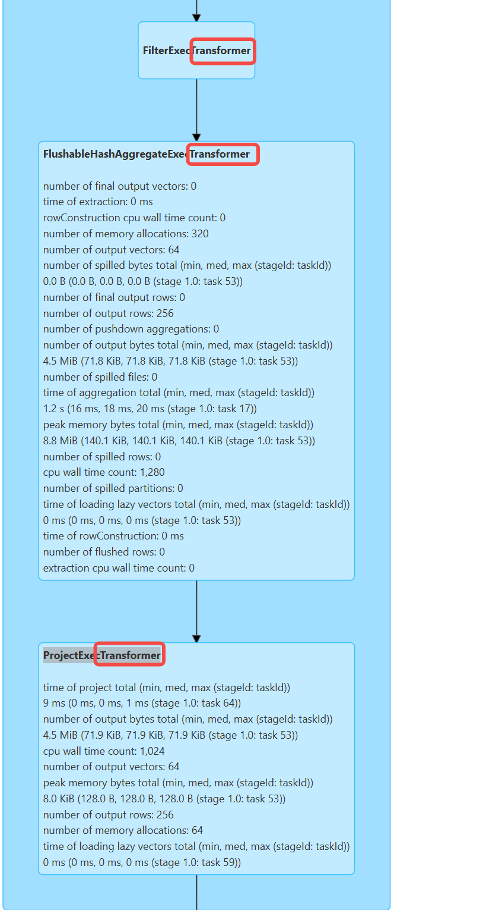

# Quick Start: Testing Gluten with the Bolt Backend

This guide provides a task-oriented walkthrough to quickly verify that the Gluten Bolt backend is working in `spark-shell` (local mode) and `spark-submit` (cluster mode), assuming you have a pre-built Gluten JAR.

---

## 1. Prerequisites (Quick Checklist)

Before you begin, ensure you have the following:

-   **Compatible Environment**: Your build and runtime environment must meet Bolt's requirements:
    -   OS: Linux
    -   Compiler: GCC 10, 11, or 12; or Clang 16
    -   Dependencies: Python 3 (with virtualenv or Conda) and Conan
    -   Kernel: Linux kernel > 5.4 is recommended to enable `io_uring` for better I/O performance.
-   **Gluten JAR with Bolt**: A Gluten JAR file that has been successfully built with the Bolt backend. It should contain `libbolt_backend.so`.

> **Note**:
> This guide does not restate the full build process. If you need to build from scratch, please refer to the Gluten repository's migration and build documents:
> - [Bolt Backend (Prerequisites & Build)](gluten/README.md#bolt-backend)
> - [Guide to Migrating from Velox to Bolt Backend in Gluten](gluten/docs/migrate-velox-to-bolt.md)

---

## 2. Locate and Verify the Gluten JAR

All tests depend on a Gluten JAR that includes the Bolt backend. This file is typically located in the `output/` directory of your Gluten project.

Use the following command to find the JAR and set its path as an environment variable for convenience:

```bash linenums="1"
# Set the path to your Gluten project's output directory
export GLUTEN_JAR=$(ls /path/to/your/gluten/output/gluten-spark*.jar | head -n 1)

# Verify that the path is set correctly
echo "Found Gluten JAR at: ${GLUTEN_JAR}"
```

**How to confirm the JAR contains Bolt?**

If you are unsure whether your JAR was built for Bolt, run this command. If it outputs a line containing `libbolt_backend.so`, the JAR is correct.

```bash
unzip -l "${GLUTEN_JAR}" | grep libbolt_backend.so
```

---

## 3. Local `spark-shell` Smoke Test

Using `spark-shell` is the fastest way to verify that the Bolt backend is active on your local machine.

### 3.1. Startup Command Template

Launch a `spark-shell` session with Gluten and Bolt enabled. Make sure the `GLUTEN_JAR` and `JAVA_HOME` are set correctly.

```bash
# Ensure GLUTEN_JAR is set
if [ -z "${GLUTEN_JAR}" ]; then echo "Error: GLUTEN_JAR is not set." >&2; exit 1; fi

spark-shell \
  --master local[4] \
  --driver-memory 4G \
  --conf spark.plugins=org.apache.gluten.GlutenPlugin \
  --conf spark.memory.offHeap.enabled=true \
  --conf spark.memory.offHeap.size=10g \
  --conf spark.shuffle.manager=org.apache.spark.shuffle.sort.ColumnarShuffleManager \
  --conf spark.driver.extraClassPath=${GLUTEN_JAR} \
  --conf spark.executor.extraClassPath=${GLUTEN_JAR} \
  # For Java 11, set following two options
  --conf spark.driver.extraJavaOptions=-Dio.netty.tryReflectionSetAccessible=true \
  --conf spark.executor.extraJavaOptions=-Dio.netty.tryReflectionSetAccessible=true \
  --jars ${GLUTEN_JAR}
```


### 3.2. Sample Query and Validation

Once inside the `spark-shell`, run the following Scala code. It creates a small Parquet file and then reads, filters, and aggregates it.

1.  **Prepare Test Data** (run in `spark-shell`):

    ```scala
    import spark.implicits._

    // Create a simple DataFrame
    val data = (1 to 1000).map(i => (i, s"name_$i", i % 10))
    val df = spark.createDataFrame(data).toDF("id", "name", "category")

    // Save it as a Parquet file
    val parquetPath = "/tmp/bolt_quick_test.parquet"
    df.write.mode("overwrite").parquet(parquetPath)

    println(s"Test Parquet file written to: ${parquetPath}")
    ```

2.  **Execute a Query and Check the Plan**:

    ```scala
    // Read the Parquet file
    val inputDF = spark.read.parquet(parquetPath)

    // Perform a filter and aggregation query
    val resultDF = inputDF
      .filter($"category" > 5)
      .groupBy("category")
      .count()

    // Print the execution plan
    resultDF.explain()

    // Show the results
    resultDF.show()
    ```

3.  **Verify Bolt is Active**:

    The key is to inspect Spark UI(ip:4040) `SQL/DataFrame` tab. If you see *Transformer, like `FilterExecTransformer`,`ProjectExecTransformer`, it confirms that Gluten has offloaded the computation to the Bolt backend.
    

---