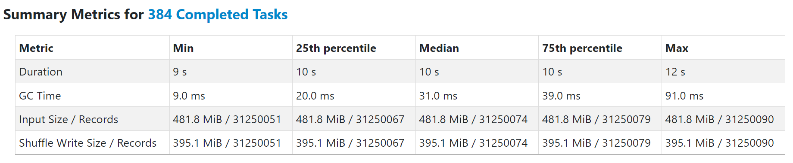

# Generate Micro Benchmarks for Velox Backend

**This document explains how to use the existing micro benchmark template in Gluten Cpp.**

A micro benchmark for Velox backend is provided in Gluten Cpp to simulate the execution of a first or middle stage in Spark.
It serves as a more convenient alternative to debug in Gluten Cpp comparing with directly debugging in a Spark job.
Developers can use it to create their own workloads, debug in native process, profile the hotspot and do optimizations.

To simulate a first stage, you need to dump the Substrait plan into a JSON file. The input URIs should be exising file locations, which can be either local or HDFS paths.

To simulate a middle stage, in addition to the JSON file, you also need to save the input data of this stage into Parquet files.
The benchmark will load the data into Arrow format, then add Arrow2Velox to feed 
the data into Velox pipeline to reproduce the reducer stage. Shuffle exchange is not included.

Please refer to the sections below to learn how to dump the Substrait plan and create the input data files.

## Try the example

To run a micro benchmark, user should provide one file that contains the Substrait plan in JSON format, and optional 
one or more input data files in parquet format.
The commands below help to generate example input files:

```shell
cd /path_to_gluten/
./dev/buildbundle-veloxbe.sh --build_tests=ON --build_benchmarks=ON

# Run test to generate input data files. If you are using spark 3.3, replace -Pspark-3.2 with -Pspark-3.3
mvn test -Pspark-3.2 -Pbackends-velox -Prss -pl backends-velox -am \
-DtagsToInclude="io.glutenproject.tags.GenerateExample" -Dtest=none -DfailIfNoTests=false -Darrow.version=11.0.0-gluten -Dexec.skip
```

The generated example files are placed in gluten/backends-velox:
```shell
$ tree gluten/backends-velox/generated-native-benchmark/
gluten/backends-velox/generated-native-benchmark/
├── example.json
├── example_lineitem
│   ├── part-00000-3ec19189-d20e-4240-85ae-88631d46b612-c000.snappy.parquet
│   └── _SUCCESS
└── example_orders
    ├── part-00000-1e66fb98-4dd6-47a6-8679-8625dbc437ee-c000.snappy.parquet
    └── _SUCCESS
```

Run micro benchmark with the generated files as input. You need to specify the **absolute** path to the input files:
```shell
cd /path_to_gluten/cpp/build/velox/benchmarks
./generic_benchmark \
/home/sparkuser/github/oap-project/gluten/backends-velox/generated-native-benchmark/example.json \
/home/sparkuser/github/oap-project/gluten/backends-velox/generated-native-benchmark/example_orders/part-00000-1e66fb98-4dd6-47a6-8679-8625dbc437ee-c000.snappy.parquet \
/home/sparkuser/github/oap-project/gluten/backends-velox/generated-native-benchmark/example_lineitem/part-00000-3ec19189-d20e-4240-85ae-88631d46b612-c000.snappy.parquet \
--threads 1 --iterations 1 --noprint-result --benchmark_filter=InputFromBatchStream
```
The output should be like:
```shell
2022-11-18T16:49:56+08:00
Running ./generic_benchmark
Run on (192 X 3800 MHz CPU s)
CPU Caches:
  L1 Data 48 KiB (x96)
  L1 Instruction 32 KiB (x96)
  L2 Unified 2048 KiB (x96)
  L3 Unified 99840 KiB (x2)
Load Average: 0.28, 1.17, 1.59
***WARNING*** CPU scaling is enabled, the benchmark real time measurements may be noisy and will incur extra overhead.
-- Project[expressions: (n3_0:BIGINT, ROW["n1_0"]), (n3_1:VARCHAR, ROW["n1_1"])] -> n3_0:BIGINT, n3_1:VARCHAR
   Output: 535 rows (65.81KB, 1 batches), Cpu time: 36.33us, Blocked wall time: 0ns, Peak memory: 1.00MB, Memory allocations: 3, Threads: 1
      queuedWallNanos    sum: 2.00us, count: 2, min: 0ns, max: 2.00us
  -- HashJoin[RIGHT SEMI (FILTER) n0_0=n1_0] -> n1_0:BIGINT, n1_1:VARCHAR
     Output: 535 rows (65.81KB, 1 batches), Cpu time: 191.56us, Blocked wall time: 0ns, Peak memory: 2.00MB, Memory allocations: 8
     HashBuild: Input: 582 rows (16.45KB, 1 batches), Output: 0 rows (0B, 0 batches), Cpu time: 1.84us, Blocked wall time: 0ns, Peak memory: 1.00MB, Memory allocations: 3, Threads: 1
        distinctKey0       sum: 583, count: 1, min: 583, max: 583
        queuedWallNanos    sum: 0ns, count: 1, min: 0ns, max: 0ns
        rangeKey0          sum: 59748, count: 1, min: 59748, max: 59748
     HashProbe: Input: 37897 rows (296.07KB, 1 batches), Output: 535 rows (65.81KB, 1 batches), Cpu time: 189.71us, Blocked wall time: 0ns, Peak memory: 1.00MB, Memory allocations: 5, Threads: 1
        queuedWallNanos    sum: 0ns, count: 1, min: 0ns, max: 0ns
    -- ArrowStream[] -> n0_0:BIGINT
       Input: 0 rows (0B, 0 batches), Output: 37897 rows (296.07KB, 1 batches), Cpu time: 1.29ms, Blocked wall time: 0ns, Peak memory: 0B, Memory allocations: 0, Threads: 1
    -- ArrowStream[] -> n1_0:BIGINT, n1_1:VARCHAR
       Input: 0 rows (0B, 0 batches), Output: 582 rows (16.45KB, 1 batches), Cpu time: 894.22us, Blocked wall time: 0ns, Peak memory: 0B, Memory allocations: 0, Threads: 1

-----------------------------------------------------------------------------------------------------------------------------
Benchmark                                                                   Time             CPU   Iterations UserCounters...
-----------------------------------------------------------------------------------------------------------------------------
InputFromBatchVector/iterations:1/process_time/real_time/threads:1   41304520 ns     23740340 ns            1 collect_batch_time=34.7812M elapsed_time=41.3113M

```

## Generate Substrait plan and input for any query

First, rebuild Gluten with build type `RelWithDebInfo`.

```shell
cd /path_to_gluten/
./dev/buildbundle-veloxbe.sh --build_tests=ON --build_benchmarks=ON --build_type=RelWithDebInfo

```
Run the query by spark-shell.  Get the Substrait plan from executor's stdout.

Example:
```shell
################################################## received substrait::Plan:
Task stageId: 2, partitionId: 855, taskId: 857; {"extensions":[{"extensionFunction":{"name":"sum:req_i32"}}],"relations":[{"root":{"input":{"fetch":{"common":{"direct":{}},"input":{"project":{"common":{"direct":{}},"input":{"aggregate":{"common":{"direct":{}},"input":{"read":{"common":{"direct":{}},"baseSchema":{"names":["i_product_name#15","i_brand#16","spark_grouping_id#14","sum#22"],"struct":{"types":[{"string":{"nullability":"NULLABILITY_NULLABLE"}},{"string":{"nullability":"NULLABILITY_NULLABLE"}},{"i64":{"nullability":"NULLABILITY_REQUIRED"}},{"i64":{"nullability":"NULLABILITY_NULLABLE"}}]}},"localFiles":{"items":[{"uriFile":"iterator:0"}]}}},"groupings":[{"groupingExpressions":[{"selection":{"directReference":{"structField":{}}}},{"selection":{"directReference":{"structField":{"field":1}}}},{"selection":{"directReference":{"structField":{"field":2}}}}]}],"measures":[{"measure":{"phase":"AGGREGATION_PHASE_INTERMEDIATE_TO_RESULT","outputType":{"i64":{"nullability":"NULLABILITY_NULLABLE"}},"arguments":[{"value":{"selection":{"directReference":{"structField":{"field":3}}}}}]}}]}},"expressions":[{"selection":{"directReference":{"structField":{"field":3}}}}]}},"count":"100"}},"names":["qoh#10"]}}]}
```

Save the Substrait plan to a JSON file, suppose the name is "plan.json".

If you are simulating a first stage, the inputs should be exising file locations, which can be either local or HDFS paths.

```json
"localFiles": {
    "items": [
        {
            "uriFile": "file:///path_to_gluten/cpp/velox/benchmarks/data/tpch_sf10m/lineitem/part-00000-6c374e0a-7d76-401b-8458-a8e31f8ab704-c000.snappy.parquet",
            "length": "1863237",
            "parquet": {}
        }
    ]
}
```

Run benchmark. The first arg is the absolute path to JSON file.
You should use `--skip-input` to skip specifying input data files used for first stages.
By default, the result will be printed to stdout. You can use `--noprint-result` to suppress this output.

```shell
cd /path_to_gluten/cpp/build/velox/benchmarks
./generic_benchmark \
/plan/to/plan.json \
--threads 1 --skip-input --noprint-result
```

If you are simulating a middle stage, get the Stage Id from spark UI.
You need to re-run the query with below configuraions to dump the input data files.

| Parameters | Description | Recommend Setting |
| ---------- | ----------- | --------------- |
| spark.gluten.sql.debug | Whether open debug mode | true |
| spark.gluten.sql.benchmark_task.stageId | Spark task stage id | 2 |
| spark.gluten.sql.benchmark_task.partitionId | Spark task partition id, default value -1 means all the partition of this stage | -1 |
| spark.gluten.sql.benchmark_task.taskId | If not specify partition id, use spark task attempt id, default value -1 means all the partition of this stage | -1 |
| spark.gluten.saveDir | Directory should exist and be empty, save the stage input to this directory, parquet name format is input_${taskId}_${iteratorIndex}_${partitionId}.parquet | /path_to_saveDir |

Suppose the dumped input files are /tmp/save/input_34_0_1.parquet and /tmp/save/input_34_0_2.parquet. Please use spark to combine the 2 files to 1 file.

```java
val df = spark.read.format("parquet").load("/tmp/save")
df.repartition(1).write.format("parquet").save("/tmp/new_save")
```

The input data files of a middle stage will be loaded as iterators to serve as the inputs for the pipeline.

```json
"localFiles": {
    "items": [{
            "uriFile": "iterator:0"
        }
    ]
}
```

Run benchmark. The first arg is the absolute path to JSON file, the following args are absolute paths to input data files.

```shell
cd /path_to_gluten/cpp/build/velox/benchmarks
./generic_benchmark \
/path_to_plan.json \
/tmp/new_save/generate.parquet \
--threads 1 --noprint-result
```

For some complex queries, stageId may cannot represent the Substrait plan input, please get the taskId from spark UI, and get your target parquet from saveDir.

In this example, only one partition input with partition id 2, taskId is 36, iterator length is 2.

```shell
cd /path_to_gluten/cpp/build/velox/benchmarks
./generic_benchmark \
/plan/to/complex_plan.json \
/tmp/save/input_36_0_2.parquet /tmp/save/input_36_1_2.parquet \
--threads 1 --noprint-result
```

## Save ouput to parquet to analyze

You can save the output to a parquet file to analyze.

```shell
cd /path_to_gluten/cpp/build/velox/benchmarks
./generic_benchmark \
/plan/to/plan.json \
/tmp/save/input_1.parquet /tmp/save/input_2.parquet \
--threads 1 --noprint-result --write-file=/path_to_result.parquet
```

## Add shuffle write process

You can add the shuffle write process at the end of this stage. Note that this will ignore the `--write-file` option.

```shell
cd /path_to_gluten/cpp/build/velox/benchmarks
./generic_benchmark \
/plan/to/plan.json \
--threads 1 --noprint-result --with-shuffle
```
By default, the compression codec for shuffle outputs is LZ4. You can switch to other codecs by adding one of the following argument flags to the command:
- --zstd: ZSTD codec, compression level 1
- --qat-gzip: QAT GZIP codec, compression level 1
- --qat-zstd: QAT ZSTD codec, compression level 1
- --iaa-gzip: IAA GZIP codec, compression level 1

Note using QAT or IAA codec requires Gluten cpp is built with these features.
Please check the corresponding section in [Velox document](../get-started/Velox.md) first for how to setup, build and enable these features in Gluten.
For QAT support, please check [Intel® QuickAssist Technology (QAT) support](../get-started/Velox.md#intel-quickassist-technology-qat-support).
For IAA support, please check [Intel® In-memory Analytics Accelerator (IAA/IAX) support](../get-started/Velox.md#intel-in-memory-analytics-accelerator-iaaiax-support)

## Simulate Spark with multiple processes and threads

You can use below command to launch several processes and threads to simulate parallel execution on Spark. Each thread in the same process will be pinned to the core number starting from `--cpu`.

Suppose running on a baremetal machine with 48C, 2-socket, HT-on, launching below command will utilize all vcores.

```shell
processes=24 # Same value of spark.executor.instances
threads=8 # Same value of spark.executor.cores

for ((i=0; i<${processes}; i++)); do
    ./generic_benchmark /path_to_plan.json --skip-input --noprint-result --threads $threads --cpu $((i*threads)) &
done
```
If you want to add the shuffle write process, you can specify multiple direcotries by setting environment variable `GLUTEN_SPARK_LOCAL_DIRS` to a comma-separated string for shuffle write to spread the I/O pressure to multiple disks.

```shell
mkdir -p {/data1,/data2,/data3}/tmp # Make sure each directory has been already created.
export GLUTEN_SPARK_LOCAL_DIRS=/data1/tmp,/data2/tmp,/data3/tmp

processes=24 # Same value of spark.executor.instances
threads=8 # Same value of spark.executor.cores

for ((i=0; i<${processes}; i++)); do
    ./generic_benchmark /path_to_plan.json --skip-input --noprint-result --with-shuffle --threads $threads --cpu $((i*threads)) &
done
```

### Run Examples

We also provide some example inputs in [cpp/velox/benchmarks/data](../../cpp/velox/benchmarks/data). E.g. [generic_q5/q5_first_stage_0.json](../../cpp/velox/benchmarks/data/generic_q5/q5_first_stage_0.json) simulates a first-stage in TPCH Q5, which has the the most heaviest table scan. You can follow below steps to run this example.

1. Open [generic_q5/q5_first_stage_0.json](../../cpp/velox/benchmarks/data/generic_q5/q5_first_stage_0.json) with file editor. Search for `"uriFile": "LINEITEM"` and replace `LINEITEM` with the URI to one partition file in lineitem. In the next line, replace the number in `"length": "..."` with the actual file length. Suppose you are using the provided small TPCH table in [cpp/velox/benchmarks/data/tpch_sf10m](../../cpp/velox/benchmarks/data/tpch_sf10m), the replaced JSON should be like:
```
"localFiles": {
    "items": [
        {
            "uriFile": "file:///path_to_gluten/cpp/velox/benchmarks/data/tpch_sf10m/lineitem/part-00000-6c374e0a-7d76-401b-8458-a8e31f8ab704-c000.snappy.parquet",
            "length": "1863237",
            "parquet": {}
        }
    ]
}
```
2. Launch multiple processes and multiple threads. Set `GLUTEN_SPARK_LOCAL_DIRS` and add --with-shuffle to the command.
```
mkdir -p {/data1,/data2,/data3}/tmp # Make sure each directory has been already created.
export GLUTEN_SPARK_LOCAL_DIRS=/data1/tmp,/data2/tmp,/data3/tmp

processes=24 # Same value of spark.executor.instances
threads=8 # Same value of spark.executor.cores

for ((i=0; i<${processes}; i++)); do
    ./generic_benchmark /path_to_gluten/cpp/velox/benchmarks/data/generic_q5/q5_first_stage_0.json --skip-input --noprint-result --with-shuffle --threads $threads --cpu $((i*threads)) &
done >stdout.log 2>stderr.log
```
You can find the "elapsed_time" and other metrics in stdout.log. In below output, the "elapsed_time" is ~10.75s. If you run TPCH Q5 with Gluten on Spark, a single task in the same Spark stage should take about the same time.
```
------------------------------------------------------------------------------------------------------------------
Benchmark                                                        Time             CPU   Iterations UserCounters...
------------------------------------------------------------------------------------------------------------------
SkipInput/iterations:1/process_time/real_time/threads:8 1317255379 ns   10061941861 ns            8 collect_batch_time=0 elapsed_time=10.7563G shuffle_compress_time=4.19964G shuffle_spill_time=0 shuffle_split_time=0 shuffle_write_time=1.91651G
```

