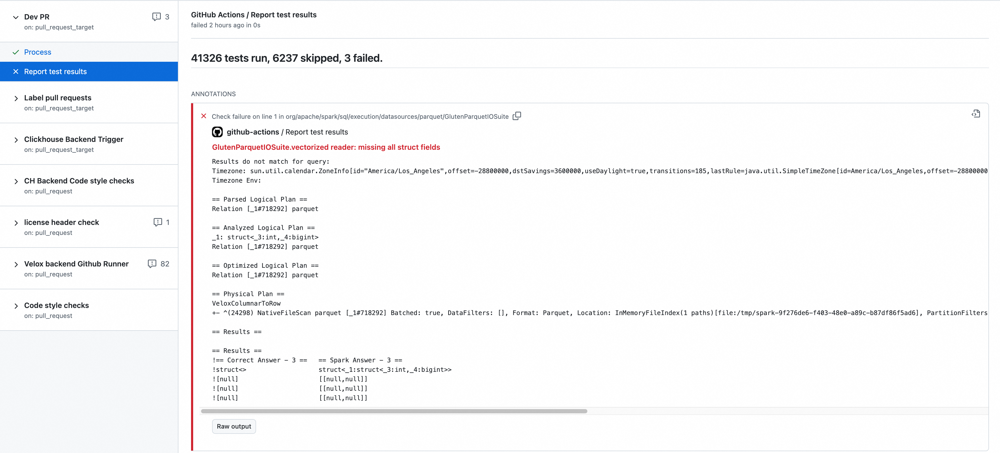

Help users to debug and test with Gluten.

# Environment

Gluten supports Ubuntu20.04, Ubuntu22.04, CentOS8, CentOS7 and MacOS.

## JDK

Currently, Gluten supports JDK 8 for Spark 3.2/3.3/3.4/3.5. For Spark 3.3 and higher versions, Gluten
supports JDK 11 and 17. Please note since Spark 4.0, JDK 8 will not be supported. So we recommend Velox
backend users to use higher JDK version now to ease the migration for deploying Gluten with Spark-4.0
in the future. And we may probably upgrade Arrow from 15.0.0 to some higher version, which also requires
JDK 11 is the minimum version.

### JDK 8

#### Environment Setting

For root user, the environment variables file is `/etc/profile`, it will take effect for all the users.

For other user, you can set in `~/.bashrc`.

#### Guide for Ubuntu

The default JDK version in ubuntu is java11, we need to set to java8.

```bash
apt install openjdk-8-jdk
update-alternatives --config java
java -version
```

`--config java` to config java executable path, `javac` and other commands can also use this command to config.
For some other uses, we suggest to set `JAVA_HOME`.

```bash
export JAVA_HOME=/usr/lib/jvm/java-8-openjdk-amd64/
JRE_HOME=$JAVA_HOME/jre
export CLASSPATH=.:$JAVA_HOME/lib/dt.jar:$JAVA_HOME/lib/tools.jar
# pay attention to $PATH double quote
export PATH="$PATH:$JAVA_HOME/bin"
```

> Must set PATH with double quote in ubuntu.

### JDK 11/17

By default, Gluten compiles package using JDK8. Enable maven profile by `-Pjava-17` to use JDK17 or `-Pjava-11` to use JDK 11, and please make sure your JAVA_HOME is set correctly.

Apache Spark and Arrow requires setting java args `-Dio.netty.tryReflectionSetAccessible=true`, see [SPARK-29924](https://issues.apache.org/jira/browse/SPARK-29924) and [ARROW-6206](https://issues.apache.org/jira/browse/ARROW-6206).
So please add following configs in `spark-defaults.conf`:

```
spark.driver.extraJavaOptions=-Dio.netty.tryReflectionSetAccessible=true
spark.executor.extraJavaOptions=-Dio.netty.tryReflectionSetAccessible=true
```

## Maven 3.6.3 or above

[Maven Download Page](https://maven.apache.org/docs/history.html)
And then set the environment setting.

## GCC 11 or above

# Compile Gluten using debug mode

If you want to just debug java/scala code, there is no need to compile cpp code with debug mode.
You can just refer to [build-gluten-with-velox-backend](../get-started/Velox.md#build-gluten-with-velox-backend).

If you need to debug cpp code, please compile the backend code and gluten cpp code with debug mode.

```bash
## compile Velox backend with benchmark and tests to debug
gluten_home/dev/builddeps-veloxbe.sh --build_tests=ON --build_benchmarks=ON --build_type=Debug
```

If you need to debug the tests in <gluten>/gluten-ut, You need to compile java code with `-P spark-ut`.

# Java/scala code development with Intellij

## Linux IntelliJ local debug

Install the Linux IntelliJ version, and debug code locally.

- Ask your linux maintainer to install the desktop, and then restart the server.
- If you use Moba-XTerm to connect linux server, you don't need to install x11 server, If not (e.g. putty), please follow this guide:
[X11 Forwarding: Setup Instructions for Linux and Mac](https://www.businessnewsdaily.com/11035-how-to-use-x11-forwarding.html)

- Download [IntelliJ Linux community version](https://www.jetbrains.com/idea/download/?fromIDE=#section=linux) to Linux server
- Start Idea, `bash <idea_dir>/idea.sh`

## Set up Gluten project

- Make sure you have compiled Gluten.
- Load the Gluten by File->Open, select <gluten_home/pom.xml>.
- Activate your profiles such as <backends-velox>, and Reload Maven Project, you will find all your need modules have been activated.
- Create breakpoint and debug as you wish, maybe you can try `CTRL+N` to find `TestOperator` to start your test.

## Java/Scala code style

IntelliJ supports importing settings for Java/Scala code style. You can import [intellij-codestyle.xml](../../dev/intellij-codestyle.xml) to your IDE.
See [IntelliJ guide](https://www.jetbrains.com/help/idea/configuring-code-style.html#import-code-style).

To generate a fix for Java/Scala code style, you can run one or more of the below commands according to the code modules involved in your PR.

For Velox backend:
```
mvn spotless:apply -Pbackends-velox -Pceleborn -Puniffle -Pspark-3.2 -Pspark-ut -DskipTests
mvn spotless:apply -Pbackends-velox -Pceleborn -Puniffle -Pspark-3.3 -Pspark-ut -DskipTests
```
For Clickhouse backend:
```
mvn spotless:apply -Pbackends-clickhouse -Pspark-3.2 -Pspark-ut -DskipTests
mvn spotless:apply -Pbackends-clickhouse -Pspark-3.3 -Pspark-ut -DskipTests
```

# CPP code development with Visual Studio Code

This guide is for remote debug. We will connect the remote linux server by `SSH`.
Download and install [Visual Studio Code](https://code.visualstudio.com/Download).

Key components found on the left side bar are:
- Explorer (Project structure)
- Search
- Run and Debug
- Extensions (Install the C/C++ Extension Pack, Remote Development, and GitLens. C++ Test Mate is also suggested.)
- Remote Explorer (Connect linux server by ssh command, click `+`, then input `ssh user@10.1.7.003`)
- Manage (Settings)

Input your password in the above pop-up window, it will take a few minutes to install linux vscode server in remote machine folder `~/.vscode-server`
If download failed, delete this folder and try again.

## Usage

### Set up project

- File->Open Folder   // select the Gluten folder
- After the project loads, you will be prompted to "Select CMakeLists.txt". Select the
  `${workspaceFolder}/cpp/CMakeLists.txt` file.
- Next, you will be prompted to "Select a Kit" for the Gluten project. Select GCC 11 or above.

### Settings

VSCode supports 2 ways to set user setting.

- Manage->Command Palette (Open `settings.json`, search by `Preferences: Open Settings (JSON)`)
- Manage->Settings (Common setting)

### Build using VSCode

VSCode will try to compile using debug mode in <gluten_home>/build. We need to compile Velox debug mode before
compiling Gluten. If you have previously compiled Velox in release mode, use the command below to compile in debug mode.

```bash
cd incubator-gluten/ep/build-velox/build/velox_ep

# Build the Velox debug version in <velox_home>/_build/debug
make debug EXTRA_CMAKE_FLAGS="-DVELOX_ENABLE_PARQUET=ON -DENABLE_HDFS=ON -DVELOX_BUILD_TESTING=OFF  -DVELOX_ENABLE_DUCKDB=ON -DVELOX_BUILD_TEST_UTILS=ON"
```

Then Gluten will link the Velox debug library.
Just click `build` in bottom bar, you will get intellisense search and link.

### Debug

The default compile command does not enable test and benchmark, so we don't get any executable files.
To enable the test and benchmark args, create or edit the `<gluten_home>/.vscode/settings.json` to add the
configurations below:

```json
{
    "cmake.configureArgs": [
        "-DBUILD_BENCHMARKS=ON",
        "-DBUILD_TESTS=ON"
    ],
    "C_Cpp.default.configurationProvider": "ms-vscode.cmake-tools"
}
```

After compiling with these updated configs, you should have executable files (such as 
`<gluten_home>/cpp/build/velox/tests/velox_shuffle_writer_test`).

Open the `Run and Debug` panel (Ctrl-Shift-D) and then click the link to create a launch.json file. If prompted,
select a debugger like  "C++ (GDB/LLDB)". The launch.json will be created at: `<gluten_home>/.vscode/launch.json`.

Click the `Add Configuration` button in launch.json, and select gdb "launch" (to start and debug a program) or
"attach" (to attach and debug a running program).

#### launch.json example

```json
{
  // Use IntelliSense to learn about possible attributes.
  // Hover to view descriptions of existing attributes.
  // For more information, visit: https://go.microsoft.com/fwlink/?linkid=830387
  "version": "0.2.0",
  "configurations": [
    {
      "name": "velox shuffle writer test",
      "type": "cppdbg",
      "request": "launch",
      "program": "${workspaceFolder}/cpp/build/velox/tests/velox_shuffle_writer_test",
      "args": ["--gtest_filter='*SinglePartitioningShuffleWriter*'"],
      "stopAtEntry": false,
      "cwd": "${fileDirname}",
      "environment": [],
      "externalConsole": false,
      "MIMode": "gdb",
      "setupCommands": [
          {
              "description": "Enable pretty-printing for gdb",
              "text": "-enable-pretty-printing",
              "ignoreFailures": true
          },
          {
              "description": "Set Disassembly Flavor to Intel",
              "text": "-gdb-set disassembly-flavor intel",
              "ignoreFailures": true
          }
      ]
    },
    {
      "name": "benchmark test",
      "type": "cppdbg",
      "request": "launch",
      "program": "${workspaceFolder}/cpp/build/velox/benchmarks/./generic_benchmark",
      "args": [
          "--threads=1",
          "--with-shuffle",
          "--partitioning=hash",
          "--iterations=1",
          "--conf=${workspaceFolder}/backends-velox/generated-native-benchmark/conf_12_0_2.ini",
          "--plan=${workspaceFolder}/backends-velox/generated-native-benchmark/plan_12_0_2.json",
          "--data=${workspaceFolder}/backends-velox/generated-native-benchmark/data_12_0_2_0.parquet,${workspaceFolder}/backends-velox/generated-native-benchmark/data_12_0_2_1.parquet"
      ],
      "stopAtEntry": false,
      "cwd": "${fileDirname}",
      "environment": [],
      "externalConsole": false,
      "MIMode": "gdb",
      "setupCommands": [
          {
              "description": "Enable pretty-printing for gdb",
              "text": "-enable-pretty-printing",
              "ignoreFailures": true
          },
          {
              "description": "Set Disassembly Flavor to Intel",
              "text": "-gdb-set disassembly-flavor intel",
              "ignoreFailures": true
          }
      ]
    }

  ]
}
```

> Change `name`, `program`, `args` for your environment. For example, your generated benchmark example file names may vary.

Then you can create breakpoint and debug in `Run and Debug` section.

### Velox debug

For some Velox tests such as `ParquetReaderTest`, tests need to read the parquet file in `<velox_home>/velox/dwio/parquet/tests/examples`, 
you should let the screen on `ParquetReaderTest.cpp`, then click `Start Debugging`, otherwise `No such file or directory` exception will be raised.

## Useful notes

### Do not upgrade vscode

No need to upgrade vscode version, if upgraded, will download linux server again, switch update mode to off
Search `update` in Manage->Settings to turn off update mode.

### Colour setting

```json
"workbench.colorTheme": "Quiet Light",
 "files.autoSave": "afterDelay",
 "workbench.colorCustomizations": {
     "editor.wordHighlightBackground": "#063ef7",
     // "editor.selectionBackground": "#d1d1c6",
     // "tab.activeBackground": "#b8b9988c",
     "editor.selectionHighlightBackground": "#c5293e"
 },
```

### Clang format

Gluten uses clang-format 15 to format source files.

```bash
apt-get install clang-format-15
```

Set config in `settings.json`

```json
"clang-format.executable": "clang-format-15",
"editor.formatOnSave": true,
```

If exists multiple clang-format version, formatOnSave may not take effect, specify the default formatter
Search `default formatter` in `Settings`, select Clang-Format.

If your formatOnSave still make no effect, you can use shortcut `SHIFT+ALT+F` to format one file manually.

### CMake format

To format cmake files, like CMakeLists.txt & *.cmake, please install `cmake-format`.
```
pip3 install --user cmake-format
```
Here is an example to format a file in command line.
```
cmake-format --first-comment-is-literal True --in-place cpp/velox/CMakeLists.txt
```

After the above installation, you can optionally do some configuration in Visual Studio Code to easily format cmake files.
1. Install `cmake-format` extension in Visual Studio Code.
2. Configure the extension. To do this, open the settings (File -> Preferences -> Settings), search for `cmake-format`,
   and do the below settings:
   * Set Args: `--first-comment-is-literal=True`.
   * Set Exe Path to the path of the `cmake-format` command. If you installed `cmake-format` in a standard
      location, you might not need to change this setting.
3. Now, you can format your CMake files by right-clicking in a file and selecting `Format Document`.

### Add UT

1. For Native Code Modifications: If you have modified native code, it is best to use gtest to test the native code. 
   A secondary option is to add Gluten UT to ensure coverage.

2. For Gluten-Related Code Modifications: If you have modified code related to Gluten, it is preferable to add scalatest rather than JUnit. 
   Additionally, the test classes should be placed in the org.apache.gluten package.

3. For Spark-Related Code Modifications: If you have modified code related to Spark, it is preferable to add scalatest rather than JUnit. 
   Additionally, the test classes should be placed in the org.apache.spark package.

4. Placement of Non-Native Code UTs: Ensure that unit tests for non-native code are placed within org.apache.gluten and org.apache.spark packages. 
   This is important because the CI system runs unit tests from these two paths in parallel. Placing tests in other paths might cause your tests to be ignored.

### View surefire reports of Velox ut in GHA  

Surefire reports are invaluable tools in the ecosystem of Java-based applications that utilize the Maven build automation tool.  
These reports are generated by the Maven Surefire Plugin during the testing phase of your build process.  
They compile results from unit tests, providing detailed insights into which tests passed or failed, what errors were encountered, and other essential metrics.  

Surefire reports play a crucial role in the development and maintenance of high-quality software.  
We provide surefire reports of Velox ut in GHA, and developers can leverage surefire reports with early bug detection and quality assurance.  

You can check surefire reports:

1. Click `Checks` Tab in PR;  

2. Find `Report test results` in `Dev PR`;

3. Then, developers can check the result with summary and annotations.  

  

# Debug cpp code with coredump

```bash
mkdir -p /mnt/DP_disk1/core
sysctl -w kernel.core_pattern=/mnt/DP_disk1/core/core-%e-%p-%t
cat /proc/sys/kernel/core_pattern
# set the core file to unlimited size
echo "ulimit -c unlimited" >> ~/.bashrc
# then you will get the core file at `/mnt/DP_disk1/core` when the program crashes
# gdb -c corefile
# gdb <gluten_home>/cpp/build/releases/libgluten.so 'core-Executor task l-2000883-1671542526'
```

'core-Executor task l-2000883-1671542526' is the generated core file name.

```bash
(gdb) bt
(gdb) f7
(gdb) set print pretty on
(gdb) p *this
```

- Get the backtrace
- Switch to 7th stack
- Print the variable in a more readable way
- Print the variable fields

Sometimes you only get the cpp exception message, you can generate core dump file by the following code:
```cpp
char* p = nullptr;
*p = 'a';
```
or by the following commands:
- `gcore <pid>`
- `kill -s SIGSEGV <pid>`

# Debug cpp with gdb

You can use gdb to debug tests and benchmarks.
And also you can debug jni call.
Place the following code to your debug path.

```cpp
pid_t pid = getpid();
printf("----------------------------------pid: %lun", pid);
sleep(10);
```

You can also get the pid by java command or grep java program when executing unit test.

```bash
jps
1375551 ScalaTestRunner
ps ux | grep TestOperator
```

Execute gdb command to debug:
```bash
gdb attach <pid>
```

```bash
gdb attach 1375551
wait to attach....
(gdb) b <velox_home>/velox/substrait/SubstraitToVeloxPlan.cpp:577
(gdb) c
```

# Debug Memory leak

## Arrow memory allocator leak

If you receive error message like 

```bash
4/04/18 08:15:38 WARN ArrowBufferAllocators$ArrowBufferAllocatorManager: Detected leaked Arrow allocator [Default], size: 191, process accumulated leaked size: 191...
24/04/18 08:15:38 WARN ArrowBufferAllocators$ArrowBufferAllocatorManager: Leaked allocator stack Allocator(ROOT) 0/191/319/9223372036854775807 (res/actual/peak/limit)
```
You can open the Arrow allocator debug config by add VP option `-Darrow.memory.debug.allocator=true`, then you can get more details like

```bash
child allocators: 0
  ledgers: 7
    ledger[10] allocator: ROOT), isOwning: , size: , references: 1, life: 10483701311283711..0, allocatorManager: [, life: ] holds 1 buffers. 
        ArrowBuf[11], address:140100698555856, capacity:128
     event log for: ArrowBuf[11]
       10483701311362601 create()
              at org.apache.arrow.memory.util.HistoricalLog$Event.<init>(HistoricalLog.java:175)
              at org.apache.arrow.memory.util.HistoricalLog.recordEvent(HistoricalLog.java:83)
              at org.apache.arrow.memory.ArrowBuf.<init>(ArrowBuf.java:97)
              at org.apache.arrow.memory.BufferLedger.newArrowBuf(BufferLedger.java:271)
              at org.apache.arrow.memory.BaseAllocator.bufferWithoutReservation(BaseAllocator.java:340)
              at org.apache.arrow.memory.BaseAllocator.buffer(BaseAllocator.java:316)
              at org.apache.arrow.memory.RootAllocator.buffer(RootAllocator.java:29)
              at org.apache.arrow.memory.BaseAllocator.buffer(BaseAllocator.java:280)
              at org.apache.arrow.memory.RootAllocator.buffer(RootAllocator.java:29)
              at org.apache.arrow.c.ArrowArray.allocateNew(ArrowArray.java:116)
              at org.apache.arrow.c.ArrayImporter.importArray(ArrayImporter.java:61)
              at org.apache.arrow.c.Data.importIntoVector(Data.java:289)
              at org.apache.arrow.c.Data.importIntoVectorSchemaRoot(Data.java:332)
              at org.apache.arrow.dataset.jni.NativeScanner$NativeReader.loadNextBatch(NativeScanner.java:151)
              at org.apache.gluten.datasource.ArrowFileFormat$$anon$1.hasNext(ArrowFileFormat.scala:99)
              at org.apache.gluten.utils.IteratorCompleter.hasNext(Iterators.scala:69)
              at org.apache.spark.memory.SparkMemoryUtil$UnsafeItr.hasNext(SparkMemoryUtil.scala:246)
```

## CPP code memory leak

Sometimes you cannot get the coredump symbols, if you debug memory leak, you can write googletest to use valgrind to detect

```bash
apt install valgrind
valgrind --leak-check=yes ./exec_backend_test
```


# Run TPC-H and TPC-DS

We supply `<gluten_home>/tools/gluten-it` to execute these queries
Refer to [velox_backend.yml](https://github.com/apache/incubator-gluten/blob/main/.github/workflows/velox_backend.yml)

# Run Gluten+Velox on clean machine

We can run Gluten + Velox on clean machine by one command (supported OS: Ubuntu20.04/22.04, CentOS 7/8, etc.).
```
spark-shell --name run_gluten \
 --master yarn --deploy-mode client \
 --conf spark.plugins=org.apache.gluten.GlutenPlugin \
 --conf spark.memory.offHeap.enabled=true \
 --conf spark.memory.offHeap.size=20g \
 --jars https://github.com/apache/incubator-gluten/releases/download/v1.1.1/gluten-velox-bundle-spark3.2_2.12-1.1.1.jar \
 --conf spark.shuffle.manager=org.apache.spark.shuffle.sort.ColumnarShuffleManager
```

# Check Gluten Approved Spark Plan

To make sure we don't accidentally modify the Gluten and Spark Plan build logic.
We introduce new logic in `VeloxTPCHSuite` to check whether the plan has been changed or not,
and this will be triggered when running the unit test.

As a result, developers may encounter unit test fail in Github CI or locally, with the following error message:
```log
- TPC-H q5 *** FAILED ***
  Mismatch for query 5
  Actual Plan path: /tmp/tpch-approved-plan/v2-bhj/spark322/5.txt
  Golden Plan path: /opt/gluten/backends-velox/target/scala-2.12/test-classes/tpch-approved-plan/v2-bhj/spark322/5.txt (VeloxTPCHSuite.scala:101)
```
For developers to update the golden plan, you can find the actual plan in Github CI Artifacts or in local `/tmp/` directory. 


Developers can simply copy the actual plan to the golden plan path, and then re-run the unit test to make sure the plan is stabled.
