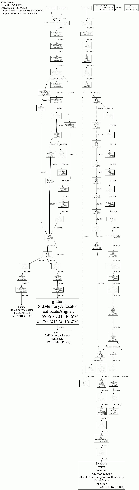
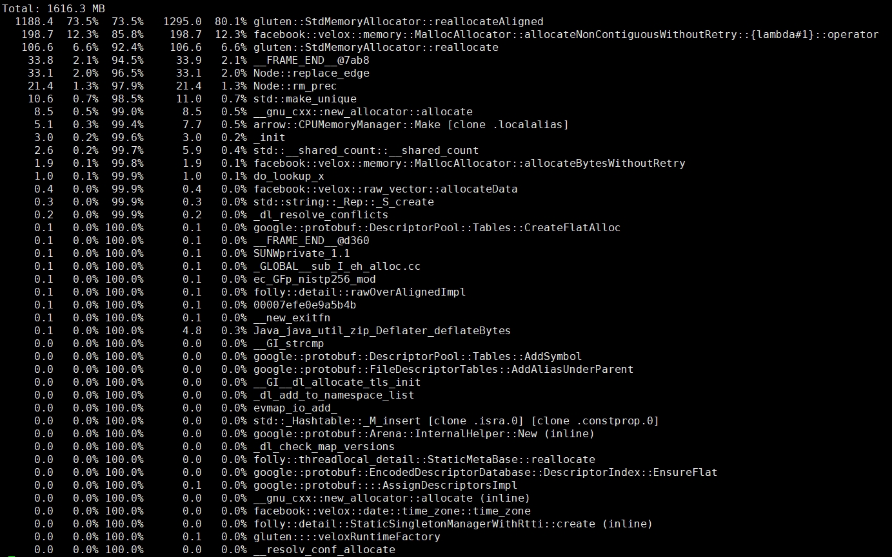

Gluten offloads most of Spark SQL execution to native engine. We can use [gperftools](https://github.com/gperftools/gperftools) or [jemalloc](https://github.com/jemalloc/jemalloc)
to analyze the offheap memory and cpu profile.

# Profile with gperftools

`gperftools` is a collection of a high-performance multi-threaded
malloc() implementation, plus some pretty nifty performance analysis
tools, see more: https://github.com/gperftools/gperftools/wiki.

## Build and install gperftools

Download `gperftools` from https://github.com/gperftools/gperftools/releases, build and install.

```bash
wget https://github.com/gperftools/gperftools/releases/download/gperftools<version>/gperftools-<version>.tar.gz
tar xzvf gperftools-<version>.tar.gz
cd gperftools-<version>
./configure
make && make install
```

Then we can find the tcmalloc libraries in `$GPERFTOOLS_HOME/.lib`.

## Run Gluten with gperftools

Configure `--files` or `spark.files` for Spark.

```
--files /path/to/gperftools/libtcmalloc_and_profiler.so
or
spark.files /path/to/gperftools/libtcmalloc_and_profiler.so
```

Use `LD_PRELOAD` to preload tcmalloc library, and enable heap profile with `HEAPPROFILE` or cpu profile with `CPUPROFILE`. 

Example of enabling heap profile in spark executor:

```
spark.executorEnv.LD_PRELOAD  ./libtcmalloc_and_profiler.so

# Specifies dump profile path. ${CONTAINER_ID} is only used to distinguish the result files when running on yarn.
spark.executorEnv.HEAPPROFILE /tmp/gluten_heap_perf_${CONTAINER_ID} 
```

Finally, profiling files prefixed with `/tmp/gluten_heap_perf_${CONTAINER_ID}` will be generated for each spark executor.

## Analyze profiling output

Prepare the required native libraries. Assume static build is used for Gluten, there is no other shared dependency libs.

```bash
jar xf gluten-velox-bundle-spark3.5_2.12-centos_7_x86_64-1.2.0.jar relative/path/to/libvelox.so ralative/path/to/libgluten.so
mv libvelox.so libgluten.so /path/to/gluten_lib_prefix
```

Generate a GIF of the analysis result:

```bash
# `/usr/bin/java` indicates the program used by running spark executor
pprof --show_bytes --gif --lib_prefix=/path/to/gluten_lib_prefix /usr/bin/java /path/to/gluten_heap_perf_XXX > result.gif
```

Result like:



Or display analysis result in TEXT:

```bash
pprof --text --lib_prefix=/path/to/gluten_lib_prefix /usr/bin/java /path/to/gluten_heap_perf_XXX
```

Result like:



**\*\*** Get more help from https://github.com/gperftools/gperftools/wiki#documentation.

# Profile with jemalloc

`jemalloc` is a general purpose malloc(3) implementation that emphasizes fragmentation
avoidance and scalable concurrency support. We can also use it to analyze Gluten performance.
Getting Started with `jemalloc`: https://github.com/jemalloc/jemalloc/wiki/Getting-Started.

## Build and install jemalloc

Download `jemalloc` from https://github.com/jemalloc/jemalloc/releases, build and install.

```
cd /path/to/jemalloc
./autogen.sh --enable-prof
make && make install
```
Then we can find the jemalloc library in `$JEMALLOC_HOME/.lib`.

## Run Gluten with jemalloc

Configure `--files` or `spark.files` for Spark.

```
--files /path/to/jemalloc/libjemalloc.so
or
spark.files /path/to/jemalloc/libjemalloc.so
```

Example of enabling heap profile in spark executor:

```
spark.executorEnv.LD_PRELOAD  ./libjemalloc.so
spark.executorEnv.MALLOC_CONF prof:true,lg_prof_interval:30,prof_prefix:/tmp/gluten_heap_perf
```

Finally, profiling files prefixed with `/tmp/gluten_heap_perf.${PID}` will be generated for each spark executor.

## Analyze profiling output

Prepare the required native libraries. Assume static build is used for Gluten, so there is no other shared dependency libs.

```bash
jar xf gluten-velox-bundle-spark3.5_2.12-centos_7_x86_64-1.2.0.jar relative/path/to/libvelox.so relative/path/to/libgluten.so
mv libvelox.so libgluten.so /path/to/gluten_lib_prefix
```

Generate a GIF of the analysis result:

```bash
# `/usr/bin/java` indicates the program used by running spark executor
jeprof --show_bytes --gif --lib_prefix=/path/to/gluten_lib_prefix /usr/bin/java /path/to/gluten_heap_perf_XXX > result.gif
```

Or display analysis result in TEXT:

```bash
jeprof --text --lib_prefix=/path/to/gluten_lib_prefix /usr/bin/java /path/to/gluten_heap_perf_XXX
```

**\*\*** Get more help from https://jemalloc.net/jemalloc.3.html.
