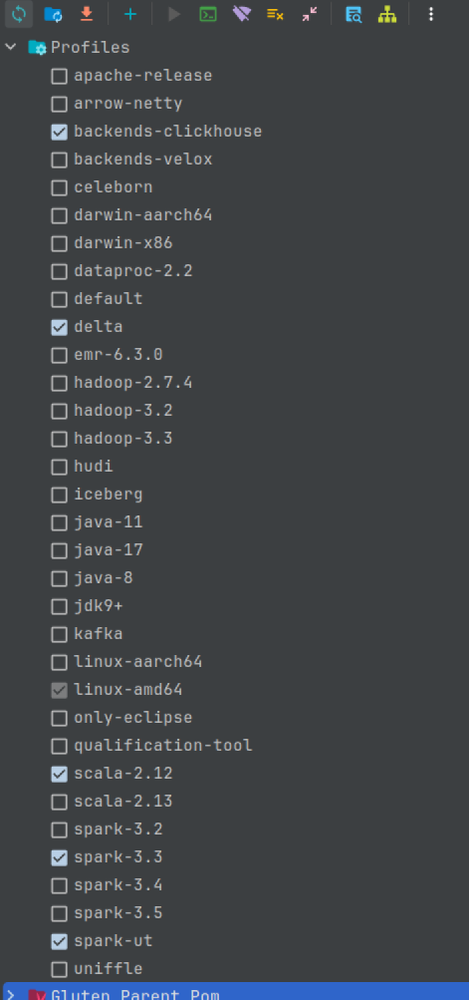

# Debug CH Backend

## Debug Java/Scala Code with IntelliJ IDEA

1. Build Gluten ClickHouse Native Lib.
   ```
   export CMAKE_BUILD_TYPE=Release && bash ep/build-clickhouse/src/build_clickhouse.sh
   ```
   libch.so will be generated in `cpp-ch/build/utils/extern-local-engine/libch.so`.

2. Maven Build Gluten ClickHouse with Profile
   ```
   mvn clean install -DskipTests -P delta -Pbackends-clickhouse -Pspark-3.3 -Pspark-ut
   ```
   
3. Set Maven Profiles in IntelliJ IDEA

   

4. Set Debug Configuration in IntelliJ IDEA

   For example, debug GlutenMathExpressionsSuite.
   

   VM Options: 
   `-Dgluten.test.data.path=/data -Dspark.gluten.sql.columnar.libpath=/path/to/gluten/cpp-ch/build/utils/extern-local-engine/libch.so -Dspark.test.home=/path/to/spark33`
   > Download tpcds-data in https://gluten-nginx.kyligence.com/dataset/
   > Download spark33 using `git clone --depth 1 --branch v3.3.1 https://github.com/apache/spark.git /tmp/spark33`
   
   Environment Variables: 
   `LD_PRELOAD=/path/to/gluten/cpp-ch/build/utils/extern-local-engine/libch.so:/usr/lib/jvm/java-1.8.0-openjdk-amd64/jre/lib/amd64/libjsig.so`

## Debug Native Code with CLion

1. Toolchains Settings

   
   > Some Clion versions have not supported lldb-18, you can manually set refer to [CLion Custom LLDB](https://youtrack.jetbrains.com/issue/CPP-3589/Support-using-custom-LLDB). Or you can use gdb as default.

2. CMake Debug Configuration

   

   CMake Options: 
   `-DENABLE_PROTOBUF=ON -DENABLE_TESTS=OFF -DENABLE_BENCHMARKS=ON -DENABLE_JEMALLOC=ON -DENABLE_MULTITARGET_CODE=ON -DENABLE_EXTERN_LOCAL_ENGINE=ON -DENABLE_ODBC=OFF -DENABLE_CAPNP=OFF -DENABLE_ROCKSDB=OFF -DENABLE_GRPC=OFF -DENABLE_RUST=OFF -DENABLE_H3=OFF -DENABLE_AMQPCPP=OFF -DENABLE_CASSANDRA=OFF -DENABLE_KAFKA=ON -DENABLE_NATS=OFF -DENABLE_LIBPQXX=OFF -DENABLE_NURAFT=OFF -DENABLE_DATASKETCHES=OFF -DENABLE_SQLITE=OFF -DENABLE_S2_GEOMETRY=OFF -DENABLE_ANNOY=OFF -DENABLE_ULID=OFF -DENABLE_MYSQL=OFF -DENABLE_BCRYPT=OFF -DENABLE_LDAP=OFF -DENABLE_MSGPACK=OFF -DUSE_REPLXX=OFF -DENABLE_CLICKHOUSE_ALL=OFF -DCOMPILER_FLAGS="-fvisibility=hidden -fvisibility-inlines-hidden" -DENABLE_BUILD_PATH_MAPPING=OFF -DDEBUG_O_LEVEL="0"`

3. Reload CMake Project

   

   After reload cmake projects, you can find target `libch` in run configurations.

4. Build `libchd.so` with Debug Mode

   

   `libchd.so` will be generated in `cmake-build-debug/utils/extern-local-engine/libchd.so`.

5. Create File `.gdbinit` and `.lldbinit` to Avoid Unused Signal

   vi ~/.gdbinit
   ```
   handle SIGSEGV nostop noprint

   set print pretty on
   set print object on
   python
   import sys
   sys.path.insert(0, '/path/to/libcxx-pretty-printers/src')
   from libcxx.v1.printers import register_libcxx_printers
   register_libcxx_printers(None)
   end
   ```
   > Download libcxx-pretty-printers in https://github.com/koutheir/libcxx-pretty-printers
   
   vi ~/.lldbinit
   ```
   process handle -n true -p true -s false SIGBUS SIGSEGV
   ```
   
6. Debug Application

   

   Executable: `/path/to/java`

   Program Arguments: Copy from IntelliJ IDEA debug command line and remove `-javaagent`
   


