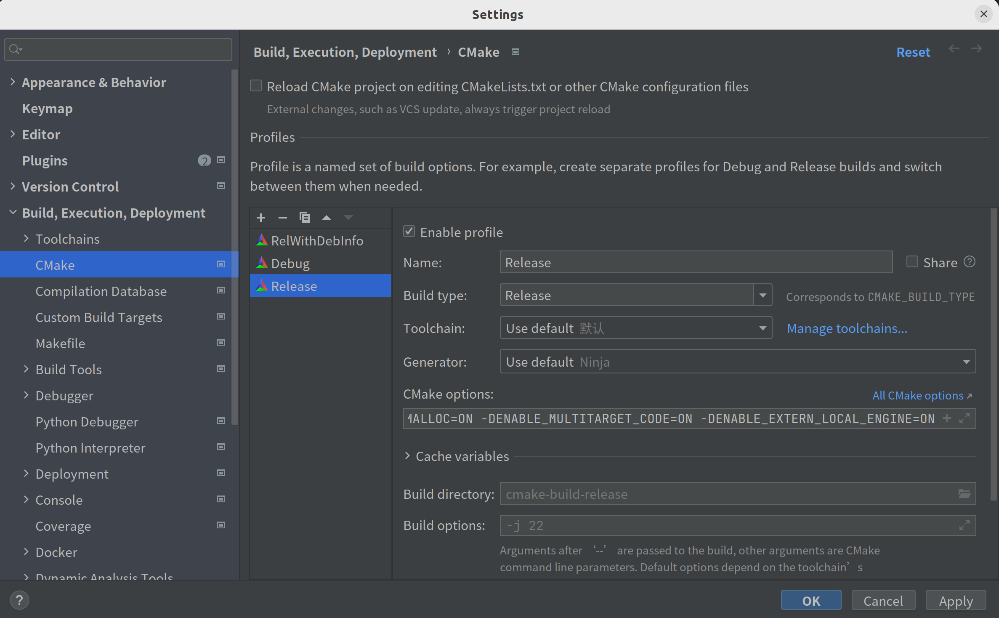

## ClickHouse Backend

ClickHouse is a column-oriented database management system (DBMS) for online analytical processing of queries (OLAP), which supports best in the industry query performance, while significantly reducing storage requirements through its innovative use of columnar storage and compression.
We port ClickHouse ( based on version **23.1** ) as a library, called 'libch.so', and Gluten loads this library through JNI as the native engine. In this way, we don't need to deploy a standalone ClickHouse Cluster, Spark uses Gluten as SparkPlugin to read and write ClickHouse MergeTree data.

### Architecture

The architecture of the ClickHouse backend is shown below:


1. On Spark driver, Spark uses Gluten SparkPlugin to transform the physical plan to the Substrait plan, and then pass the Substrait plan to ClickHouse backend through JNI call on executors.
2. Based on Spark DataSource V2 interface, implementing a ClickHouse Catalog to support operating the ClickHouse tables, and then using Delta to save some metadata about ClickHouse like the MergeTree parts information, and also provide ACID transactions.
3. When querying from a ClickHouse table, it will fetch MergeTree parts information from Delta metadata and assign these parts into Spark partitions according to some strategies.
4. When writing data into a ClickHouse table, it will use ClickHouse library to write MergeTree parts data and collect these MergeTree parts information after writing successfully, and then save these MergeTree parts information into Delta metadata. ( **The feature of writing MergeTree parts is coming soon.** )
5. On Spark executors, each executor will load the 'libch.so' through JNI when starting, and then call the operators according to the Substrait plan which is passed from Spark Driver, like reading data from the MergeTree parts, writing the MergeTree parts, filtering data, aggregating data and so on.
6. Currently, the ClickHouse backend only supports reading the MergeTree parts from local storage, it needs to use a high-performance shared file system to share a root bucket on every node of the cluster from the object storage, like JuiceFS.


### Development environment setup

In general, we use IDEA for Gluten development and CLion for ClickHouse backend development on **Ubuntu 20**.

#### Prerequisite

##### For compiling clickhouse backend

Following softwares are required,
- Clang 19.0
- cmake 3.20 or higher version
- ninja-build 1.8.2

You can run `sudo $gluten_root/ep/build-clickhouse/src/install_ubuntu.sh` to setup the requirements. We also provide a [docker file](../../cpp-ch/local-engine/docker/image/Dockerfile), you can build your own image
```shell
cd $gluten_root/cpp-ch/local-engine/docker/image/
docker build . -t libch_builder
```

You can also refer to [How-to-Build-ClickHouse-on-Linux](https://clickhouse.com/docs/en/development/build/).

##### For compiling gluten
You need to install the following software manually:
- Java 8
- Maven 3.6.3 or higher version
- Spark 3.2.2 or Spark 3.3.1

Then, get Gluten code:
```shell
git clone https://github.com/apache/incubator-gluten.git
```

#### Setup ClickHouse backend development environment

##### Compile Clickhouse backend

###### clone repos
clone gluten repo


```shell
git clone https://github.com/apache/incubator-gluten.git
```

clone Kyligence/ClickHouse repo

```shell
git clone --recursive --shallow-submodules -b clickhouse_backend https://github.com/Kyligence/ClickHouse.git
```

checkout to the latest branch

```shell
latest_branch=$(cat $gluten_root/cpp-ch/clickhouse.version  | grep CH_BRANCH | cut -d= -f2)
git fetch origin $latest_branch
git checkout -b $latest_branch origin/$latest_branch
git submodule sync --recursive
git submodule update --init --recursive
```


##### build

There are several ways to build the backend library.
1. Build it direclty


If you have setup all requirements, you can use following command to build it direclty.

```bash
cd $gluten_root
bash ./ep/build-clickhouse/src/build_clickhouse.sh
```


This will download Clickhouse for you and build everything.
The target file is `$gluten_root/cpp-ch/build/utils/extern-local-engine/libch.so`.


2. Use docker


You can use [docker file](../../cpp-ch/local-engine/docker/image/Dockerfile) to build a docker image
```shell
cd $gluten_root/cpp-ch/local-engine/docker/image/
docker build . -t libch_builder

cd $gluten_root/cpp-ch/local-engine/docker
./build.sh -g <gluten_root> -c <clickhouse_root> [-b <build_directory>] [-o <output_directory>] libch_builder
```
`build_directory` is a directory used as to store the intermediate files from compiling. It will use `current_dir>`/build as the default value if you don't provide it.


`output_directory` is used as to store the finally output `libch.so`. The default value is `current_dir`/output if you don't provide it.


3. (Option 1) Use CLion

    - Open ClickHouse repo
    - Choose File -> Settings -> Build, Execution, Deployment -> Toolchains, and then choose Bundled CMake, clang-16 as C Compiler, clang++-16 as C++ Compiler:

        

    - Choose File -> Settings -> Build, Execution, Deployment -> CMake:

        

        And then add these options into CMake options:
        ```
        -DENABLE_PROTOBUF=ON -DENABLE_TESTS=OFF -DENABLE_JEMALLOC=ON -DENABLE_MULTITARGET_CODE=ON -DENABLE_EXTERN_LOCAL_ENGINE=ON
        ```
    - Build 'ch' target on ClickHouse Project with Debug mode or Release mode:

       

      If it builds with Release mode successfully, there is a library file called 'libch.so' in path '${CH_SOURCE_DIR}/cmake-build-release/utils/extern-local-engine/'.
   
      If it builds with Debug mode successfully, there is a library file called 'libchd.so' in path '${CH_SOURCE_DIR}/cmake-build-debug/utils/extern-local-engine/'.

4. Build it as a submodule of Clickhouse


```shell
ln -s $gluten_root/cpp-ch/local-engine $clickhouse_root/utils/extern-local-engine
mkdir -p $clickhouse_root/build
cd $clickhouse_root/build
cmake -G Ninja  "-DCMAKE_C_COMPILER=$CC" "-DCMAKE_CXX_COMPILER=$CXX" \
          "-DCMAKE_BUILD_TYPE=Release" \
          "-DENABLE_PROTOBUF=1" \
          "-DENABLE_EMBEDDED_COMPILER=$ENABLE_EMBEDDED_COMPILER" \
          "-DENABLE_TESTS=OFF" \
          "-DWERROR=OFF" \
          "-DENABLE_JEMALLOC=1" \
          "-DENABLE_MULTITARGET_CODE=ON" \
          "-DENABLE_GWP_ASAN=OFF" \
          "-DENABLE_EXTERN_LOCAL_ENGINE=ON" \
          "-DENABLE_THINLTO=false" \
          ..
ninja
```
The result is in `$clickhouse_root/build/utils/extern-local-engine/libch.so`.


#### Compile Gluten

The prerequisites are the same as the one mentioned above. Compile Gluten with ClickHouse backend through maven:

- for Spark 3.2.2<span id="deploy-spark-322"></span>

```
    git clone https://github.com/apache/incubator-gluten.git
    cd incubator-gluten/
    export MAVEN_OPTS="-Xmx8g -XX:ReservedCodeCacheSize=2g"
    mvn clean install -Pbackends-clickhouse -Phadoop-2.7.4 -Pspark-3.2 -Dhadoop.version=2.8.5 -DskipTests -Dcheckstyle.skip
    ls -al backends-clickhouse/target/gluten-XXXXX-spark-3.2-jar-with-dependencies.jar
```

- for Spark 3.3.1

```
    git clone https://github.com/apache/incubator-gluten.git
    cd incubator-gluten/
    export MAVEN_OPTS="-Xmx8g -XX:ReservedCodeCacheSize=2g"
    mvn clean install -Pbackends-clickhouse -Phadoop-2.7.4 -Pspark-3.3 -Dhadoop.version=2.8.5 -DskipTests -Dcheckstyle.skip
    ls -al backends-clickhouse/target/gluten-XXXXX-spark-3.3-jar-with-dependencies.jar
```

### Gluten in local Spark Thrift Server

#### Prepare working directory 

- for Spark 3.2.2

```
tar zxf spark-3.2.2-bin-hadoop2.7.tgz
cd spark-3.2.2-bin-hadoop2.7
#download delta-core_2.12-2.0.1.jar and delta-storage-2.0.1.jar
wget https://repo1.maven.org/maven2/io/delta/delta-core_2.12/2.0.1/delta-core_2.12-2.0.1.jar -P ./jars
wget https://repo1.maven.org/maven2/io/delta/delta-storage/2.0.1/delta-storage-2.0.1.jar -P ./jars
cp gluten-XXXXX-spark-3.2-jar-with-dependencies.jar jars/
```

- for Spark 3.3.1

```
tar zxf spark-3.3.1-bin-hadoop2.7.tgz
cd spark-3.3.1-bin-hadoop2.7
#download delta-core_2.12-2.2.0.jar and delta-storage-2.2.0.jar
wget https://repo1.maven.org/maven2/io/delta/delta-core_2.12/2.2.0/delta-core_2.12-2.2.0.jar -P ./jars
wget https://repo1.maven.org/maven2/io/delta/delta-storage/2.2.0/delta-storage-2.2.0.jar -P ./jars
cp gluten-XXXXX-spark-3.3-jar-with-dependencies.jar jars/
```

#### Query local data

##### Start Spark Thriftserver on local
```
cd spark-3.2.2-bin-hadoop2.7
./sbin/start-thriftserver.sh \
  --master local[3] \
  --driver-memory 10g \
  --conf spark.serializer=org.apache.spark.serializer.JavaSerializer \
  --conf spark.sql.sources.ignoreDataLocality=true \
  --conf spark.default.parallelism=1 \
  --conf spark.sql.shuffle.partitions=1 \
  --conf spark.sql.files.minPartitionNum=1 \
  --conf spark.sql.files.maxPartitionBytes=1073741824 \
  --conf spark.sql.adaptive.enabled=false \
  --conf spark.locality.wait=0 \
  --conf spark.locality.wait.node=0 \
  --conf spark.locality.wait.process=0 \
  --conf spark.sql.columnVector.offheap.enabled=true \
  --conf spark.memory.offHeap.enabled=true \
  --conf spark.memory.offHeap.size=6442450944 \
  --conf spark.plugins=org.apache.gluten.GlutenPlugin \
  --conf spark.executorEnv.LD_PRELOAD=/path_to_clickhouse_library/libch.so\
  --conf spark.gluten.sql.columnar.libpath=/path_to_clickhouse_library/libch.so \
  --conf spark.gluten.sql.columnar.iterator=true \
  --conf spark.gluten.sql.columnar.loadarrow=false \
  --conf spark.gluten.sql.columnar.hashagg.enablefinal=true \
  --conf spark.gluten.sql.enable.native.validation=false \
  --conf spark.io.compression.codec=snappy \
  --conf spark.gluten.sql.columnar.forceShuffledHashJoin=true \
  --conf spark.sql.catalog.spark_catalog=org.apache.spark.sql.execution.datasources.v2.clickhouse.ClickHouseSparkCatalog \
  --conf spark.databricks.delta.maxSnapshotLineageLength=20 \
  --conf spark.databricks.delta.snapshotPartitions=1 \
  --conf spark.databricks.delta.properties.defaults.checkpointInterval=5 \
  --conf spark.databricks.delta.stalenessLimit=3600000

#connect to Spark Thriftserver by beeline
bin/beeline -u jdbc:hive2://localhost:10000/ -n root
```

##### Query local MergeTree files

- Prepare data<span id="data-preparation"></span>

Currently, the feature of writing ClickHouse MergeTree parts by Spark is developing, so you need to use command 'clickhouse-local' to generate MergeTree parts data manually. We provide a python script to call the command 'clickhouse-local' to convert parquet data to MergeTree parts:

```

#install ClickHouse community version
sudo apt-get install -y apt-transport-https ca-certificates dirmngr
sudo apt-key adv --keyserver hkp://keyserver.ubuntu.com:80 --recv 8919F6BD2B48D754
echo "deb https://packages.clickhouse.com/deb stable main" | sudo tee /etc/apt/sources.list.d/clickhouse.list
sudo apt-get update
sudo apt install -y --allow-downgrades clickhouse-server=22.5.1.2079 clickhouse-client=22.5.1.2079 clickhouse-common-static=22.5.1.2079

#generate MergeTree parts
mkdir -p /path_clickhouse_database/table_path/
python3 /path_to_clickhouse_backend_src/utils/local-engine/tool/parquet_to_mergetree.py --path=/tmp --source=/path_to_parquet_data/tpch-data-sf100/lineitem --dst=/path_clickhouse_database/table_path/lineitem
```

**This python script will convert one parquet data file to one MergeTree parts.**

- Create a TPC-H lineitem table using ClickHouse DataSource

```
    DROP TABLE IF EXISTS lineitem;
    CREATE TABLE IF NOT EXISTS lineitem (
     l_orderkey      bigint,
     l_partkey       bigint,
     l_suppkey       bigint,
     l_linenumber    bigint,
     l_quantity      double,
     l_extendedprice double,
     l_discount      double,
     l_tax           double,
     l_returnflag    string,
     l_linestatus    string,
     l_shipdate      date,
     l_commitdate    date,
     l_receiptdate   date,
     l_shipinstruct  string,
     l_shipmode      string,
     l_comment       string)
     USING clickhouse
     TBLPROPERTIES (engine='MergeTree'
                    )
     LOCATION '/path_clickhouse_database/table_path/lineitem';
```

- TPC-H Q6 test

```
    SELECT
        sum(l_extendedprice * l_discount) AS revenue
    FROM
        lineitem
    WHERE
        l_shipdate >= date'1994-01-01'
        AND l_shipdate < date'1994-01-01' + interval 1 year
        AND l_discount BETWEEN 0.06 - 0.01 AND 0.06 + 0.01
        AND l_quantity < 24;
```

- Result

    The DAG is shown on Spark UI as below:

    

##### Query local Parquet files

You can query local parquet files directly.
```sql
-- query on a single file
select * from parquet.`/your_data_root_dir/1.parquet`;

-- query on a directly which has multiple files
select * from parquet.`/your_data_roo_dir/`;
```

You can also create a TEMPORARY VIEW for parquet files.
```sql
create or replace temporary view your_table_name
using org.apache.spark.sql.parquet
options(
    path "/your_data_root_dir/"
)
```


##### Query Parquet files in S3

If you have parquet files in S3(either AWS S3 or S3 compatible storages like MINIO), you can query them directly.
You need to add these additional configs to spark:

```bash
  --config spark.hadoop.fs.s3a.endpoint=S3_ENDPOINT
  --config spark.hadoop.fs.s3a.path.style.access=true
  --config spark.hadoop.fs.s3a.access.key=YOUR_ACCESS_KEY
  --config spark.hadoop.fs.s3a.secret.key=YOUR_SECRET_KEY
```
where S3_ENDPOINT must follow the format of `https://s3.region-code.amazonaws.com`, e.g. `https://s3.us-east-1.amazonaws.com` (or `http://hostname:39090 for MINIO)

When you query the parquet files in S3, you need to add the prefix `s3a://` to the path, e.g. `s3a://your_bucket_name/path_to_your_parquet`.

Additionally, you can add these configs to enable local caching of S3 data. Each spark executor will have its own cache. Cache stealing between executors is not supported yet.

```bash
  --config spark.gluten.sql.columnar.backend.ch.runtime_config.s3.local_cache.enabled=true
  --config spark.gluten.sql.columnar.backend.ch.runtime_config.s3.local_cache.cache_path=/executor_local_folder_for_cache
```

##### Use beeline to execute queries

After start a spark thriftserver, we can use the beeline to connect to this server.
```bash
# run a file
/path_to_spark/bin/beeline -u jdbc:hive2://localhost:10000 -f <your_sql_file>

# run a query
/path_to_spark/bin/beeline -u jdbc:hive2://localhost:10000 -e '<your_sql>'

# enter a interactive mode
/path_to_spark/bin/beeline -u jdbc:hive2://localhost:10000
```

#### Query Hive tables in HDFS

Suppose that you have set up hive and hdfs, you can query the data on hive directly.

- Copy `hive-site.xml` into `/path_to_spark/conf/`
- Copy `hdfs-site.xml` into `/path_to_spark/conf/`, and edit `spark-env.sh`

```bash
# add this line into spark-env.sh
export HADOOP_CONF_DIR=/path_to_spark/conf
```

- Start spark thriftserver with hdfs configurations

```bash
hdfs_conf_file=/your_local_path/hdfs-site.xml

cd spark-3.2.2-bin-hadoop2.7
# add a new option: spark.gluten.sql.columnar.backend.ch.runtime_config.hdfs.libhdfs3_conf
./sbin/start-thriftserver.sh \
  --master local[3] \
  --files $hdfs_conf_file \
  --driver-memory 10g \
  --conf spark.serializer=org.apache.spark.serializer.JavaSerializer \
  --conf spark.sql.sources.ignoreDataLocality=true \
  --conf spark.default.parallelism=1 \
  --conf spark.sql.shuffle.partitions=1 \
  --conf spark.sql.files.minPartitionNum=1 \
  --conf spark.sql.files.maxPartitionBytes=1073741824 \
  --conf spark.locality.wait=0 \
  --conf spark.locality.wait.node=0 \
  --conf spark.locality.wait.process=0 \
  --conf spark.sql.columnVector.offheap.enabled=true \
  --conf spark.memory.offHeap.enabled=true \
  --conf spark.memory.offHeap.size=6442450944 \
  --conf spark.plugins=org.apache.gluten.GlutenPlugin \
  --conf spark.executorEnv.LD_PRELOAD=/path_to_clickhouse_library/libch.so\
  --conf spark.gluten.sql.columnar.libpath=/path_to_clickhouse_library/libch.so \
  --conf spark.gluten.sql.columnar.iterator=true \
  --conf spark.gluten.sql.columnar.loadarrow=false \
  --conf spark.gluten.sql.columnar.hashagg.enablefinal=true \
  --conf spark.gluten.sql.enable.native.validation=false \
  --conf spark.io.compression.codec=snappy \
  --conf spark.gluten.sql.columnar.forceShuffledHashJoin=true \
  --conf spark.sql.catalog.spark_catalog=org.apache.spark.sql.execution.datasources.v2.clickhouse.ClickHouseSparkCatalog \
  --conf spark.databricks.delta.maxSnapshotLineageLength=20 \
  --conf spark.databricks.delta.snapshotPartitions=1 \
  --conf spark.databricks.delta.properties.defaults.checkpointInterval=5 \
  --conf spark.databricks.delta.stalenessLimit=3600000 \
  --conf spark.gluten.sql.columnar.backend.ch.runtime_config.hdfs.libhdfs3_conf=./hdfs-site.xml
```

For example, you have a table `demo_database`.`demo_table` on the hive, you can run queries as below.

```sql
select * from demo_database.demo_talbe;
```


### Gluten in YARN cluster

We can to run a Spark SQL task by gluten on a yarn cluster as following
```bash
#!/bin/bash

# The file contains the sql you want to run
sql_file=/path/to/spark/sql/file

export SPARK_HOME=/path/to/spark/home
spark_cmd=$SPARK_HOME/bin/spark-sql

# Define the path to libch.so
ch_lib=/path/to/libch.so
export LD_PRELOAD=$ch_lib

# copy gluten jar file to $SPARK_HOME/jar
gluten_jar=/path/to/gluten/jar/file
cp $gluten_jar $SPARK_HOME/jar

batchsize=20480
hdfs_conf=/path/to/hdfs-site.xml

$spark_cmd \
  --name gluten_on_yarn
  --master yarn \
  --deploy-mode client \
  --files $ch_lib \
  --executor-cores 1 \
  --num-executors 2 \
  --executor-memory 10g \
  --conf spark.default.parallelism=4 \
  --conf spark.memory.offHeap.enabled=true \
  --conf spark.memory.offHeap.size=7g \
  --conf spark.driver.maxResultSize=2g \
  --conf spark.sql.autoBroadcastJoinThreshold=-1 \
  --conf spark.sql.parquet.columnarReaderBatchSize=${batchsize} \
  --conf spark.sql.inMemoryColumnarStorage.batchSize=${batchsize} \
  --conf spark.sql.execution.arrow.maxRecordsPerBatch=${batchsize} \
  --conf spark.sql.broadcastTimeout=4800 \
  --conf spark.task.maxFailures=1 \
  --conf spark.excludeOnFailure.enabled=false \
  --conf spark.driver.maxResultSize=4g \
  --conf spark.sql.adaptive.enabled=false \
  --conf spark.dynamicAllocation.executorIdleTimeout=0s \
  --conf spark.sql.shuffle.partitions=112 \
  --conf spark.sql.sources.useV1SourceList=avro \
  --conf spark.sql.files.maxPartitionBytes=1073741824 \
  --conf spark.gluten.sql.columnar.loadnative=true \
  --conf spark.gluten.sql.columnar.libpath=$ch_lib \
  --conf spark.gluten.sql.columnar.iterator=true \
  --conf spark.gluten.sql.columnar.loadarrow=false \
  --conf spark.gluten.sql.columnar.hashagg.enablefinal=true \
  --conf spark.gluten.sql.enable.native.validation=false \
  --conf spark.gluten.sql.columnar.forceShuffledHashJoin=true \
  --conf spark.gluten.sql.columnar.backend.ch.runtime_config.hdfs.libhdfs3_conf=$hdfs_conf \
  --conf spark.gluten.sql.columnar.backend.ch.runtime_config.logger.level=debug \
  --conf spark.plugins=org.apache.gluten.GlutenPlugin \
  --conf spark.executorEnv.LD_PRELOAD=$LD_PRELOAD \
  --conf spark.hadoop.input.connect.timeout=600000 \
  --conf spark.hadoop.input.read.timeout=600000 \
  --conf spark.hadoop.input.write.timeout=600000 \
  --conf spark.hadoop.dfs.client.log.severity="DEBUG2" \
  --files $ch_lib \
  -f $sql_file
```

We also can use `spark-submit` to run a task.


### Benchmark with TPC-H 100 Q6 on Gluten with ClickHouse backend

This benchmark is tested on AWS EC2 cluster, there are 7 EC2 instances:

| Node Role | EC2 Type | Instances Count | Resources | AMI |
| ---------- | ----------- | ------------- | ------------- | ------------- |
| Master | m5.4xlarge | 1  | 16 cores 64G memory per node | ubuntu-focal-20.04 |
| Worker | m5.4xlarge | 1  | 16 cores 64G memory per node | ubuntu-focal-20.04 |


#### Deploy on Cloud

- Tested on Spark Standalone cluster, its resources are shown below:

  |  | CPU cores | Memory | Instances Count |
      | ---------- | ----------- | ------------- | ------------- |
  | Spark Worker | 15 | 60G  | 6 |

- Prepare jars

  Refer to [Deploy Spark 3.2.2](#deploy-spark-322)

- Deploy gluten-substrait-XXXXX-jar-with-dependencies.jar

```
    #deploy 'gluten-substrait-XXXXX-jar-with-dependencies.jar' to every node, and then
    cp gluten-substrait-XXXXX-jar-with-dependencies.jar /path_to_spark/jars/
```

- Deploy ClickHouse library

  Deploy ClickHouse library 'libch.so' to every worker node.


##### Deploy JuiceFS

- JuiceFS uses Redis to save metadata, install redis firstly:

```
    wget https://download.redis.io/releases/redis-6.0.14.tar.gz
    sudo apt install build-essential
    tar -zxvf redis-6.0.14.tar.gz
    cd redis-6.0.14
    make
    make install PREFIX=/home/ubuntu/redis6
    cd ..
    rm -rf redis-6.0.14

    #start redis server
    /home/ubuntu/redis6/bin/redis-server /home/ubuntu/redis6/redis.conf

```
- Use JuiceFS to format a S3 bucket and mount a volumn on every node

  Please refer to [The-JuiceFS-Command-Reference](https://juicefs.com/docs/community/command_reference)

```
    wget https://github.com/juicedata/juicefs/releases/download/v0.17.5/juicefs-0.17.5-linux-amd64.tar.gz
    tar -zxvf juicefs-0.17.5-linux-amd64.tar.gz

    ./juicefs format --block-size 4096 --storage s3 --bucket https://s3.cn-northwest-1.amazonaws.com.cn/s3-gluten-tpch100/ --access-key "XXXXXXXX" --secret-key "XXXXXXXX" redis://:123456@master-ip:6379/1 gluten-tables

    #mount a volumn on every node
    ./juicefs mount -d --no-usage-report --no-syslog --attr-cache 7200 --entry-cache 7200 --dir-entry-cache 7200 --buffer-size 500 --prefetch 1 --open-cache 86400 --log /home/ubuntu/juicefs-logs/mount1.log --cache-dir /home/ubuntu/juicefs-cache/ --cache-size 102400 redis://:123456@master-ip:6379/1 /home/ubuntu/gluten/gluten_table
    #create a directory for lineitem table path
    mkdir -p /home/ubuntu/gluten/gluten_table/lineitem

```

#### Preparation

Please refer to [Data-preparation](#data-preparation) to generate MergeTree parts data to the lineitem table path: /home/ubuntu/gluten/gluten_table/lineitem.

#### Run Spark Thriftserver

```
cd spark-3.2.2-bin-hadoop2.7
./sbin/start-thriftserver.sh \
  --master spark://master-ip:7070 --deploy-mode client \
  --driver-memory 16g --driver-cores 4 \
  --total-executor-cores 90 --executor-memory 60g --executor-cores 15 \
  --conf spark.driver.memoryOverhead=8G \
  --conf spark.default.parallelism=90 \
  --conf spark.sql.shuffle.partitions=1 \
  --conf spark.sql.files.minPartitionNum=1 \
  --conf spark.sql.files.maxPartitionBytes=536870912 \
  --conf spark.sql.parquet.filterPushdown=true \
  --conf spark.sql.parquet.enableVectorizedReader=true \
  --conf spark.locality.wait=0 \
  --conf spark.locality.wait.node=0 \
  --conf spark.locality.wait.process=0 \
  --conf spark.sql.columnVector.offheap.enabled=true \
  --conf spark.memory.offHeap.enabled=true \
  --conf spark.memory.offHeap.size=42949672960 \
  --conf spark.serializer=org.apache.spark.serializer.JavaSerializer \
  --conf spark.sql.sources.ignoreDataLocality=true \
  --conf spark.plugins=org.apache.gluten.GlutenPlugin \
  --conf spark.gluten.sql.columnar.libpath=/path_to_clickhouse_library/libch.so \
  --conf spark.gluten.sql.columnar.iterator=true \
  --conf spark.gluten.sql.columnar.loadarrow=false \
  --conf spark.gluten.sql.columnar.hashagg.enablefinal=true \
  --conf spark.gluten.sql.enable.native.validation=false \
  --conf spark.io.compression.codec=snappy \
  --conf spark.gluten.sql.columnar.forceShuffledHashJoin=true \
  --conf spark.sql.catalog.spark_catalog=org.apache.spark.sql.execution.datasources.v2.clickhouse.ClickHouseSparkCatalog \
  --conf spark.databricks.delta.maxSnapshotLineageLength=20 \
  --conf spark.databricks.delta.snapshotPartitions=1 \
  --conf spark.databricks.delta.properties.defaults.checkpointInterval=5 \
  --conf spark.databricks.delta.stalenessLimit=3600000
```

#### Test TPC-H Q6 with JMeter

- Create a lineitem table using clickhouse datasource

```
    DROP TABLE IF EXISTS lineitem;
    CREATE TABLE IF NOT EXISTS lineitem (
     l_orderkey      bigint,
     l_partkey       bigint,
     l_suppkey       bigint,
     l_linenumber    bigint,
     l_quantity      double,
     l_extendedprice double,
     l_discount      double,
     l_tax           double,
     l_returnflag    string,
     l_linestatus    string,
     l_shipdate      date,
     l_commitdate    date,
     l_receiptdate   date,
     l_shipinstruct  string,
     l_shipmode      string,
     l_comment       string)
     USING clickhouse
     TBLPROPERTIES (engine='MergeTree'
                    )
     LOCATION 'file:///home/ubuntu/gluten/gluten_table/lineitem';
```

- Run TPC-H Q6 test with JMeter
    1. Run TPC-H Q6 test 100 times in the first round;
    2. Run TPC-H Q6 test 1000 times in the second round;

#### Performance

The performance of Gluten + ClickHouse backend increases by **about 1/3**.

|  | 70% | 80% | 90% | 99% | Avg |
| ---------- | ----------- | ------------- | ------------- | ------------- | ------------- |
| Spark + Parquet | 590ms | 592ms  | 597ms | 609ms | 588ms |
| Spark + Gluten + ClickHouse backend | 402ms | 405ms  | 409ms | 425ms | 399ms |


### New CI System

https://opencicd.kyligence.com/job/Gluten/job/gluten-ci/
public read-only account：gluten/hN2xX3uQ4m

### Celeborn support

Gluten with clickhouse backend supports [Celeborn](https://github.com/apache/celeborn) as remote shuffle service. Currently, the supported Celeborn versions are `0.3.x`, `0.4.x` and `0.5.x`.

Below introduction is used to enable this feature.

First refer to this URL(https://github.com/apache/celeborn) to setup a celeborn cluster.

When compiling the Gluten Java module, it's required to enable `celeborn` profile, as follows:

```
mvn clean package -Pbackends-clickhouse -Pspark-3.3 -Pceleborn -DskipTests
```

Then add the Spark Celeborn Client packages to your Spark application's classpath(usually add them into `$SPARK_HOME/jars`).

- Celeborn: celeborn-client-spark-3-shaded_2.12-[celebornVersion].jar

Currently to use Gluten following configurations are required in `spark-defaults.conf`

```
spark.shuffle.manager org.apache.spark.shuffle.gluten.celeborn.CelebornShuffleManager

# celeborn master
spark.celeborn.master.endpoints clb-master:9097

spark.shuffle.service.enabled false

# options: hash, sort
# Hash shuffle writer use (partition count) * (celeborn.push.buffer.max.size) * (spark.executor.cores) memory.
# Sort shuffle writer uses less memory than hash shuffle writer, if your shuffle partition count is large, try to use sort hash writer.
spark.celeborn.client.spark.shuffle.writer hash

# We recommend setting spark.celeborn.client.push.replicate.enabled to true to enable server-side data replication
# If you have only one worker, this setting must be false 
# If your Celeborn is using HDFS, it's recommended to set this setting to false
spark.celeborn.client.push.replicate.enabled true

# Support for Spark AQE only tested under Spark 3
# we recommend setting localShuffleReader to false to get better performance of Celeborn
spark.sql.adaptive.localShuffleReader.enabled false

# If Celeborn is using HDFS
spark.celeborn.storage.hdfs.dir hdfs://<namenode>/celeborn

# If you want to use dynamic resource allocation,
# please refer to this URL (https://github.com/apache/celeborn/tree/main/assets/spark-patch) to apply the patch into your own Spark.
spark.dynamicAllocation.enabled false
```


