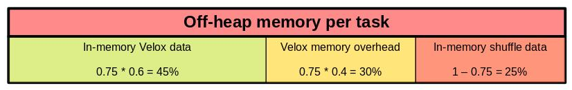

Currently, the mvn script can automatically fetch and build all dependency libraries incluing Velox and Arrow. Our nightly build still use Velox under oap-project. 

# Prerequisite

Currently, Gluten+Velox backend is only tested on **Ubuntu20.04/Ubuntu22.04/Centos8**. Other kinds of OS support are still in progress. The long term goal is to support several
common OS and conda env deployment.

Gluten builds with Spark3.2.x and Spark3.3.x now but only fully tested in CI with 3.2.2 and 3.3.1. We will add/update supported/tested versions according to the upstream changes. 

Velox uses the script `scripts/setup-xxx.sh` to install all dependency libraries, but Arrow's dependency libraries are not installed. Velox also requires ninja for compilation.
So we need to install all of them manually. Also, we need to set up the `JAVA_HOME` env. Currently, **java 8** is required and the support for java 11/17 is not ready.

```bash
## run as root
## install gcc and libraries to build arrow
apt-get update && apt-get install -y sudo locales wget tar tzdata git ccache cmake ninja-build build-essential llvm-11-dev clang-11 libiberty-dev libdwarf-dev libre2-dev libz-dev libssl-dev libboost-all-dev libcurl4-openssl-dev openjdk-8-jdk maven
```

**For x86_64**

```bash
## make sure jdk8 is used
export JAVA_HOME=/usr/lib/jvm/java-8-openjdk-amd64
export PATH=$JAVA_HOME/bin:$PATH
```

**For aarch64**

```bash
## make sure jdk8 is used
export JAVA_HOME=/usr/lib/jvm/java-8-openjdk-arm64
export PATH=$JAVA_HOME/bin:$PATH
```

**Get gluten**

```bash
## config maven, like proxy in ~/.m2/settings.xml

## fetch gluten code
git clone https://github.com/oap-project/gluten.git
```

# Build Gluten with Velox Backend

It's recommended to use buildbundle-veloxbe.sh and build gluten in one script.
[Gluten Usage](./GlutenUsage.md) listed the parameters and their default value of build command for your reference.

**For x86_64 build**

```bash
cd /path_to_gluten

## The script builds two jars for spark 3.2.2 and 3.3.1.
./dev/buildbundle-veloxbe.sh

## When you have successfully compiled once and changed some codes then compile again.
## you may use following command to skip the arrow, velox and protobuf build
# ./dev/buildbundle-veloxbe.sh --build_arrow_from_source=OFF --build_velox_from_source=OFF --build_protobuf=OFF
```

**For aarch64 build:**

```bash
export CPU_TARGET="aarch64"

cd /path_to_gluten

./dev/builddeps-veloxbe.sh
```

**Build Velox or Arrow separately**

Scripts under `/path_to_gluten/ep/build-xxx/src` provide `get_xxx.sh` and `build_xxx.sh` to build Velox or Arrow separately, you could use these scripts with custom repo/branch/location.

Velox can use pre-build arrow/parquet lib from ARROW_HOME parsed by --arrow_home to decrease build time.
Gluten cpp module need a required VELOX_HOME parsed by --velox_home and an optional ARROW_HOME by --arrow_home, if you specify custom ep location, make sure these variables be passed correctly.

```bash
## fetch Arrow and compile
cd /path_to_gluten/ep/build-arrow/src/
## you could use custom ep location by --arrow_home=custom_path, make sure specify --arrow_home in build_arrow.sh too.
./get_arrow.sh
./build_arrow.sh

## fetch Velox and compile
cd /path_to_gluten/ep/build-velox/src/
## you could use custom ep location by --velox_home=custom_path, make sure specify --velox_home in build_velox.sh too.
./get_velox.sh
## make sure specify --arrow_home or --velox_home if you have specified it in get_xxx.sh.
./build_velox.sh

## compile Gluten cpp module
cd /path_to_gluten/cpp
## if you use custom velox_home or arrow_home, make sure specified here by --arrow_home or --velox_home 
./compile.sh --build_velox_backend=ON
make -j

## compile Gluten java module and create package jar
cd /path_to_gluten
# For spark3.2.x
mvn clean package -Pbackends-velox -Prss -Pspark-3.2 -DskipTests
# For spark3.3.x
mvn clean package -Pbackends-velox -Prss -Pspark-3.3 -DskipTests
```

notes：The compilation of `Velox` using the script of `build_velox.sh` may fail caused by `oom`, you can prevent this failure by using the user command of `export NUM_THREADS=4` before executing the above scripts.

Once building successfully, the Jar file will be generated in the directory: package/target/\<gluten-jar\> for Spark 3.2.2/Spark 3.3.1.

## HDFS support

Hadoop hdfs support is ready via the [libhdfs3](https://github.com/apache/hawq/tree/master/depends/libhdfs3) library. The libhdfs3 provides native API for Hadoop I/O without the drawbacks of JNI. It also provides advanced authentication like Kerberos based. Please note this library has several dependencies which may require extra installations on Driver and Worker node.

### Build with HDFS support
To build Gluten with HDFS support, below command is suggested:

```bash
cd /path_to_gluten
./dev/buildbundle-veloxbe.sh --enable_hdfs=ON
```

### Configuration about HDFS support
 
HDFS uris (hdfs://host:port) will be extracted from a valid hdfs file path to initialize hdfs client, you do not need to specify it explicitly.

libhdfs3 need a configuration file and [example here](https://github.com/apache/hawq/blob/e9d43144f7e947e071bba48871af9da354d177d0/src/backend/utils/misc/etc/hdfs-client.xml), this file is a bit different from hdfs-site.xml and core-site.xml.
Download that example config file to local and do some needed modifications to support HA or else, then set env variable like below to use it, or upload it to HDFS to use, more details [here](https://github.com/apache/hawq/blob/e9d43144f7e947e071bba48871af9da354d177d0/depends/libhdfs3/src/client/Hdfs.cpp#L171-L189).

```
// Spark local mode
export LIBHDFS3_CONF="/path/to/hdfs-client.xml"

// Spark Yarn cluster mode
--conf spark.executorEnv.LIBHDFS3_CONF="/path/to/hdfs-client.xml"

// Spark Yarn cluster mode and upload hdfs config file
cp /path/to/hdfs-client.xml hdfs-client.xml
--files hdfs-client.xml
```

### Kerberos support

Here are two steps to enable kerberos.

- Make sure the hdfs-client.xml contains

```xml
<property>
    <name>hadoop.security.authentication</name>
    <value>kerberos</value>
</property>
```

- Specify the environment variable [KRB5CCNAME](https://github.com/apache/hawq/blob/e9d43144f7e947e071bba48871af9da354d177d0/depends/libhdfs3/src/client/FileSystem.cpp#L56) and upload the kerberos ticket cache file

```
--conf spark.executorEnv.KRB5CCNAME=krb5cc_0000  --files /tmp/krb5cc_0000
```

The ticket cache file can be found by `klist`.

## AWS S3 support

Velox supports S3 with the open source [AWS C++ SDK](https://github.com/aws/aws-sdk-cpp) and Gluten uses Velox S3 connector to connect with S3.
A new build option for S3(enable_s3) is added. Below command is used to enable this feature

```
cd /path_to_gluten
./dev/buildbundle-veloxbe.sh --enable_s3=ON
```

Currently there are several ways to asscess S3 in Spark. Please refer [Velox S3](VeloxS3.md) part for more detailed configurations

## Celeborn support

Gluten with velox backend supports [Celeborn](https://github.com/apache/incubator-celeborn) as remote shuffle service. Below introduction is used to enable this feature

First refer to this URL(https://github.com/apache/incubator-celeborn) to setup a celeborn cluster.

Then compile Gluten according to the following statement

```
mvn clean package -Pbackends-velox -Pspark-3.3 -Prss -DskipTests
```

Currently to use Celeborn following configurations are required in spark-defaults.conf

```
spark.shuffle.manager org.apache.spark.shuffle.gluten.celeborn.CelebornShuffleManager

# celeborn master
spark.celeborn.master.endpoints clb-master:9097

# we recommend set spark.celeborn.push.replicate.enabled to true to enable server-side data replication
# If you have only one worker, this setting must be false 
spark.celeborn.push.replicate.enabled true

spark.celeborn.shuffle.writer hash
spark.shuffle.service.enabled false
spark.sql.adaptive.localShuffleReader.enabled false

# If you want to use dynamic resource allocation,
# please refer to this URL (https://github.com/apache/incubator-celeborn/tree/main/assets/spark-patch) to apply the patch into your own Spark.
spark.dynamicAllocation.enabled false
```

# Coverage
Spark3.3 has 387 functions in total. ~240 are commonly used. Velox's functions have two category, Presto and Spark. Presto has 124 functions implemented. Spark has 62 functions. Spark functions are verified to have the same result as Vanilla Spark. Some Presto functions have the same result as Vanilla Spark but some others have different. Gluten prefer to use Spark functions firstly. If it's not in Spark's list but implemented in Presto, we currently offload to Presto one until we noted some result mismatch, then we need to reimplement the function in Spark category. Gluten currently offloads 94 functions and 14 operators, more details refer to [The Operators and Functions Support Progress](../SupportProgress.md).

> Velox doesn't support [ANSI mode](https://spark.apache.org/docs/latest/sql-ref-ansi-compliance.html)), so as Gluten. Once ANSI mode is enabled in Spark config, Gluten will fallback to Vanilla Spark.

To identify what can be offloaded in a query and detailed fallback reasons, user can follow below steps to retrieve corresponding logs.

```
1) Enable Gluten by proper [configuration](https://github.com/oap-project/gluten/blob/main/docs/Configuration.md).

2) Disable Spark AQE to trigger plan validation in Gluten
spark.sql.adaptive.enabled = false

3) Check physical plan 
sparkSession.sql("your_sql").explain()
```

With above steps, you will get a physical plan output like:

```
== Physical Plan ==
-Execute InsertIntoHiveTable (7)
  +- Coalesce (6)
    +- VeloxColumnarToRowExec (5)
      +- ^ ProjectExecTransformer (3)
        +- GlutenRowToArrowColumnar (2)
          +- Scan hive default.extracted_db_pins (1)

```

"GlutenRowToArrowColumnar" and "VeloxColumnarToRowExec" indicate there is a fallback and you may find related log with key words "due to" like:

```
native validation failed due to: in ProjectRel, Scalar function name not registered: get_struct_field, called with arguments: (ROW<col_0:INTEGER,col_1:BIGINT,col_2:BIGINT>, INTEGER).
```

# High-Bandwidth Memory (HBM) support

Gluten supports allocating memory on HBM. This feature is optional and is disabled by default. It is implemented on top of [Memkind library](http://memkind.github.io/memkind/). You can refer to memkind's [readme](https://github.com/memkind/memkind#memkind) for more details.

## Build Gluten with HBM

Gluten will internally build and link to a specific version of Memkind library and [hwloc](https://github.com/open-mpi/hwloc). Other dependencies should be installed on Driver and Worker node first:

```bash
sudo apt install -y autoconf automake g++ libnuma-dev libtool numactl unzip libdaxctl-dev
```

After the set-up, you can now build Gluten with HBM. Below command is used to enable this feature

```bash
cd /path_to_gluten

## The script builds two jars for spark 3.2.2 and 3.3.1.
./dev/buildbundle-veloxbe.sh --enable_hbm=ON
```

## Configure and enable HBM in Spark Application

At runtime, `MEMKIND_HBW_NODES` enviroment variable is detected for configuring HBM NUMA nodes. For the explaination to this variable, please refer to memkind's manual page. This can be set for all executors through spark conf, e.g. `--conf spark.executorEnv.MEMKIND_HBW_NODES=8-15`. Note that memory allocation fallback is also supported and cannot be turned off. If HBM is unavailable or fills up, the allocator will use default(DDR) memory.

# Spill (Experimental)

Velox backend supports spilling-to-disk.

Using the following configuration options to customize spilling:

| Name                                                                     | Default Value  | Description                                                                                                                                                                                                                     |
|--------------------------------------------------------------------------|----------------|---------------------------------------------------------------------------------------------------------------------------------------------------------------------------------------------------------------------------------|
| spark.gluten.sql.columnar.backend.velox.spillStrategy                    | threshold      | none: Disable spill on Velox backend; threshold: Use spark.gluten.sql.columnar.backend.velox.memoryCapRatio to calculate a memory threshold number for triggering spill; auto: Let Spark memory manager manage Velox's spilling |
| spark.gluten.sql.columnar.backend.velox.memoryCapRatio                   | 0.75           | The overall ratio of total off-heap memory Velox is able to allocate from. If this value is set lower, spill will be triggered more frequently.                                                                                 |
| spark.gluten.sql.columnar.backend.velox.aggregationSpillEnabled          | true           | Whether spill is enabled on aggregations                                                                                                                                                                                        |
| spark.gluten.sql.columnar.backend.velox.joinSpillEnabled                 | true           | Whether spill is enabled on joins                                                                                                                                                                                               |
| spark.gluten.sql.columnar.backend.velox.orderBySpillEnabled              | true           | Whether spill is enabled on sorts                                                                                                                                                                                               |
| spark.gluten.sql.columnar.backend.velox.spillMemoryThresholdRatio        | 0.6            | Overall size ratio (in percentage) in task memory for spilling data. This will automatically set values for options <operator>SpillMemoryThreshold if they were not set                                                         |
| spark.gluten.sql.columnar.backend.velox.aggregationSpillMemoryThreshold  | 0              | Memory limit before spilling to disk for aggregations, per Spark task. Unit: byte                                                                                                                                               |
| spark.gluten.sql.columnar.backend.velox.joinSpillMemoryThreshold         | 0              | Memory limit before spilling to disk for joins, per Spark task. Unit: byte                                                                                                                                                      |
| spark.gluten.sql.columnar.backend.velox.orderBySpillMemoryThreshold      | 0              | Memory limit before spilling to disk for sorts, per Spark task. Unit: byte                                                                                                                                                      |
| spark.gluten.sql.columnar.backend.velox.maxSpillLevel                    | 4              | The max allowed spilling level with zero being the initial spilling level                                                                                                                                                       |
| spark.gluten.sql.columnar.backend.velox.maxSpillFileSize                 | 0              | The max allowed spill file size. If it is zero, then there is no limit                                                                                                                                                          |
| spark.gluten.sql.columnar.backend.velox.minSpillRunSize                  | 268435456      | The min spill run size limit used to select partitions for spilling                                                                                                                                                             |
| spark.gluten.sql.columnar.backend.velox.spillStartPartitionBit           | 29             | The start partition bit which is used with 'spillPartitionBits' together to calculate the spilling partition number                                                                                                             |
| spark.gluten.sql.columnar.backend.velox.spillPartitionBits               | 2              | The number of bits used to calculate the spilling partition number. The number of spilling partitions will be power of two                                                                                                      |
| spark.gluten.sql.columnar.backend.velox.spillableReservationGrowthPct    | 25             | The spillable memory reservation growth percentage of the previous memory reservation size                                                                                                                                      |

## Guidance to tune against spilling

Gluten enables spilling-to-disk by default. However, manual tweaking may still be required if user wants to get it working at the best situation.

The following tips may help when you are trying to tune against spilling-related configuration options:

* `spark.gluten.sql.columnar.backend.velox.memoryCapRatio`

  This is to set the memory cap limit (represented as MEMORY_LIMIT) for Velox backend. The formula is: MEMORY_LIMIT = offHeap.size * memoryCapRatio. OOM will be raised if the memory usage exceeds this limit.

* `spark.gluten.sql.columnar.backend.velox.spillMemoryThresholdRatio`

  This is to set the spill limit (represented as SPILL_LIMIT) for Velox operators during execution. The formula is: SPILL_LIMIT = MEMORY_LIMIT * spillMemoryThresholdRatio. Once the allocated memory by Velox becomes larger than this size, a spill request will be sent to the current active operator to force spilling-to-disk procedure before it continues processing. 

Please refer to the figure below:



You can see that the 25% of off-heap memory (controlled by spark.gluten.sql.columnar.backend.velox.memoryCapRatio) is mainly preserved for storing shuffle data which is not controlled by Velox task.

The 30% of off-heap memory is preserved for the operators in Velox that doesn't yet support spilling so far, for example, the window operator.

It's worth noting that the 45% of off-heap memory is not shared across Velox operators in a single task. This could cause OOM if more than one memory-consuming operators are there in the task. If so, please try decreasing `spark.gluten.sql.columnar.backend.velox.spillMemoryThresholdRatio` to make each operator manage its own share. 

# Intel® QuickAssist Technology (QAT) support

Gluten supports using Intel® QuickAssist Technology (QAT) for data compression during Spark Shuffle. It benefits from QAT Hardware-based acceleration on compression/decompression, and uses Gzip as compression format for higher compression ratio to reduce the pressure on disks and network transmission.

This feature is based on QAT driver library and [QATzip](https://github.com/intel/QATzip) library. Please manually download QAT driver for your system, and follow its README to build and install on all Driver and Worker node: [Intel® QuickAssist Technology Driver for Linux* – HW Version 2.0](https://www.intel.com/content/www/us/en/download/765501/intel-quickassist-technology-driver-for-linux-hw-version-2-0.html?wapkw=quickassist).

## Build Gluten with QAT

Gluten will internally build and link to a specific version of QATzip library. Please **uninstall QATzip library** before building Gluten if it's already installed. Additional environment set-up are also required:

1. Setup ICP_ROOT environment variable. This environment variable is required during building Gluten and running Spark applicaitons. It's recommended to put it in .bashrc on Driver and Worker node.

```bash
export ICP_ROOT=/path_to_QAT_driver
```
2. **This step is required if your application is running as Non-root user**. The users must be added to the 'qat' group after QAT drvier is installed:

```bash
sudo usermod -aG qat username # need to relogin
```
Change the amount of max locked memory for the username that is included in the group name. This can be done by specifying the limit in /etc/security/limits.conf. To set 500MB add a line like this in /etc/security/limits.conf:

```bash
cat /etc/security/limits.conf |grep qat
@qat - memlock 500000
```

3. Enable huge page as root user. **Note that this step is required to execute each time after system reboot.**

```bash
 echo 1024 > /sys/kernel/mm/hugepages/hugepages-2048kB/nr_hugepages
 rmmod usdm_drv
 insmod $ICP_ROOT/build/usdm_drv.ko max_huge_pages=1024 max_huge_pages_per_process=32
```
 
After the set-up, you can now build Gluten with QAT. Below command is used to enable this feature

```bash
cd /path_to_gluten

## The script builds two jars for spark 3.2.2 and 3.3.1.
./dev/buildbundle-veloxbe.sh --enable_qat=ON
```

## Enable QAT with Gzip Compression for shuffle compression

1. To enable QAT at run-time, first make sure you have the right QAT configuration file at /etc/4xxx_devX.conf. We provide a [example configuration file](../qat/4x16.conf). This configuration sets up to 4 processes that can bind to 1 QAT, and each process can use up to 16 QAT DC instances.

```bash
## run as root
## Overwrite QAT configuration file.
cd /etc
for i in {0..7}; do echo "4xxx_dev$i.conf"; done | xargs -i cp -f /path_to_gluten/docs/qat/4x16.conf {}
## Restart QAT after updating configuration files.
adf_ctl restart
```

2. Check QAT status and make sure the status is up

```bash
adf_ctl status
```

The output should be like:

```
Checking status of all devices.
There is 8 QAT acceleration device(s) in the system:
 qat_dev0 - type: 4xxx,  inst_id: 0,  node_id: 0,  bsf: 0000:6b:00.0,  #accel: 1 #engines: 9 state: up
 qat_dev1 - type: 4xxx,  inst_id: 1,  node_id: 1,  bsf: 0000:70:00.0,  #accel: 1 #engines: 9 state: up
 qat_dev2 - type: 4xxx,  inst_id: 2,  node_id: 2,  bsf: 0000:75:00.0,  #accel: 1 #engines: 9 state: up
 qat_dev3 - type: 4xxx,  inst_id: 3,  node_id: 3,  bsf: 0000:7a:00.0,  #accel: 1 #engines: 9 state: up
 qat_dev4 - type: 4xxx,  inst_id: 4,  node_id: 4,  bsf: 0000:e8:00.0,  #accel: 1 #engines: 9 state: up
 qat_dev5 - type: 4xxx,  inst_id: 5,  node_id: 5,  bsf: 0000:ed:00.0,  #accel: 1 #engines: 9 state: up
 qat_dev6 - type: 4xxx,  inst_id: 6,  node_id: 6,  bsf: 0000:f2:00.0,  #accel: 1 #engines: 9 state: up
 qat_dev7 - type: 4xxx,  inst_id: 7,  node_id: 7,  bsf: 0000:f7:00.0,  #accel: 1 #engines: 9 state: up
```

3. Extra Gluten configurations are required when starting Spark application

```
--conf spark.gluten.sql.columnar.shuffle.codec=gzip
--conf spark.gluten.sql.columnar.shuffle.codecBackend=qat
```

4. You can use below command to check whether QAT is working normally at run-time. The value of fw_counters should continue to increase during shuffle. 

```
while :; do cat /sys/kernel/debug/qat_4xxx_0000:6b:00.0/fw_counters; sleep 1; done
```

## QAT driver references

**Documentation**

[README Text Files (README_QAT20.L.1.0.0-00021.txt)](https://downloadmirror.intel.com/765523/README_QAT20.L.1.0.0-00021.txt)

**Release Notes**

Check out the [Intel® QuickAssist Technology Software for Linux*](https://www.intel.com/content/www/us/en/content-details/632507/intel-quickassist-technology-intel-qat-software-for-linux-release-notes-hardware-version-2-0.html) - Release Notes for the latest changes in this release.

**Getting Started Guide**

Check out the [Intel® QuickAssist Technology Software for Linux*](https://www.intel.com/content/www/us/en/content-details/632506/intel-quickassist-technology-intel-qat-software-for-linux-getting-started-guide-hardware-version-2-0.html) - Getting Started Guide for detailed installation instructions.

**Programmer's Guide**

Check out the [Intel® QuickAssist Technology Software for Linux*](https://www.intel.com/content/www/us/en/content-details/743912/intel-quickassist-technology-intel-qat-software-for-linux-programmers-guide-hardware-version-2-0.html) - Programmer's Guide for software usage guidelines.

For more Intel® QuickAssist Technology resources go to [Intel® QuickAssist Technology (Intel® QAT)](https://developer.intel.com/quickassist)

# Intel® In-memory Analytics Accelerator (IAA/IAX) support

Similar to Intel® QAT, Gluten supports using Intel® In-memory Analytics Accelerator (IAA, also called IAX) for data compression during Spark Shuffle. It benefits from IAA Hardware-based acceleration on compression/decompression, and uses Gzip as compression format for higher compression ratio to reduce the pressure on disks and network transmission.

This feature is based on Intel® [QPL](https://github.com/intel/qpl).

## Build Gluten with IAA

Gluten will internally build and link to a specific version of QPL library, but extra environment setup is still required. Please refer to [QPL Installation Guide](https://intel.github.io/qpl/documentation/get_started_docs/installation.html) to install dependencies and configure accelerators.

**This step is required if your application is running as Non-root user**. Create a group for the users who have privilege to use IAA, and grant group iaa read/write access to the IAA Work-Queues.

```bash
sudo groupadd iaa
sudo usermod -aG iaa username # need to relogin
sudo chgrp -R iaa /dev/iax
sudo chmod -R g+rw /dev/iax
```
 
After the set-up, you can now build Gluten with QAT. Below command is used to enable this feature

```bash
cd /path_to_gluten

## The script builds two jars for spark 3.2.2 and 3.3.1.
./dev/buildbundle-veloxbe.sh --enable_iaa=ON
```

## Enable IAA with Gzip Compression for shuffle compression

1. To enable QAT at run-time, first make sure you have configured the IAA Work-Queues correctly, and the file permissions of /dev/iax/wqX.0 are correct.

```bash
sudo ls -l /dev/iax
```

The output should be like:
```
total 0
crw-rw---- 1 root iaa 509, 0 Apr  5 18:54 wq1.0
crw-rw---- 1 root iaa 509, 5 Apr  5 18:54 wq11.0
crw-rw---- 1 root iaa 509, 6 Apr  5 18:54 wq13.0
crw-rw---- 1 root iaa 509, 7 Apr  5 18:54 wq15.0
crw-rw---- 1 root iaa 509, 1 Apr  5 18:54 wq3.0
crw-rw---- 1 root iaa 509, 2 Apr  5 18:54 wq5.0
crw-rw---- 1 root iaa 509, 3 Apr  5 18:54 wq7.0
crw-rw---- 1 root iaa 509, 4 Apr  5 18:54 wq9.0
```

2. Extra Gluten configurations are required when starting Spark application

```
--conf spark.gluten.sql.columnar.shuffle.codec=gzip
--conf spark.gluten.sql.columnar.shuffle.codecBackend=iaa
```

## IAA references

**Intel® IAA Enabling Guide**

Check out the [Intel® In-Memory Analytics Accelerator (Intel® IAA) Enabling Guide](https://www.intel.com/content/www/us/en/developer/articles/technical/intel-iaa-enabling-guide.html)

**Intel® QPL Documentation**

Check out the [Intel® Query Processing Library (Intel® QPL) Documentation](https://intel.github.io/qpl/index.html)

# Test TPC-H or TPC-DS on Gluten with Velox backend

All TPC-H and TPC-DS queries are supported in Gluten Velox backend.  

## Data preparation

The data generation scripts are [TPC-H dategen script](../backends-velox/workload/tpch/gen_data/parquet_dataset/tpch_datagen_parquet.sh) and
[TPC-DS dategen script](../backends-velox/workload/tpcds/gen_data/parquet_dataset/tpcds_datagen_parquet.sh).

The used TPC-H and TPC-DS queries are the original ones, and can be accessed from [TPC-DS queries](../gluten-core/src/test/resources/tpcds-queries/tpcds.queries.original)
and [TPC-H queries](../gluten-core/src/test/resources/tpch-queries).

Some other versions of TPC-DS and TPC-H queries are also provided, but are **not** recommended for testing, including:
- the modified TPC-H queries with "Date-to-String" conversions: [TPC-H non-date queries](../tools/gluten-it/src/main/resources/tpch-queries-nodate) (outdated).
- the modified TPC-DS queries with "Decimal-to-Double": [TPC-DS non-decimal queries](../gluten-core/src/test/resources/tpcds-queries/tpcds.queries.no-decimal) (outdated).
- the modified TPC-DS queries with "Decimal-to-Double" and "Date-to-String" conversions: [TPC-DS modified queries](../tools/gluten-it/src/main/resources/tpcds-queries-nodecimal-nodate) (outdated).

## Submit the Spark SQL job

Submit test script from spark-shell. You can find the scala code to [Run TPC-H](../backends-velox/workload/tpch/run_tpch/tpch_parquet.scala) as an example. Please remember to modify the location of TPC-H files as well as TPC-H queries in backends-velox/workload/tpch/run_tpch/tpch_parquet.scala before you run the testing. 

```
var parquet_file_path = "/PATH/TO/TPCH_PARQUET_PATH"
var gluten_root = "/PATH/TO/GLUTEN"
```

Below script shows an example about how to run the testing, you should modify the parameters such as executor cores, memory, offHeap size based on your environment. 

```bash
export GLUTEN_JAR = /PATH/TO/GLUTEN/backends-velox/target/<gluten-jar>
cat tpch_parquet.scala | spark-shell --name tpch_powertest_velox \
  --master yarn --deploy-mode client \
  --conf spark.plugins=io.glutenproject.GlutenPlugin \
  --conf spark.gluten.sql.columnar.backend.lib=velox \
  --conf spark.driver.extraClassPath=${GLUTEN_JAR} \
  --conf spark.executor.extraClassPath=${GLUTEN_JAR} \
  --conf spark.memory.offHeap.enabled=true \
  --conf spark.memory.offHeap.size=20g \
  --conf spark.gluten.sql.columnar.forceShuffledHashJoin=true \
  --conf spark.shuffle.manager=org.apache.spark.shuffle.sort.ColumnarShuffleManager \
  --num-executors 6 \
  --executor-cores 6 \
  --driver-memory 20g \
  --executor-memory 25g \
  --conf spark.executor.memoryOverhead=5g \
  --conf spark.driver.maxResultSize=32g
```

Refer to [Gluten parameters ](../Configuration.md) for more details of each parameter used by Gluten.

## Result
*wholestagetransformer* indicates that the offload works.


## Performance

Below table shows the TPC-H Q1 and Q6 Performance in a multiple-thread test (--num-executors 6 --executor-cores 6) for Velox and vanilla Spark.
Both Parquet and ORC datasets are sf1024.

| Query Performance (s) | Velox (ORC) | Vanilla Spark (Parquet) | Vanilla Spark (ORC) |
|---------------- | ----------- | ------------- | ------------- |
| TPC-H Q6 | 13.6 | 21.6  | 34.9 |
| TPC-H Q1 | 26.1 | 76.7 | 84.9 |

# External reference setup

TO ease your first-hand experience of using Gluten, we have set up an external reference cluster. If you are interested, please contact Weiting.Chen@intel.com.
