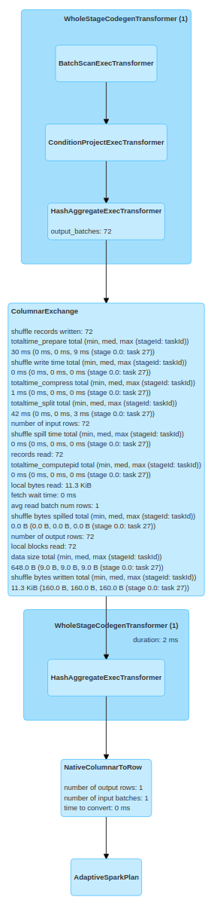

Currently, the mvn script can automatically fetch and build all dependency libraries incluing Velox and Arrow. Our nightly build still use Velox under oap-project. 

# Prerequisite

Currently, Gluten+Velox backend is only tested on **Ubuntu20.04/Ubuntu22.04/Centos8**. Other kinds of OS support are still in progress. The long term goal is to support several
common OS and conda env deployment.

Gluten builds with Spark3.2.x and Spark3.3.x now but only fully tested in CI with 3.2.2 and 3.3.1. We will add/update supported/tested versions according to the upstream changes. 

Velox uses the script `scripts/setup-xxx.sh` to install all dependency libraries, but Arrow's dependency libraries are not installed. Velox also requires ninja for compilation.
So we need to install all of them manually. Also, we need to set up the `JAVA_HOME` env. Currently, **java 8** is required and the support for java 11/17 is not ready.

```bash
## run as root
## install gcc and libraries to build arrow
apt-get update && apt-get install -y sudo locales wget tar tzdata git ccache cmake ninja-build build-essential llvm-11-dev clang-11 libiberty-dev libdwarf-dev libre2-dev libz-dev libssl-dev libboost-all-dev libcurl4-openssl-dev openjdk-8-jdk maven
```

**For x86_64**

```bash
## make sure jdk8 is used
export JAVA_HOME=/usr/lib/jvm/java-8-openjdk-amd64
export PATH=$JAVA_HOME/bin:$PATH
```

**For aarch64**

```bash
## make sure jdk8 is used
export JAVA_HOME=/usr/lib/jvm/java-8-openjdk-arm64
export PATH=$JAVA_HOME/bin:$PATH
```

**Get gluten**

```bash
## config maven, like proxy in ~/.m2/settings.xml

## fetch gluten code
git clone https://github.com/oap-project/gluten.git
```

# Build Gluten with Velox Backend

It's recommended to use buildbundle-veloxbe.sh and build gluten in one script.
[Gluten Usage](./GlutenUsage.md) listed the parameters and their default value of build command for your reference.

**For x86_64 build**

```bash
cd /path/to/gluten

## The script builds two jars for spark 3.2.2 and 3.3.1.
./dev/buildbundle-veloxbe.sh

## After a complete build, if you need to re-build the project and only some gluten code is changed,
## you can use the following command to skip building arrow, velox and protobuf.
# ./dev/buildbundle-veloxbe.sh --skip_build_ep=ON --build_protobuf=OFF
```

**For aarch64 build:**

```bash
export CPU_TARGET="aarch64"

cd /path/to/gluten

./dev/builddeps-veloxbe.sh
```

**Build Velox or Arrow separately**

Scripts under `/path/to/gluten/ep/build-xxx/src` provide `get_xxx.sh` and `build_xxx.sh` to build Velox or Arrow separately, you could use these scripts with custom repo/branch/location.

Velox can use pre-build arrow/parquet lib from ARROW_HOME parsed by --arrow_home to decrease build time.
Gluten cpp module need a required VELOX_HOME parsed by --velox_home and an optional ARROW_HOME by --arrow_home, if you specify custom ep location, make sure these variables be passed correctly.

```bash
## fetch Arrow and compile
cd /path/to/gluten/ep/build-arrow/src/
## you could use custom ep location by --arrow_home=custom_path, make sure specify --arrow_home in build_arrow.sh too.
./get_arrow.sh
./build_arrow.sh

## fetch Velox and compile
cd /path/to/gluten/ep/build-velox/src/
## you could use custom ep location by --velox_home=custom_path, make sure specify --velox_home in build_velox.sh too.
./get_velox.sh
## make sure specify --arrow_home or --velox_home if you have specified it in get_xxx.sh.
./build_velox.sh

## compile Gluten cpp module
cd /path/to/gluten/cpp
## if you use custom velox_home or arrow_home, make sure specified here by --arrow_home or --velox_home 
./compile.sh --build_velox_backend=ON

## compile Gluten java module and create package jar
cd /path/to/gluten
# For spark3.2.x
mvn clean package -Pbackends-velox -Prss -Pspark-3.2 -DskipTests
# For spark3.3.x
mvn clean package -Pbackends-velox -Prss -Pspark-3.3 -DskipTests
```

notes：The compilation of `Velox` using the script of `build_velox.sh` may fail caused by `oom`, you can prevent this failure by using the user command of `export NUM_THREADS=4` before executing the above scripts.

Once building successfully, the Jar file will be generated in the directory: package/target/\<gluten-jar\> for Spark 3.2.x/Spark 3.3.x.

## Dependency library deployment

With config `enable_vcpkg=ON`, the dependency libraries will be built and staticly linked into libvelox.so and libgluten.so, which is packed into the gluten-jar. In this way, only the gluten-jar is needed to add to `spark.<driver|executor>.extraClassPath` and spark will deploy the jar to each worker node. It's better to build the static version using a clean docker image without any extra libraries installed. On host with some libraries like jemalloc installed, the script may crash with odd message. You may need to uninstall those libraries to get a clean host.

With config `enable_vcpkg=OFF`, the dependency libraries won't be staticly linked, instead the script will install the libraries to system then pack the dependency libraries into another jar named gluten-package-<version>-SNAPSHOT.jar. Then you need to add the jar to extraClassPath then set `spark.gluten.loadLibFromJar=true`. Or you already manually deployed the dependency libraries on each worker node. You may find the libraries list from the gluten-package jar.

## HDFS support

Hadoop hdfs support is ready via the [libhdfs3](https://github.com/apache/hawq/tree/master/depends/libhdfs3) library. The libhdfs3 provides native API for Hadoop I/O without the drawbacks of JNI. It also provides advanced authentication like Kerberos based. Please note this library has several dependencies which may require extra installations on Driver and Worker node.

### Build with HDFS support
To build Gluten with HDFS support, below command is suggested:

```bash
cd /path/to/gluten
./dev/buildbundle-veloxbe.sh --enable_hdfs=ON
```

### Configuration about HDFS support
 
HDFS uris (hdfs://host:port) will be extracted from a valid hdfs file path to initialize hdfs client, you do not need to specify it explicitly.

libhdfs3 need a configuration file and [example here](https://github.com/apache/hawq/blob/e9d43144f7e947e071bba48871af9da354d177d0/src/backend/utils/misc/etc/hdfs-client.xml), this file is a bit different from hdfs-site.xml and core-site.xml.
Download that example config file to local and do some needed modifications to support HA or else, then set env variable like below to use it, or upload it to HDFS to use, more details [here](https://github.com/apache/hawq/blob/e9d43144f7e947e071bba48871af9da354d177d0/depends/libhdfs3/src/client/Hdfs.cpp#L171-L189).

```
// Spark local mode
export LIBHDFS3_CONF="/path/to/hdfs-client.xml"

// Spark Yarn cluster mode
--conf spark.executorEnv.LIBHDFS3_CONF="/path/to/hdfs-client.xml"

// Spark Yarn cluster mode and upload hdfs config file
cp /path/to/hdfs-client.xml hdfs-client.xml
--files hdfs-client.xml
```

One typical deployment on Spark/HDFS cluster is to enable [short-circuit reading](https://hadoop.apache.org/docs/stable/hadoop-project-dist/hadoop-hdfs/ShortCircuitLocalReads.html). Short-circuit reads provide a substantial performance boost to many applications.

By default libhdfs3 does not set the default hdfs domain socket path to support HDFS short-circuit read. If this feature is required in HDFS setup, users may need to setup the domain socket path correctly by patching the libhdfs3 source code or by setting the correct config environment. In Gluten the short-circuit domain socket path is set to "/var/lib/hadoop-hdfs/dn_socket" in [build_velox.sh](https://github.com/oap-project/gluten/blob/main/ep/build-velox/src/build_velox.sh) So we need to make sure the folder existed and user has write access as below script.

```
sudo mkdir -p /var/lib/hadoop-hdfs/
sudo chown <sparkuser>:<sparkuser> /var/lib/hadoop-hdfs/
```

You also need to add configuration to the "hdfs-site.xml" as below:

```
<property>
   <name>dfs.client.read.shortcircuit</name>
   <value>true</value>
</property>
<property>
   <name>dfs.domain.socket.path</name>
   <value>/var/lib/hadoop-hdfs/dn_socket</value>
</property>
```

### Kerberos support

Here are two steps to enable kerberos.

- Make sure the hdfs-client.xml contains

```xml
<property>
    <name>hadoop.security.authentication</name>
    <value>kerberos</value>
</property>
```

- Specify the environment variable [KRB5CCNAME](https://github.com/apache/hawq/blob/e9d43144f7e947e071bba48871af9da354d177d0/depends/libhdfs3/src/client/FileSystem.cpp#L56) and upload the kerberos ticket cache file

```
--conf spark.executorEnv.KRB5CCNAME=krb5cc_0000  --files /tmp/krb5cc_0000
```

The ticket cache file can be found by `klist`.

## AWS S3 support

Velox supports S3 with the open source [AWS C++ SDK](https://github.com/aws/aws-sdk-cpp) and Gluten uses Velox S3 connector to connect with S3.
A new build option for S3(enable_s3) is added. Below command is used to enable this feature

```
cd /path/to/gluten
./dev/buildbundle-veloxbe.sh --enable_s3=ON
```

Currently there are several ways to asscess S3 in Spark. Please refer [Velox S3](VeloxS3.md) part for more detailed configurations

## Celeborn support

Gluten with velox backend supports [Celeborn](https://github.com/apache/incubator-celeborn) as remote shuffle service. Below introduction is used to enable this feature

First refer to this URL(https://github.com/apache/incubator-celeborn) to setup a celeborn cluster.

When compiling the Gluten Java module, it's required to enable `rss` profile, as follows:

```
mvn clean package -Pbackends-velox -Pspark-3.3 -Prss -DskipTests
```

Then add the Gluten and Spark Celeborn Client packages to your Spark application's classpath(usually add them into `$SPARK_HOME/jars`).

- Celeborn: celeborn-client-spark-3-shaded_2.12-0.3.0-incubating.jar
- Gluten: gluten-velox-bundle-spark3.x_2.12-xx-xx-SNAPSHOT.jar, gluten-thirdparty-lib-xx.jar

Currently to use Gluten following configurations are required in `spark-defaults.conf`

```
spark.shuffle.manager org.apache.spark.shuffle.gluten.celeborn.CelebornShuffleManager

# celeborn master
spark.celeborn.master.endpoints clb-master:9097

spark.shuffle.service.enabled false

# options: hash, sort
# Hash shuffle writer use (partition count) * (celeborn.push.buffer.max.size) * (spark.executor.cores) memory.
# Sort shuffle writer uses less memory than hash shuffle writer, if your shuffle partition count is large, try to use sort hash writer.  
spark.celeborn.client.spark.shuffle.writer hash

# We recommend setting spark.celeborn.client.push.replicate.enabled to true to enable server-side data replication
# If you have only one worker, this setting must be false 
# If your Celeborn is using HDFS, it's recommended to set this setting to false
spark.celeborn.client.push.replicate.enabled true

# Support for Spark AQE only tested under Spark 3
# we recommend setting localShuffleReader to false to get better performance of Celeborn
spark.sql.adaptive.localShuffleReader.enabled false

# If Celeborn is using HDFS
spark.celeborn.storage.hdfs.dir hdfs://<namenode>/celeborn

# If you want to use dynamic resource allocation,
# please refer to this URL (https://github.com/apache/incubator-celeborn/tree/main/assets/spark-patch) to apply the patch into your own Spark.
spark.dynamicAllocation.enabled false
```

# Coverage
Spark3.3 has 387 functions in total. ~240 are commonly used. Velox's functions have two category, Presto and Spark. Presto has 124 functions implemented. Spark has 62 functions. Spark functions are verified to have the same result as Vanilla Spark. Some Presto functions have the same result as Vanilla Spark but some others have different. Gluten prefer to use Spark functions firstly. If it's not in Spark's list but implemented in Presto, we currently offload to Presto one until we noted some result mismatch, then we need to reimplement the function in Spark category. Gluten currently offloads 94 functions and 14 operators, more details refer to [Velox Backend's Supported Operators & Functions](../velox-backend-support-progress.md).

> Velox doesn't support [ANSI mode](https://spark.apache.org/docs/latest/sql-ref-ansi-compliance.html)), so as Gluten. Once ANSI mode is enabled in Spark config, Gluten will fallback to Vanilla Spark.

To identify what can be offloaded in a query and detailed fallback reasons, user can follow below steps to retrieve corresponding logs.

```
1) Enable Gluten by proper [configuration](https://github.com/oap-project/gluten/blob/main/docs/Configuration.md).

2) Disable Spark AQE to trigger plan validation in Gluten
spark.sql.adaptive.enabled = false

3) Check physical plan 
sparkSession.sql("your_sql").explain()
```

With above steps, you will get a physical plan output like:

```
== Physical Plan ==
-Execute InsertIntoHiveTable (7)
  +- Coalesce (6)
    +- VeloxColumnarToRowExec (5)
      +- ^ ProjectExecTransformer (3)
        +- GlutenRowToArrowColumnar (2)
          +- Scan hive default.extracted_db_pins (1)

```

`GlutenRowToArrowColumnar`/`VeloxColumnarToRowExec` indicates there is a fallback operator before or after it. And you may find fallback reason like below in logs.

```
native validation failed due to: in ProjectRel, Scalar function name not registered: get_struct_field, called with arguments: (ROW<col_0:INTEGER,col_1:BIGINT,col_2:BIGINT>, INTEGER).
```

In the above, the symbol `^` indicates a plan is offloaded to Velox in a stage. In Spark DAG, all such pipelined plans (consecutive plans marked with `^`) are plotted
inside an umbrella node named `WholeStageCodegenTransformer` (It's not codegen node. The naming is just for making it well plotted like Spark Whole Stage Codegen).

# Spill (Experimental)

Velox backend supports spilling-to-disk.

Using the following configuration options to customize spilling:

| Name                                                                     | Default Value | Description                                                                                                                                                                       |
|--------------------------------------------------------------------------|---------------|-----------------------------------------------------------------------------------------------------------------------------------------------------------------------------------|
| spark.gluten.sql.columnar.backend.velox.spillStrategy                    | auto          | none: Disable spill on Velox backend; auto: Let Spark memory manager manage Velox's spilling                                                                                      |
| spark.gluten.sql.columnar.backend.velox.spillFileSystem                  | local         | The filesystem used to store spill data. local: The local file system. heap-over-local: Write files to JVM heap if having extra heap space. Otherwise write to local file system. |
| spark.gluten.sql.columnar.backend.velox.aggregationSpillEnabled          | true          | Whether spill is enabled on aggregations                                                                                                                                          |
| spark.gluten.sql.columnar.backend.velox.joinSpillEnabled                 | true          | Whether spill is enabled on joins                                                                                                                                                 |
| spark.gluten.sql.columnar.backend.velox.orderBySpillEnabled              | true          | Whether spill is enabled on sorts                                                                                                                                                 |
| spark.gluten.sql.columnar.backend.velox.aggregationSpillMemoryThreshold  | 0             | Memory limit before spilling to disk for aggregations, per Spark task. Unit: byte                                                                                                 |
| spark.gluten.sql.columnar.backend.velox.joinSpillMemoryThreshold         | 0             | Memory limit before spilling to disk for joins, per Spark task. Unit: byte                                                                                                        |
| spark.gluten.sql.columnar.backend.velox.orderBySpillMemoryThreshold      | 0             | Memory limit before spilling to disk for sorts, per Spark task. Unit: byte                                                                                                        |
| spark.gluten.sql.columnar.backend.velox.maxSpillLevel                    | 4             | The max allowed spilling level with zero being the initial spilling level                                                                                                         |
| spark.gluten.sql.columnar.backend.velox.maxSpillFileSize                 | 20MB          | The max allowed spill file size. If it is zero, then there is no limit                                                                                                            |
| spark.gluten.sql.columnar.backend.velox.minSpillRunSize                  | 268435456     | The min spill run size limit used to select partitions for spilling                                                                                                               |
| spark.gluten.sql.columnar.backend.velox.spillStartPartitionBit           | 29            | The start partition bit which is used with 'spillPartitionBits' together to calculate the spilling partition number                                                               |
| spark.gluten.sql.columnar.backend.velox.spillPartitionBits               | 2             | The number of bits used to calculate the spilling partition number. The number of spilling partitions will be power of two                                                        |
| spark.gluten.sql.columnar.backend.velox.spillableReservationGrowthPct    | 25            | The spillable memory reservation growth percentage of the previous memory reservation size                                                                                        |

# Velox User-Defined Functions (UDF)

## Introduction

Velox backend supports User-Defined Functions (UDF). Users can create their own functions using the UDF interface provided in Velox backend and build libraries for these functions. At runtime, the UDF are registered at the start of applications. Once registered, Gluten will be able to parse and offload these UDF into Velox during execution.

## Creating a UDF library

The following steps demonstrate how to set up a UDF library project:

- **Include the UDF Interface Header:** First, include the UDF interface header file [Udf.h](../../cpp/velox/udf/Udf.h) in the project file. The header file defines the `UdfEntry` struct, along with the macros for declaring the necessary functions to integrate the UDF into Gluten and Velox.

- **Implement the UDF:** Implement UDF. These functions should be able to register to Velox.

- **Implement the Interface Functions:** Implement the following interface functions that integrate UDF into Project Gluten:

  - `getNumUdf()`: This function should return the number of UDF in the library. This is used to allocating udfEntries array as the argument for the next function `getUdfEntries`.

  - `getUdfEntries(gluten::UdfEntry* udfEntries)`: This function should populate the provided udfEntries array with the details of the UDF, including function names and return types.

  - `registerUdf()`: This function is called to register the UDF to Velox function registry. This is where users should register functions by calling `facebook::velox::exec::registerVecotorFunction` or other Velox APIs.

  - The interface functions are mapping to marcos in [Udf.h](../../cpp/velox/udf/Udf.h). Here's an example of how to implement these functions:

  ```
  // Filename MyUDF.cpp

  #include <velox/expression/VectorFunction.h>
  #include <velox/udf/Udf.h>

  const int kNumMyUdf = 1;

  gluten::UdfEntry myUdf[kNumMyUdf] = {{"myudf1", "integer"}};

  class MyUdf : public facebook::velox::exec::VectorFunction {
    ... // Omit concrete implementation
  }

  static std::vector<std::shared_ptr<exec::FunctionSignature>>
  myUdfSignatures() {
    return {facebook::velox::exec::FunctionSignatureBuilder()
                .returnType(myUdf[0].dataType)
                .argumentType("integer")
                .build()};
  }

  DEFINE_GET_NUM_UDF { return kNumMyUdf; }

  DEFINE_GET_UDF_ENTRIES { udfEntries[0] = myUdf[0]; }

  DEFINE_REGISTER_UDF {
    facebook::velox::exec::registerVectorFunction(
        myUdf[0].name, myUdfSignatures(), std::make_unique<MyUdf>());
  }

  ```

## Building the UDF library

To build the UDF library, users need to compile the C++ code and link to `libvelox.so`. It's recommended to create a CMakeLists.txt for the project. Here's an example:
```
project(myudf)

set(CMAKE_CXX_STANDARD 17)
set(CMAKE_CXX_STANDARD_REQUIRED ON)

set(GLUTEN_HOME /path/to/gluten)

add_library(myudf SHARED "MyUDF.cpp")

find_library(VELOX_LIBRARY REQUIRED NAMES velox HINTS ${GLUTEN_HOME}/cpp/build/releases NO_DEFAULT_PATH)

target_include_directories(myudf PRIVATE ${GLUTEN_HOME}/cpp ${GLUTEN_HOME}/ep/build-velox/build/velox_ep)
target_link_libraries(myudf PRIVATE ${VELOX_LIBRARY})
```

## Using UDF in Gluten

Gluten loads the UDF libraries at runtime. You can upload UDF libraries via `--files` or `--archives`, and configure the libray paths using the provided Spark configuration, which accepts comma separated list of library paths.

Note if running on Yarn client mode, the uploaded files are not reachable on driver side. Users should copy those files to somewhere reachable for driver and set `spark.gluten.sql.columnar.backend.velox.driver.udfLibraryPaths`. This configuration is also useful when the `udfLibraryPaths` is different between driver side and executor side.

- Use `--files`
```shell
--files /path/to/gluten/cpp/build/velox/udf/examples/libmyudf.so
--conf spark.gluten.sql.columnar.backend.velox.udfLibraryPaths=libmyudf.so
# Needed for Yarn client mode
--conf spark.gluten.sql.columnar.backend.velox.driver.udfLibraryPaths=file:///path/to/libmyudf.so
```

- Use `--archives`
```shell
--archives /path/to/udf_archives.zip#udf_archives
--conf spark.gluten.sql.columnar.backend.velox.udfLibraryPaths=udf_archives
# Needed for Yarn client mode
--conf spark.gluten.sql.columnar.backend.velox.driver.udfLibraryPaths=file:///path/to/udf_archives.zip
```

- Specify URI

You can also specify the local or HDFS URIs to the UDF libraries or archives. Local URIs should exist on driver and every worker nodes.
```shell
--conf spark.gluten.sql.columnar.backend.velox.udfLibraryPaths=hdfs://path/to/library_or_archive
```

## Try the example

We provided an Velox UDF example file [MyUDF.cpp](../../cpp/velox/udf/examples/MyUDF.cpp). After building gluten cpp, you can find the example library at /path/to/gluten/cpp/build/velox/udf/examples/libmyudf.so

Start spark-shell or spark-sql with below configuration 
```
--files /path/to/gluten/cpp/build/velox/udf/examples/libmyudf.so
--conf spark.gluten.sql.columnar.backend.velox.udfLibraryPaths=libmyudf.so
```
Run query. The functions `myudf1` and `myudf2` increment the input value by a constant of 5
```
select myudf1(1), myudf2(100L)
```
The output from spark-shell will be like
```
+----------------+------------------+
|udfexpression(1)|udfexpression(100)|
+----------------+------------------+
|               6|               105|
+----------------+------------------+
```

# High-Bandwidth Memory (HBM) support

Gluten supports allocating memory on HBM. This feature is optional and is disabled by default. It is implemented on top of [Memkind library](http://memkind.github.io/memkind/). You can refer to memkind's [readme](https://github.com/memkind/memkind#memkind) for more details.

## Build Gluten with HBM

Gluten will internally build and link to a specific version of Memkind library and [hwloc](https://github.com/open-mpi/hwloc). Other dependencies should be installed on Driver and Worker node first:

```bash
sudo apt install -y autoconf automake g++ libnuma-dev libtool numactl unzip libdaxctl-dev
```

After the set-up, you can now build Gluten with HBM. Below command is used to enable this feature

```bash
cd /path/to/gluten

## The script builds two jars for spark 3.2.2 and 3.3.1.
./dev/buildbundle-veloxbe.sh --enable_hbm=ON
```

## Configure and enable HBM in Spark Application

At runtime, `MEMKIND_HBW_NODES` enviroment variable is detected for configuring HBM NUMA nodes. For the explaination to this variable, please refer to memkind's manual page. This can be set for all executors through spark conf, e.g. `--conf spark.executorEnv.MEMKIND_HBW_NODES=8-15`. Note that memory allocation fallback is also supported and cannot be turned off. If HBM is unavailable or fills up, the allocator will use default(DDR) memory.

# Intel® QuickAssist Technology (QAT) support

Gluten supports using Intel® QuickAssist Technology (QAT) for data compression during Spark Shuffle. It benefits from QAT Hardware-based acceleration on compression/decompression, and uses Gzip as compression format for higher compression ratio to reduce the pressure on disks and network transmission.

This feature is based on QAT driver library and [QATzip](https://github.com/intel/QATzip) library. Please manually download QAT driver for your system, and follow its README to build and install on all Driver and Worker node: [Intel® QuickAssist Technology Driver for Linux* – HW Version 2.0](https://www.intel.com/content/www/us/en/download/765501/intel-quickassist-technology-driver-for-linux-hw-version-2-0.html?wapkw=quickassist).

## Software Requirements
- Download QAT driver for your system, and follow its README to build and install on all Driver and Worker nodes: [Intel® QuickAssist Technology Driver for Linux* – HW Version 2.0](https://www.intel.com/content/www/us/en/download/765501/intel-quickassist-technology-driver-for-linux-hw-version-2-0.html?wapkw=quickassist).
- Below compression libraries need to be installed on all Driver and Worker nodes:
  - Zlib* library of version 1.2.7 or higher
  - ZSTD* library of version 1.5.4 or higher
  - LZ4* library

## Build Gluten with QAT

1. Setup ICP_ROOT environment variable to the directory where QAT driver is extracted.
This environment variable is required during building Gluten and running Spark applications.
It's recommended to put it in .bashrc on Driver and Worker nodes.

```bash
echo "export ICP_ROOT=/path/to/QAT_driver" >> ~/.bashrc
source ~/.bashrc

# Also set for root if running as non-root user
sudo su - 
echo "export ICP_ROOT=/path/to/QAT_driver" >> ~/.bashrc
exit
```

2. **This step is required if your application is running as Non-root user**.
The users must be added to the 'qat' group after QAT drvier is installed.
And change the amount of max locked memory for the username that is included in the group name. This can be done by specifying the limit in /etc/security/limits.conf.

```bash
sudo su -
usermod -aG qat username # need relogin to take effect

# To set 500MB add a line like this in /etc/security/limits.conf
echo "@qat - memlock 500000" >> /etc/security/limits.conf

exit
```

3. Enable huge page. This step is required to execute each time after system reboot. We recommend using systemctl to manage at system startup.
You change the values for "max_huge_pages" and "max_huge_pages_per_process" to make sure there are enough resources for your workload.
As for Spark applications, one process matches one executor. Within the executor, every task is allocated a maximum of 5 huge pages.

```bash
sudo su -

cat << EOF > /usr/local/bin/qat_startup.sh
#!/bin/bash
echo 1024 > /sys/kernel/mm/hugepages/hugepages-2048kB/nr_hugepages
rmmod usdm_drv
insmod $ICP_ROOT/build/usdm_drv.ko max_huge_pages=1024 max_huge_pages_per_process=32
EOF

chmod +x /usr/local/bin/qat_startup.sh

cat << EOF > /etc/systemd/system/qat_startup.service
[Unit]
Description=Configure QAT

[Service]
ExecStart=/usr/local/bin/qat_startup.sh

[Install]
WantedBy=multi-user.target
EOF

systemctl enable qat_startup.service
systemctl start qat_startup.service # setup immediately
systemctl status qat_startup.service

exit
```

4. After the setup, you are now ready to build Gluten with QAT. Use the command below to enable this feature:

```bash
cd /path/to/gluten

## The script builds two jars for spark 3.2.2 and 3.3.1.
./dev/buildbundle-veloxbe.sh --enable_qat=ON
```

## Enable QAT with Gzip/Zstd for shuffle compression

1. To offload shuffle compression into QAT, first make sure you have the right QAT configuration file at /etc/4xxx_devX.conf. We provide a [example configuration file](../qat/4x16.conf). This configuration sets up to 4 processes that can bind to 1 QAT, and each process can use up to 16 QAT DC instances.

```bash
## run as root
## Overwrite QAT configuration file.
cd /etc
for i in {0..7}; do echo "4xxx_dev$i.conf"; done | xargs -i cp -f /path/to/gluten/docs/qat/4x16.conf {}
## Restart QAT after updating configuration files.
adf_ctl restart
```

2. Check QAT status and make sure the status is up

```bash
adf_ctl status
```

The output should be like:

```
Checking status of all devices.
There is 8 QAT acceleration device(s) in the system:
 qat_dev0 - type: 4xxx,  inst_id: 0,  node_id: 0,  bsf: 0000:6b:00.0,  #accel: 1 #engines: 9 state: up
 qat_dev1 - type: 4xxx,  inst_id: 1,  node_id: 1,  bsf: 0000:70:00.0,  #accel: 1 #engines: 9 state: up
 qat_dev2 - type: 4xxx,  inst_id: 2,  node_id: 2,  bsf: 0000:75:00.0,  #accel: 1 #engines: 9 state: up
 qat_dev3 - type: 4xxx,  inst_id: 3,  node_id: 3,  bsf: 0000:7a:00.0,  #accel: 1 #engines: 9 state: up
 qat_dev4 - type: 4xxx,  inst_id: 4,  node_id: 4,  bsf: 0000:e8:00.0,  #accel: 1 #engines: 9 state: up
 qat_dev5 - type: 4xxx,  inst_id: 5,  node_id: 5,  bsf: 0000:ed:00.0,  #accel: 1 #engines: 9 state: up
 qat_dev6 - type: 4xxx,  inst_id: 6,  node_id: 6,  bsf: 0000:f2:00.0,  #accel: 1 #engines: 9 state: up
 qat_dev7 - type: 4xxx,  inst_id: 7,  node_id: 7,  bsf: 0000:f7:00.0,  #accel: 1 #engines: 9 state: up
```

3. Extra Gluten configurations are required when starting Spark application

```
--conf spark.gluten.sql.columnar.shuffle.codec=gzip # Valid options are gzip and zstd
--conf spark.gluten.sql.columnar.shuffle.codecBackend=qat
```

4. You can use below command to check whether QAT is working normally at run-time. The value of fw_counters should continue to increase during shuffle. 

```
while :; do cat /sys/kernel/debug/qat_4xxx_0000:6b:00.0/fw_counters; sleep 1; done
```

## QAT driver references

**Documentation**

[README Text Files (README_QAT20.L.1.0.0-00021.txt)](https://downloadmirror.intel.com/765523/README_QAT20.L.1.0.0-00021.txt)

**Release Notes**

Check out the [Intel® QuickAssist Technology Software for Linux*](https://www.intel.com/content/www/us/en/content-details/632507/intel-quickassist-technology-intel-qat-software-for-linux-release-notes-hardware-version-2-0.html) - Release Notes for the latest changes in this release.

**Getting Started Guide**

Check out the [Intel® QuickAssist Technology Software for Linux*](https://www.intel.com/content/www/us/en/content-details/632506/intel-quickassist-technology-intel-qat-software-for-linux-getting-started-guide-hardware-version-2-0.html) - Getting Started Guide for detailed installation instructions.

**Programmer's Guide**

Check out the [Intel® QuickAssist Technology Software for Linux*](https://www.intel.com/content/www/us/en/content-details/743912/intel-quickassist-technology-intel-qat-software-for-linux-programmers-guide-hardware-version-2-0.html) - Programmer's Guide for software usage guidelines.

For more Intel® QuickAssist Technology resources go to [Intel® QuickAssist Technology (Intel® QAT)](https://developer.intel.com/quickassist)

# Intel® In-memory Analytics Accelerator (IAA/IAX) support

Similar to Intel® QAT, Gluten supports using Intel® In-memory Analytics Accelerator (IAA, also called IAX) for data compression during Spark Shuffle. It benefits from IAA Hardware-based acceleration on compression/decompression, and uses Gzip as compression format for higher compression ratio to reduce the pressure on disks and network transmission.

This feature is based on Intel® [QPL](https://github.com/intel/qpl).

## Build Gluten with IAA

Gluten will internally build and link to a specific version of QPL library, but extra environment setup is still required. Please refer to [QPL Installation Guide](https://intel.github.io/qpl/documentation/get_started_docs/installation.html) to install dependencies and configure accelerators.

**This step is required if your application is running as Non-root user**. Create a group for the users who have privilege to use IAA, and grant group iaa read/write access to the IAA Work-Queues.

```bash
sudo groupadd iaa
sudo usermod -aG iaa username # need to relogin
sudo chgrp -R iaa /dev/iax
sudo chmod -R g+rw /dev/iax
```
 
After the set-up, you can now build Gluten with QAT. Below command is used to enable this feature

```bash
cd /path/to/gluten

## The script builds two jars for spark 3.2.2 and 3.3.1.
./dev/buildbundle-veloxbe.sh --enable_iaa=ON
```

## Enable IAA with Gzip Compression for shuffle compression

1. To enable QAT at run-time, first make sure you have configured the IAA Work-Queues correctly, and the file permissions of /dev/iax/wqX.0 are correct.

```bash
sudo ls -l /dev/iax
```

The output should be like:
```
total 0
crw-rw---- 1 root iaa 509, 0 Apr  5 18:54 wq1.0
crw-rw---- 1 root iaa 509, 5 Apr  5 18:54 wq11.0
crw-rw---- 1 root iaa 509, 6 Apr  5 18:54 wq13.0
crw-rw---- 1 root iaa 509, 7 Apr  5 18:54 wq15.0
crw-rw---- 1 root iaa 509, 1 Apr  5 18:54 wq3.0
crw-rw---- 1 root iaa 509, 2 Apr  5 18:54 wq5.0
crw-rw---- 1 root iaa 509, 3 Apr  5 18:54 wq7.0
crw-rw---- 1 root iaa 509, 4 Apr  5 18:54 wq9.0
```

2. Extra Gluten configurations are required when starting Spark application

```
--conf spark.gluten.sql.columnar.shuffle.codec=gzip
--conf spark.gluten.sql.columnar.shuffle.codecBackend=iaa
```

## IAA references

**Intel® IAA Enabling Guide**

Check out the [Intel® In-Memory Analytics Accelerator (Intel® IAA) Enabling Guide](https://www.intel.com/content/www/us/en/developer/articles/technical/intel-iaa-enabling-guide.html)

**Intel® QPL Documentation**

Check out the [Intel® Query Processing Library (Intel® QPL) Documentation](https://intel.github.io/qpl/index.html)

# Test TPC-H or TPC-DS on Gluten with Velox backend

All TPC-H and TPC-DS queries are supported in Gluten Velox backend.  

## Data preparation

The data generation scripts are [TPC-H dategen script](../backends-velox/workload/tpch/gen_data/parquet_dataset/tpch_datagen_parquet.sh) and
[TPC-DS dategen script](../backends-velox/workload/tpcds/gen_data/parquet_dataset/tpcds_datagen_parquet.sh).

The used TPC-H and TPC-DS queries are the original ones, and can be accessed from [TPC-DS queries](../gluten-core/src/test/resources/tpcds-queries/tpcds.queries.original)
and [TPC-H queries](../gluten-core/src/test/resources/tpch-queries).

Some other versions of TPC-DS and TPC-H queries are also provided, but are **not** recommended for testing, including:
- the modified TPC-H queries with "Date-to-String" conversions: [TPC-H non-date queries](../tools/gluten-it/src/main/resources/tpch-queries-nodate) (outdated).
- the modified TPC-DS queries with "Decimal-to-Double": [TPC-DS non-decimal queries](../gluten-core/src/test/resources/tpcds-queries/tpcds.queries.no-decimal) (outdated).
- the modified TPC-DS queries with "Decimal-to-Double" and "Date-to-String" conversions: [TPC-DS modified queries](../tools/gluten-it/src/main/resources/tpcds-queries-nodecimal-nodate) (outdated).

## Submit the Spark SQL job

Submit test script from spark-shell. You can find the scala code to [Run TPC-H](../backends-velox/workload/tpch/run_tpch/tpch_parquet.scala) as an example. Please remember to modify the location of TPC-H files as well as TPC-H queries in backends-velox/workload/tpch/run_tpch/tpch_parquet.scala before you run the testing. 

```
var parquet_file_path = "/PATH/TO/TPCH_PARQUET_PATH"
var gluten_root = "/PATH/TO/GLUTEN"
```

Below script shows an example about how to run the testing, you should modify the parameters such as executor cores, memory, offHeap size based on your environment. 

```bash
export GLUTEN_JAR = /PATH/TO/GLUTEN/backends-velox/target/<gluten-jar>
cat tpch_parquet.scala | spark-shell --name tpch_powertest_velox \
  --master yarn --deploy-mode client \
  --conf spark.plugins=io.glutenproject.GlutenPlugin \
  --conf spark.driver.extraClassPath=${GLUTEN_JAR} \
  --conf spark.executor.extraClassPath=${GLUTEN_JAR} \
  --conf spark.memory.offHeap.enabled=true \
  --conf spark.memory.offHeap.size=20g \
  --conf spark.gluten.sql.columnar.forceShuffledHashJoin=true \
  --conf spark.shuffle.manager=org.apache.spark.shuffle.sort.ColumnarShuffleManager \
  --num-executors 6 \
  --executor-cores 6 \
  --driver-memory 20g \
  --executor-memory 25g \
  --conf spark.executor.memoryOverhead=5g \
  --conf spark.driver.maxResultSize=32g
```

Refer to [Gluten parameters ](../Configuration.md) for more details of each parameter used by Gluten.

## Result
*wholestagetransformer* indicates that the offload works.



## Performance

Below table shows the TPC-H Q1 and Q6 Performance in a multiple-thread test (--num-executors 6 --executor-cores 6) for Velox and vanilla Spark.
Both Parquet and ORC datasets are sf1024.

| Query Performance (s) | Velox (ORC) | Vanilla Spark (Parquet) | Vanilla Spark (ORC) |
|---------------- | ----------- | ------------- | ------------- |
| TPC-H Q6 | 13.6 | 21.6  | 34.9 |
| TPC-H Q1 | 26.1 | 76.7 | 84.9 |

# External reference setup

TO ease your first-hand experience of using Gluten, we have set up an external reference cluster. If you are interested, please contact Weiting.Chen@intel.com.

# Gluten UI

## Gluten event

Gluten provides two events `GlutenBuildInfoEvent` and `GlutenPlanFallbackEvent`:

- GlutenBuildInfoEvent, it contains the Gluten build information so that we are able to be aware of the environment when doing some debug.
  It includes `Java Version`, `Scala Version`, `GCC Version`, `Gluten Version`, `Spark Version`, `Hadoop Version`, `Gluten Revision`, `Backend`, `Backend Revision`, etc.

- GlutenPlanFallbackEvent, it contains the fallback information for each query execution.
  Note, if the query execution is in AQE, then Gluten will post it for each stage.

Developers can register `SparkListener` to handle these two Gluten events.

## SQL tab

Gluten provides a tab based on Spark UI, named `Gluten SQL / DataFrame`


This tab contains two parts:

1. The Gluten build information.
2. SQL/Dataframe queries fallback information.

If you want to disable Gluten UI, add a config when submitting `--conf spark.gluten.ui.enabled=false`.

## History server

Gluten UI also supports Spark history server. Add gluten-ui jar into the history server classpath, e.g., $SPARK_HOME/jars, then restart history server.
