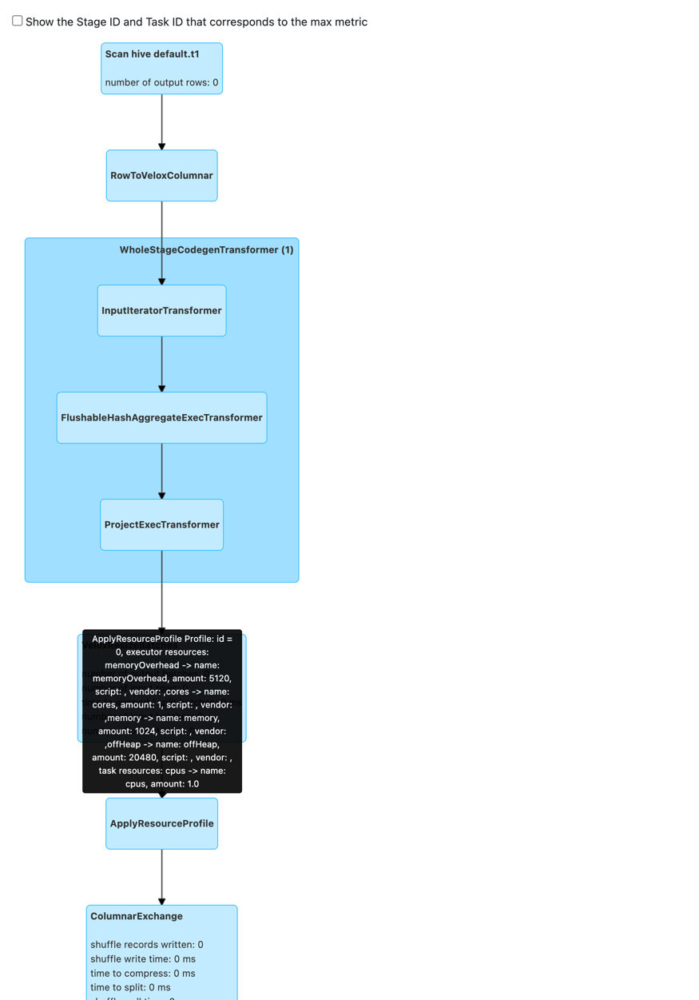

## Using Stage-Level Resource Adjustment to Avoid OOM(Experimental)
---

### **Overview**
Apache Gluten introduces a stage-level resource auto-adjustment framework to mitigate heap Out-of-Memory (OOM) issues caused by varying memory demands across stages in Spark applications. This feature dynamically adjusts task and executor resource profiles (e.g., heap/off-heap memory allocation) based on stage characteristics, such as the presence of fallback operators or heavy shuffle workloads(to be supported).

This document explains how to configure and use this feature to avoid OOM errors.

---

### **Prerequisites**
1. **Enable Adaptive Query Execution (AQE)**:
   ```properties  
   spark.sql.adaptive.enabled=true  
   ```  
2. **Enable Executor Dynamic Allocation**:
   ```properties  
   spark.dynamicAllocation.enabled=true  
   ```  
3. **Resource Scheduler Compatibility**:  
   Ensure the underlying cluster resource manager (e.g., YARN, Kubernetes) supports dynamic resource allocation.

---

### **Key Configurations**
Add the following configurations to your Spark application:


| Parameters                                                        | Description                                                                                                                                               | Default |
|-------------------------------------------------------------------|-----------------------------------------------------------------------------------------------------------------------------------------------------------|---------|
| spark.gluten.auto.adjustStageResource.enabled                     | Experimental: If enabled, gluten will try to set the stage resource according to stage execution plan. Only worked when aqe is enabled at the same time!! | false   |
| spark.gluten.auto.adjustStageResources.heap.ratio                 | Experimental: Increase executor heap memory when match adjust stage resource rule.                                                                        | 2.0d    |
| spark.gluten.auto.adjustStageResources.fallenNode.ratio.threshold | Experimental: Increase executor heap memory when stage contains fallen node count exceeds the total node count ratio.                                     | 0.5d    |
#### **1. Enable Auto-Adjustment**
```properties  
spark.gluten.auto.AdjustStageResource.enabled=true  
```
### **How It Works**
The framework analyzes each stage during query planning and adjusts resource profiles in following scenarios:

#### **Scenario 1: Fallback Operators Exist**
If a stage all operator fallback to vanilla Spark operator or  fallback operators (e.g., unsupported UDAFs) ratio exceed specified threshold, Gluten will automic increases heap memory allocation to handle the extra load.
---

### **Verification**
1. **Check Logs**:  
   Look for driver log entries indicating resource profile adjustments:
   ```  
   Apply resource profile [RP_ID] for plan [plan node name]  
   ```  

2. **Check SparkUI SQL Tab**  

There will be a ApplyResourceProfile node in the Query details.

And the execution plan will like following with ApplyResourceProfile node inserted.
```
+- *(3) HashAggregate(keys=[_nondeterministic#37], functions=[count(1)], output=[java_method(java.lang.Integer, signum, c1)#35, count(1)#36L])
            +- AQEShuffleRead coalesced
               +- ShuffleQueryStage 0
                  +- Exchange hashpartitioning(_nondeterministic#37, 5), ENSURE_REQUIREMENTS, [plan_id=607]
                     +- ApplyResourceProfile Profile: id = 0, executor resources: cores -> name: cores, amount: 1, script: , vendor: ,memory -> name: memory, amount: 1024, script: , vendor: ,offHeap -> name: offHeap, amount: 2048, script: , vendor: , task resources: cpus -> name: cpus, amount: 1.0
                        +- *(2) HashAggregate(keys=[_nondeterministic#37], functions=[partial_count(1)], output=[_nondeterministic#37, count#41L])
                           +- Project [java_method(java.lang.Integer, signum, c1#22) AS _nondeterministic#37]
                              +- *(1) ColumnarToRow
                                 +- FileScan parquet default.tmp1[c1#22] Batched: true, DataFilters: [], Format: Parquet
```
   
### **Limitations**
• Tested with YARN/Kubernetes; other resource managers may need validation.


For issues or feedback, refer to [GLUTEN-8018](https://github.com/apache/incubator-gluten/issues/8018).