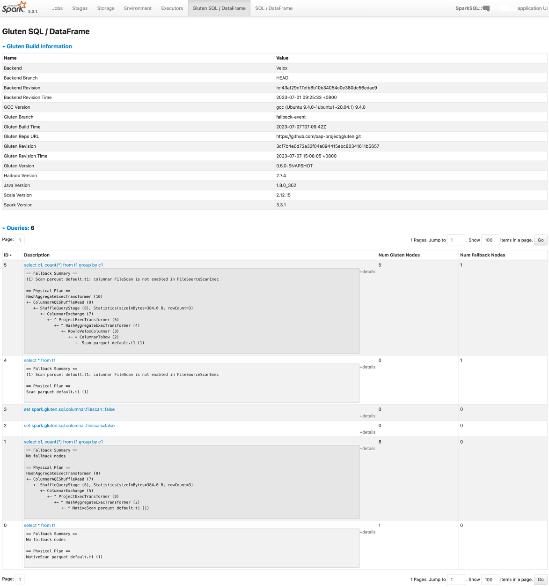

# Gluten UI

## Gluten event

Gluten provides two events `GlutenBuildInfoEvent` and `GlutenPlanFallbackEvent`:

- GlutenBuildInfoEvent, it contains the Gluten build information so that we are able to be aware of the environment when doing some debug.
  It includes `Java Version`, `Scala Version`, `GCC Version`, `Gluten Version`, `Spark Version`, `Hadoop Version`, `Gluten Revision`, `Backend`, `Backend Revision`, etc.

- GlutenPlanFallbackEvent, it contains the fallback information for each query execution.
  Note, if the query execution is in AQE, then Gluten will post it for each stage.

Developers can register `SparkListener` to handle these two Gluten events.

## SQL tab

Gluten provides a tab based on Spark UI, named `Gluten SQL / DataFrame`



This tab contains two parts:

1. The Gluten build information.
2. SQL/Dataframe queries fallback information.

If you want to disable Gluten UI, add a config when submitting `--conf spark.gluten.ui.enabled=false`.

## History server

Gluten UI also supports Spark history server. Add gluten-ui jar into the history server classpath, e.g., $SPARK_HOME/jars, then restart history server.

## Native plan string

Gluten supports inject native plan string into Spark explain with formatted mode by setting `--conf spark.gluten.sql.injectNativePlanStringToExplain=true`.
Here is an example, how Gluten show the native plan string.

```
(9) WholeStageCodegenTransformer (2)
Input [6]: [c1#0L, c2#1L, c3#2L, c1#3L, c2#4L, c3#5L]
Arguments: false
Native Plan:
-- Project[expressions: (n3_6:BIGINT, "n0_0"), (n3_7:BIGINT, "n0_1"), (n3_8:BIGINT, "n0_2"), (n3_9:BIGINT, "n1_0"), (n3_10:BIGINT, "n1_1"), (n3_11:BIGINT, "n1_2")] -> n3_6:BIGINT, n3_7:BIGINT, n3_8:BIGINT, n3_9:BIGINT, n3_10:BIGINT, n3_11:BIGINT
  -- HashJoin[INNER n1_1=n0_1] -> n1_0:BIGINT, n1_1:BIGINT, n1_2:BIGINT, n0_0:BIGINT, n0_1:BIGINT, n0_2:BIGINT
    -- TableScan[table: hive_table, range filters: [(c2, Filter(IsNotNull, deterministic, null not allowed))]] -> n1_0:BIGINT, n1_1:BIGINT, n1_2:BIGINT
    -- ValueStream[] -> n0_0:BIGINT, n0_1:BIGINT, n0_2:BIGINT
```

## Native plan with stats

Gluten supports print native plan with stats to executor system output stream by setting `--conf spark.gluten.sql.debug=true`.
Note that, the plan string with stats is task level which may cause executor log size big. Here is an example, how Gluten show the native plan string with stats.

```
I20231121 10:19:42.348845 90094332 WholeStageResultIterator.cc:220] Native Plan with stats for: [Stage: 1 TID: 16]
-- Project[expressions: (n3_6:BIGINT, "n0_0"), (n3_7:BIGINT, "n0_1"), (n3_8:BIGINT, "n0_2"), (n3_9:BIGINT, "n1_0"), (n3_10:BIGINT, "n1_1"), (n3_11:BIGINT, "n1_2")] -> n3_6:BIGINT, n3_7:BIGINT, n3_8:BIGINT, n3_9:BIGINT, n3_10:BIGINT, n3_11:BIGINT
   Output: 27 rows (3.56KB, 3 batches), Cpu time: 10.58us, Blocked wall time: 0ns, Peak memory: 0B, Memory allocations: 0, Threads: 1
      queuedWallNanos              sum: 2.00us, count: 1, min: 2.00us, max: 2.00us
      runningAddInputWallNanos     sum: 626ns, count: 1, min: 626ns, max: 626ns
      runningFinishWallNanos       sum: 0ns, count: 1, min: 0ns, max: 0ns
      runningGetOutputWallNanos    sum: 5.54us, count: 1, min: 5.54us, max: 5.54us
  -- HashJoin[INNER n1_1=n0_1] -> n1_0:BIGINT, n1_1:BIGINT, n1_2:BIGINT, n0_0:BIGINT, n0_1:BIGINT, n0_2:BIGINT
     Output: 27 rows (3.56KB, 3 batches), Cpu time: 223.00us, Blocked wall time: 0ns, Peak memory: 93.12KB, Memory allocations: 15
     HashBuild: Input: 10 rows (960B, 10 batches), Output: 0 rows (0B, 0 batches), Cpu time: 185.67us, Blocked wall time: 0ns, Peak memory: 68.00KB, Memory allocations: 2, Threads: 1
        distinctKey0                 sum: 4, count: 1, min: 4, max: 4
        hashtable.capacity           sum: 4, count: 1, min: 4, max: 4
        hashtable.numDistinct        sum: 10, count: 1, min: 10, max: 10
        hashtable.numRehashes        sum: 1, count: 1, min: 1, max: 1
        queuedWallNanos              sum: 0ns, count: 1, min: 0ns, max: 0ns
        rangeKey0                    sum: 4, count: 1, min: 4, max: 4
        runningAddInputWallNanos     sum: 1.27ms, count: 1, min: 1.27ms, max: 1.27ms
        runningFinishWallNanos       sum: 0ns, count: 1, min: 0ns, max: 0ns
        runningGetOutputWallNanos    sum: 1.29us, count: 1, min: 1.29us, max: 1.29us
     H23/11/21 10:19:42 INFO TaskSetManager: Finished task 3.0 in stage 1.0 (TID 13) in 335 ms on 10.221.97.35 (executor driver) (1/10)
ashProbe: Input: 9 rows (864B, 3 batches), Output: 27 rows (3.56KB, 3 batches), Cpu time: 37.33us, Blocked wall time: 0ns, Peak memory: 25.12KB, Memory allocations: 13, Threads: 1
        dynamicFiltersProduced       sum: 1, count: 1, min: 1, max: 1
        queuedWallNanos              sum: 0ns, count: 1, min: 0ns, max: 0ns
        runningAddInputWallNanos     sum: 4.54us, count: 1, min: 4.54us, max: 4.54us
        runningFinishWallNanos       sum: 83ns, count: 1, min: 83ns, max: 83ns
        runningGetOutputWallNanos    sum: 29.08us, count: 1, min: 29.08us, max: 29.08us
    -- TableScan[table: hive_table, range filters: [(c2, Filter(IsNotNull, deterministic, null not allowed))]] -> n1_0:BIGINT, n1_1:BIGINT, n1_2:BIGINT
       Input: 9 rows (864B, 3 batches), Output: 9 rows (864B, 3 batches), Cpu time: 630.75us, Blocked wall time: 0ns, Peak memory: 2.44KB, Memory allocations: 63, Threads: 1, Splits: 3
          dataSourceWallNanos              sum: 102.00us, count: 1, min: 102.00us, max: 102.00us
          dynamicFiltersAccepted           sum: 1, count: 1, min: 1, max: 1
          flattenStringDictionaryValues    sum: 0, count: 1, min: 0, max: 0
          ioWaitNanos                      sum: 312.00us, count: 1, min: 312.00us, max: 312.00us
          localReadBytes                   sum: 0B, count: 1, min: 0B, max: 0B
          numLocalRead                     sum: 0, count: 1, min: 0, max: 0
          numPrefetch                      sum: 0, count: 1, min: 0, max: 0
          numRamRead                       sum: 0, count: 1, min: 0, max: 0
          numStorageRead                   sum: 6, count: 1, min: 6, max: 6
          overreadBytes                    sum: 0B, count: 1, min: 0B, max: 0B
          prefetchBytes                    sum: 0B, count: 1, min: 0B, max: 0B
          queryThreadIoLatency             sum: 12, count: 1, min: 12, max: 12
          ramReadBytes                     sum: 0B, count: 1, min: 0B, max: 0B
          runningAddInputWallNanos         sum: 0ns, count: 1, min: 0ns, max: 0ns
          runningFinishWallNanos           sum: 125ns, count: 1, min: 125ns, max: 125ns
          runningGetOutputWallNanos        sum: 1.07ms, count: 1, min: 1.07ms, max: 1.07ms
          skippedSplitBytes                sum: 0B, count: 1, min: 0B, max: 0B
          skippedSplits                    sum: 0, count: 1, min: 0, max: 0
          skippedStrides                   sum: 0, count: 1, min: 0, max: 0
          storageReadBytes                 sum: 3.44KB, count: 1, min: 3.44KB, max: 3.44KB
          totalScanTime                    sum: 0ns, count: 1, min: 0ns, max: 0ns
    -- ValueStream[] -> n0_0:BIGINT, n0_1:BIGINT, n0_2:BIGINT
       Input: 0 rows (0B, 0 batches), Output: 10 rows (960B, 10 batches), Cpu time: 1.03ms, Blocked wall time: 0ns, Peak memory: 0B, Memory allocations: 0, Threads: 1
          runningAddInputWallNanos     sum: 0ns, count: 1, min: 0ns, max: 0ns
          runningFinishWallNanos       sum: 54.62us, count: 1, min: 54.62us, max: 54.62us
          runningGetOutputWallNanos    sum: 1.10ms, count: 1, min: 1.10ms, max: 1.10ms
```
