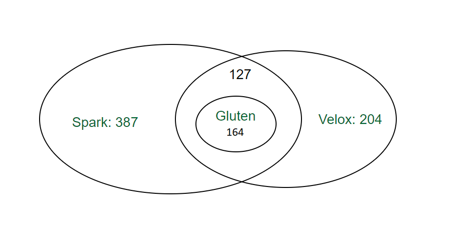

# The Operators and Functions Support Progress

Gluten is still in active development. Here is a list of supported operators and functions.

Since the same function may have different semantics between Presto and Spark, Velox implement the functions in Presto category, if we note a different sematics from Spark, then the function is implemented in Spark category. So Gluten firstly will use Velox's spark category, if a function isn't implemented there then refer to Presto category.

The total supported functions' number for [Spark3.3 is 387](https://spark.apache.org/docs/latest/api/sql/) and for [Velox is 204](https://facebookincubator.github.io/velox/functions/coverage.html).
Gluten supported frequently used 164, shown as below picture.

| Value        | Description                                                                               |
|--------------|-------------------------------------------------------------------------------------------|
| S            | Supported. Gluten or Velox supports fully.                                                |
| S*           | Mark for foldable expression that will be converted to alias after spark's optimization.  |
| [Blank Cell] | Not applicable case or needs to confirm.                                                  |
| PS           | Partial Support. Velox only partially supports it.                                        |
| NS           | Not Supported. Velox backend does not support it.                                         |

| Value      | Description                                                                                                                                                      |
| ---------- |------------------------------------------------------------------------------------------------------------------------------------------------------------------|
| Mismatched | Some functions are implemented by Velox, which return results mismatched with Apache Spark. So we marked then as "Mismatched".                                   |
| Ansi OFF   | Gluten doesn't support [ANSI mode](https://spark.apache.org/docs/latest/sql-ref-ansi-compliance.html). If it is enabled, Gluten will fall back to Vanilla Spark. |

### Operator Map

Gluten supports 20 operators (Draw to right to see all data types)

| Executor                    | Description                                                                                                                                                                          | Gluten Name                      | Velox Name            | BOOLEAN | BYTE | SHORT | INT | LONG | FLOAT | DOUBLE | STRING | NULL | BINARY | ARRAY | MAP | STRUCT(ROW) | DATE | TIMESTAMP | DECIMAL | CALENDAR | UDT |
| --------------------------- | ------------------------------------------------------------------------------------------------------------------------------------------------------------------------------------ | -------------------------------- | --------------------- | ------ | --- | ---- | --- | --- | ---- | ----- | ----- | --- | ----- | ---- |-----| ---------- |-----| --------- | ------ | -------- | --- |
| FileSourceScanExec          | Reading  data from files, often from Hive tables                                                                                                                                     | FileSourceScanExecTransformer    | TableScanNode         | S      | S   | S    | S   | S   | S    | S     | S     | S   | S     | NS   | NS  | NS         | S   | NS        | NS     | NS       | NS  |
| BatchScanExec               | The backend for most file input                                                                                                                                                      | BatchScanExecTransformer         | TableScanNode         | S      | S   | S    | S   | S   | S    | S     | S     | S   | S     | NS   | NS  | NS         | S   | NS        | NS     | NS       | NS  |
| FilterExec                  | The backend for most filter statements                                                                                                                                               | FilterExecTransformer            | FilterNode            | S      | S   | S    | S   | S   | S    | S     | S     | S   | S     | NS   | NS  | NS         | S   | NS        | NS     | NS       | NS  |
| ProjectExec                 | The backend for most select, withColumn and dropColumn statements                                                                                                                    | ProjectExecTransformer           | ProjectNode           | S      | S   | S    | S   | S   | S    | S     | S     | S   | S     | NS   | NS  | NS         | S   | NS        | NS     | NS       | NS  |
| HashAggregateExec           | The backend for hash based aggregations                                                                                                                                              | HashAggregateBaseTransformer     | AggregationNode       | S      | S   | S    | S   | S   | S    | S     | S     | S   | S     | NS   | NS  | NS         | S   | NS        | NS     | NS       | NS  |
| BroadcastHashJoinExec       | Implementation of join using broadcast data                                                                                                                                          | BroadcastHashJoinExecTransformer | HashJoinNode          | S      | S   | S    | S   | S   | S    | S     | S     | S   | S     | NS   | NS  | NS         | S   | NS        | NS     | NS       | NS  |
| ShuffledHashJoinExec        | Implementation of join using hashed shuffled data                                                                                                                                    | ShuffleHashJoinExecTransformer   | HashJoinNode          | S      | S   | S    | S   | S   | S    | S     | S     | S   | S     | NS   | NS  | NS         | S   | NS        | NS     | NS       | NS  |
| SortExec                    | The backend for the sort operator                                                                                                                                                    | SortExecTransformer              | OrderByNode           | S      | S   | S    | S   | S   | S    | S     | S     | S   | S     | NS   | NS  | NS         | S   | NS        | NS     | NS       | NS  |
| SortMergeJoinExec           | Sort merge join, replacing with shuffled hash join                                                                                                                                   | SortMergeJoinExecTransformer     | MergeJoinNode         | S      | S   | S    | S   | S   | S    | S     | S     | S   | S     | NS   | NS  | NS         | S   | NS        | NS     | NS       | NS  |
| WindowExec                  | Window-operator backend                                                                                                                                                              | WindowExecTransformer            | WindowNode            | S      | S   | S    | S   | S   | S    | S     | S     | S   | S     | NS   | NS  | NS         | S   | NS        | NS     | NS       | NS  |
| GlobalLimitExec             | Limiting of results across partitions                                                                                                                                                | LimitTransformer                 | LimitNode             | S      | S   | S    | S   | S   | S    | S     | S     | S   | S     | NS   | NS  | NS         | S   | NS        | NS     | NS       | NS  |
| LocalLimitExec              | Per-partition limiting of results                                                                                                                                                    | LimitTransformer                 | LimitNode             | S      | S   | S    | S   | S   | S    | S     | S     | S   | S     | NS   | NS  | NS         | S   | NS        | NS     | NS       | NS  |
| ExpandExec                  | The backend for the expand operator                                                                                                                                                  | ExpandExecTransformer            | GroupIdNode           | S      | S   | S    | S   | S   | S    | S     | S     | S   | S     | NS   | NS  | NS         | S   | NS        | NS     | NS       | NS  |
| UnionExec                   | The backend for the union operator                                                                                                                                                   | UnionExecTransformer             | N                     | S      | S   | S    | S   | S   | S    | S     | S     | S   | S     | NS   | NS  | NS         | S   | NS        | NS     | NS       | NS  |
| DataWritingCommandExec      | Writing data                                                                                                                                                                         | Y                                | TableWriteNode        | S      | S   | S    | S   | S   | S    | S     | S     | S   | S     | S    | NS  | S          | S   | NS        | S      | NS       | NS  |
| CartesianProductExec        | Implementation of join using brute force                                                                                                                                             | N                                | CrossJoinNode         | NS     | NS  | NS   | NS  | NS  | NS   | NS    | NS    | NS  | NS    | NS   | NS  | NS         | NS  | NS        | NS     | NS       | NS  |
| ShuffleExchangeExec         | The backend for most data being exchanged between processes                                                                                                                          | N                                | ExchangeNode          | NS     | NS  | NS   | NS  | NS  | NS   | NS    | NS    | NS  | NS    | NS   | NS  | NS         | NS  | NS        | NS     | NS       | NS  |
|                             | The unnest operation expands arrays and maps into separate columns                                                                                                                   | N                                | UnnestNode            | NS     | NS  | NS   | NS  | NS  | NS   | NS    | NS    | NS  | NS    | NS   | NS  | NS         | NS  | NS        | NS     | NS       | NS  |
|                             | The top-n operation reorders a dataset based on one or more identified sort fields as well as a sorting order                                                                        | N                                | TopNNode              | NS     | NS  | NS   | NS  | NS  | NS   | NS    | NS    | NS  | NS    | NS   | NS  | NS         | NS  | NS        | NS     | NS       | NS  |
|                             | The partitioned output operation redistributes data based on zero or more distribution fields                                                                                        | N                                | PartitionedOutputNode | NS     | NS  | NS   | NS  | NS  | NS   | NS    | NS    | NS  | NS    | NS   | NS  | NS         | NS  | NS        | NS     | NS       | NS  |
|                             | The values operation returns specified data                                                                                                                                          | N                                | ValuesNode            | NS     | NS  | NS   | NS  | NS  | NS   | NS    | NS    | NS  | NS    | NS   | NS  | NS         | NS  | NS        | NS     | NS       | NS  |
|                             | A receiving operation that merges multiple ordered streams to maintain  orderedness                                                                                                  | N                                | MergeExchangeNode     | NS     | NS  | NS   | NS  | NS  | NS   | NS    | NS    | NS  | NS    | NS   | NS  | NS         | NS  | NS        | NS     | NS       | NS  |
|                             | An operation that merges multiple ordered streams to maintain orderedness                                                                                                            | N                                | LocalMergeNode        | NS     | NS  | NS   | NS  | NS  | NS   | NS    | NS    | NS  | NS    | NS   | NS  | NS         | NS  | NS        | NS     | NS       | NS  |
|                             | Partitions input data into multiple streams or combines data from multiple streams into a single stream                                                                              | N                                | LocalPartitionNode    | NS     | NS  | NS   | NS  | NS  | NS   | NS    | NS    | NS  | NS    | NS   | NS  | NS         | NS  | NS        | NS     | NS       | NS  |
|                             | The enforce single row operation checks that input contains at most one row and returns that row unmodified                                                                          | N                                | EnforceSingleRowNode  | NS     | NS  | NS   | NS  | NS  | NS   | NS    | NS    | NS  | NS    | NS   | NS  | NS         | NS  | NS        | NS     | NS       | NS  |
|                             | The assign unique id operation adds one column at the end of the input columns with unique value per row                                                                             | N                                | AssignUniqueIdNode    | NS     | NS  | NS   | NS  | NS  | NS   | NS    | NS    | NS  | NS    | NS   | NS  | NS         | S   | S         | S      | S        | S   |
| CollectLimitExec            | Reduce to single partition and apply limit                                                                                                                                           | N                                | N                     |        |     |      |     |     |      |       |       |     |       |      |     |            |     |           |        |          |     |
| BroadcastExchangeExec       | The backend for broadcast exchange of data                                                                                                                                           | Y                                | Y                     | S      | S   | S    | S   | S   | S    | S     | S     | S   | S     | NS   | NS  | NS         | S   | NS        | S      | NS       | NS  |
| ObjectHashAggregateExec     | The backend for hash based aggregations supporting TypedImperativeAggregate functions                                                                                                | N                                | N                     |        |     |      |     |     |      |       |       |     |       |      |     |            |     |           |        |          |     |
| SortAggregateExec           | The backend for sort based aggregations                                                                                                                                              | N                                | N                     |        |     |      |     |     |      |       |       |     |       |      |     |            |     |           |        |          |     |
| CoalesceExec                | Reduce the partition numbers                                                                                                                                                         | N                                | N                     |        |     |      |     |     |      |       |       |     |       |      |     |            |     |           |        |          |     |
| GenerateExec                | The backend for operations that generate more output rows than input rows like explode                                                                                               | N                                | N                     |        |     |      |     |     |      |       |       |     |       |      |     |            |     |           |        |          |     |
| RangeExec                   | The backend for range operator                                                                                                                                                       | N                                | N                     |        |     |      |     |     |      |       |       |     |       |      |     |            |     |           |        |          |     |
| SampleExec                  | The backend for the sample operator                                                                                                                                                  | N                                | N                     |        |     |      |     |     |      |       |       |     |       |      |     |            |     |           |        |          |     |
| SubqueryBroadcastExec       | Plan to collect and transform the broadcast key values                                                                                                                               | Y                                | Y                     | S      | S   | S    | S   | S   | S    | S     | S     | S   | S     | NS   | NS  | NS         | S   | NS        | S      | NS       | NS  |
| TakeOrderedAndProjectExec   | Take the first limit elements as defined by the sortOrder, and do projection if needed                                                                                               | Y                                | Y                     | S      | S   | S    | S   | S   | S    | S     | S     | S   | S     | NS   | NS  | NS         | S   | NS        | S      | NS       | NS  |
| CustomShuffleReaderExec     | A wrapper of shuffle query stage                                                                                                                                                     | N                                | N                     |        |     |      |     |     |      |       |       |     |       |      |     |            |     |           |        |          |     |
| InMemoryTableScanExec       | Implementation of InMemory Table Scan                                                                                                                                                | N                                | N                     |        |     |      |     |     |      |       |       |     |       |      |     |            |     |           |        |          |     |
| BroadcastNestedLoopJoinExec | Implementation of join using brute force. Full outer joins and joins where the broadcast side matches the join side (e.g.: LeftOuter with left broadcast) are not supported          | N                                | N                     |        |     |      |     |     |      |       |       |     |       |      |     |            |     |           |        |          |     |
| AggregateInPandasExec       | The backend for an Aggregation Pandas UDF, this accelerates the data transfer between the Java process and the Python process                                                        | N                                | N                     |        |     |      |     |     |      |       |       |     |       |      |     |            |     |           |        |          |     |
| ArrowEvalPythonExec         | The backend of the Scalar Pandas UDFs. Accelerates the data transfer between the Java process and the Python process                                                                 | N                                | N                     |        |     |      |     |     |      |       |       |     |       |      |     |            |     |           |        |          |     |
| FlatMapGroupsInPandasExec   | The backend for Flat Map Groups Pandas UDF, Accelerates the data transfer between the Java process and the Python process                                                            | N                                | N                     |        |     |      |     |     |      |       |       |     |       |      |     |            |     |           |        |          |     |
| MapInPandasExec             | The backend for Map Pandas Iterator UDF. Accelerates the data transfer between the Java process and the Python process                                                               | N                                | N                     |        |     |      |     |     |      |       |       |     |       |      |     |            |     |           |        |          |     |
| WindowInPandasExec          | The backend for Window Aggregation Pandas UDF, Accelerates the data transfer between the Java process and the Python process                                                         | N                                | N                     |        |     |      |     |     |      |       |       |     |       |      |     |            |     |           |        |          |     |
| Velox2Row                   | Convert Velox format to Row format                                                                                                                                                   | Y                                | Y                     | S      | S   | S    | S   | S   | S    | S     | S     | NS  | S     | NS   | NS  | NS         | S   | S         | NS     | NS       | NS  |
| Velox2Arrow                 | Convert Velox format to Arrow format                                                                                                                                                 | Y                                | Y                     | S      | S   | S    | S   | S   | S    | S     | S     | NS  | S     | S    | S   | S          | S   | NS        | S      | NS       | NS  |

### Function support

Gluten supports 164 functions. (Draw to right to see all data types)

| Spark Functions               | Velox/Presto Functions | Velox/Spark functions | Gluten | Restrictions           | BOOLEAN | BYTE | SHORT | INT | LONG | FLOAT | DOUBLE | DATE | TIMESTAMP | STRING | DECIMAL | NULL | BINARS | CALENDAR | ARRAS | MAP  | STRUCT | UDT  |
|-------------------------------|------------------------|-----------------------|--------|------------------------|---------|------|-------|-----|------| ----- | ------ |------| --------- | ------ | ------- | ---- | ------ | -------- | ----- | ---- | ------ | ---- |
| !                             |                        | not                   | S      |                        | S       | S    | S     | S   | S    | S     | S      |      |           | S      |         |      |        |          |       |      |        |      |
| !=                            | neq                    |                       | S      |                        | S       | S    | S     | S   | S    | S     | S      |      |           | S      |         |      |        |          |       |      |        |      |
| %                             | mod                    | remainder             | S      | Ansi Off               |         | S    | S     | S   | S    | S     |        |      |           |        |         |      |        |          |       |      |        |      |
| &                             | bitwise_and            | bitwise_and           | S      |                        |         |      |       |     |      |       |        |      |           |        |         |      |        |          |       |      |        |      |
| *                             | multiply               | multiply              | S      | Ansi Off               |         | S    | S     | S   | S    | S     |        |      |           |        |         |      |        |          |       |      |        |      |
| +                             | plus                   | add                   | S      | Ansi Off               |         | S    | S     | S   | S    | S     |        |      |           |        |         |      |        |          |       |      |        |      |
| -                             | minus                  | substract             | S      | Ansi Off               |         | S    | S     | S   | S    | S     |        |      |           |        |         |      |        |          |       |      |        |      |
| /                             | divide                 | divide                | S      | Ansi Off               |         | S    | S     | S   | S    | S     |        |      |           |        |         |      |        |          |       |      |        |      |
| <                             | lt                     | lessthan              | S      |                        | S       | S    | S     | S   | S    | S     | S      |      |           | S      |         |      |        |          |       |      |        |      |
| <=                            | lte                    | lessthanorequa        | S      |                        | S       | S    | S     | S   | S    | S     | S      |      |           | S      |         |      |        |          |       |      |        |      |
| <=>                           |                        | equalnullsafe         | S      |                        |         |      |       |     |      |       |        |      |           |        |         |      |        |          |       |      |        |      |
| <>                            | neq                    | notequalto            | S      |                        | S       | S    | S     | S   | S    | S     | S      |      |           | S      |         |      |        |          |       |      |        |      |
| =                             |                        |                       | S      |                        |         |      |       |     |      |       |        |      |           |        |         |      |        |          |       |      |        |      |
| ==                            | eq                     | equalto               | S      |                        | S       | S    | S     | S   | S    | S     | S      |      |           | S      |         |      |        |          |       |      |        |      |
| >                             | gt                     | greaterthan           | S      |                        | S       | S    | S     | S   | S    | S     | S      |      |           | S      |         |      |        |          |       |      |        |      |
| >=                            | gte                    | greaterthanorequal    | S      |                        | S       | S    | S     | S   | S    | S     | S      |      |           | S      |         |      |        |          |       |      |        |      |
| ^                             | bitwise_xor            |                       | S      |                        |         |      | S     | S   | S    |       |        |      |           |        |         |      |        |          |       |      |        |      |
| &#124;                        | bitwise_or             | bitwise_or            | S      |                        |         |      | S     | S   | S    |       |        |      |           |        |         |      |        |          |       |      |        |      |
| &#124;&#124;                  |                        |                       |        |                        |         |      |       |     |      |       |        |      |           |        |         |      |        |          |       |      |        |      |
| ~                             | bitwise_not            |                       | S      |                        |         |      | S     | S   | S    |       |        |      |           |        |         |      |        |          |       |      |        |      |
| and                           |                        |                       | S      |                        | S       | S    | S     | S   | S    | S     | S      |      |           | S      |         |      |        |          |       |      |        |      |
| between                       | between                | between               | S      |                        | S       | S    | S     | S   | S    | S     | S      | S    |           | S      |         |      |        |          |       |      |        |      |
| bit_and                       |                        |                       |        |                        |         |      |       |     |      |       |        |      |           |        |         |      |        |          |       |      |        |      |
| bit_count                     | bit_count              | bit_count             | S      |                        | S       | S    | S     | S   | S    |       |        |      |           |        |         |      |        |          |       |      |        |      |
| bit_get                       |                        | bit_get               | S      |                        |         | S    | S     | S   | S    |       |        |      |           |        |         |      |        |          |       |      |        |      |
| bit_or                        |                        |                       |        |                        |         |      |       |     |      |       |        |      |           |        |         |      |        |          |       |      |        |      |
| bit_xor                       |                        |                       |        |                        |         |      |       |     |      |       |        |      |           |        |         |      |        |          |       |      |        |      |
| case                          |                        |                       |        |                        |         |      |       |     |      |       |        |      |           |        |         |      |        |          |       |      |        |      |
| div                           |                        |                       |        |                        |         |      |       |     |      |       |        |      |           |        |         |      |        |          |       |      |        |      |
| getbit                        |                        |                       |        |                        |         |      |       |     |      |       |        |      |           |        |         |      |        |          |       |      |        |      |
| if                            |                        |                       | S      |                        |         |      |       |     |      |       |        |      |           |        |         |      |        |          |       |      |        |      |
| ifnull                        |                        |                       |        |                        |         |      |       |     |      |       |        |      |           |        |         |      |        |          |       |      |        |      |
| in                            |                        | in                    | S      |                        |         |      | S     | S   | S    | S     | S      | S    | S         | S      |         |      |        |          |       |      |        |      |
| isnan                         | is_nan                 |                       |        |                        |         |      |       |     |      |       |        |      |           |        |         |      |        |          |       |      |        |      |
| isnotnull                     |                        | isnotnull             | S      |                        | S       | S    | S     | S   | S    | S     | S      |      |           | S      |         |      |        |          |       |      |        |      |
| isnull                        | is_null                | isnull                | S      |                        | S       | S    | S     | S   | S    | S     | S      |      |           | S      |         |      |        |          |       |      |        |      |
| mod                           | mod                    | remainder             | S      |                        |         |      |       |     |      |       |        |      |           |        |         |      |        |          |       |      |        |      |
| negative                      | negate                 | unaryminus            |        |                        |         |      |       |     |      |       |        |      |           |        |         |      |        |          |       |      |        |      |
| not                           |                        | not                   | S      |                        | S       | S    | S     | S   | S    | S     | S      | S    |           |        |         |      |        |          |       |      |        |      |
| nullif                        |                        |                       | S      |                        |         |      |       |     |      |       |        |      |           |        |         |      |        |          |       |      |        |      |
| or                            |                        |                       | S      |                        |         |      |       |     |      |       |        |      |           |        |         |      |        |          |       |      |        |      |
| positive                      |                        |                       | S      |                        |         |      |       |     |      |       |        |      |           |        |         |      |        |          |       |      |        |      |
| when                          |                        |                       | S      |                        |         |      |       |     |      |       |        |      |           |        |         |      |        |          |       |      |        |      |
| ascii                         |                        | ascii                 | S      |                        |         |      |       |     |      |       |        |      |           | S      |         |      |        |          |       |      |        |      |
| base64                        |                        |                       |        |                        |         |      |       |     |      |       |        |      |           |        |         |      |        |          |       |      |        |      |
| bin                           |                        | bin                   |        |                        |         |      |       |     |      |       |        |      |           |        |         |      |        |          |       |      |        |      |
| bit_length                    |                        |                       |        |                        |         |      |       |     |      |       |        |      |           |        |         |      |        |          |       |      |        |      |
| btrim                         |                        |                       | S      |                        |         |      |       |     |      |       |        |      |           |        |         |      |        |          |       |      |        |      |
| char, chr                     | chr                    | chr                   | S      |                        |         |      |       |     |      |       |        |      |           | S      |         |      |        |          |       |      |        |      |
| char_length, character_length | length                 | length                | S      |                        |         |      |       |     |      |       |        |      |           | S      |         |      |        |          |       |      |        |      |
| character_length, char_length | length                 | length                | S      |                        |         |      |       |     |      |       |        |      |           | S      |         |      |        |          |       |      |        |      |
| chr, char                     | chr                    | chr                   | S      |                        |         |      |       |     |      |       |        |      |           | S      |         |      |        |          |       |      |        |      |
| concat                        | concat                 | concat                | S      |                        |         |      |       |     |      |       |        |      |           | S      |         |      |        |          |       |      |        |      |
| concat_ws                     |                        |                       |        |                        |         |      |       |     |      |       |        |      |           |        |         |      |        |          |       |      |        |      |
| contains                      |                        | contains              |        |                        |         |      |       |     |      |       |        |      |           |        |         |      |        |          |       |      |        |      |
| decode                        |                        |                       |        |                        |         |      |       |     |      |       |        |      |           |        |         |      |        |          |       |      |        |      |
| elt                           |                        |                       |        |                        |         |      |       |     |      |       |        |      |           |        |         |      |        |          |       |      |        |      |
| encode                        |                        |                       |        |                        |         |      |       |     |      |       |        |      |           |        |         |      |        |          |       |      |        |      |
| endswith                      |                        | endsWith              |        |                        |         |      |       |     |      |       |        |      |           |        |         |      |        |          |       |      |        |      |
| find_in_set                   |                        |                       |        |                        |         |      |       |     |      |       |        |      |           |        |         |      |        |          |       |      |        |      |
| format_number                 |                        |                       |        |                        |         |      |       |     |      |       |        |      |           |        |         |      |        |          |       |      |        |      |
| format_string                 |                        |                       |        |                        |         |      |       |     |      |       |        |      |           |        |         |      |        |          |       |      |        |      |
| initcap                       |                        |                       |        |                        |         |      |       |     |      |       |        |      |           |        |         |      |        |          |       |      |        |      |
| instr                         |                        | instr                 | S      |                        |         |      |       |     |      |       |        |      |           | S      |         |      |        |          |       |      |        |      |
| lcase, lower                  | lower                  | lower                 | S      |                        |         |      |       |     |      |       |        |      |           | S      |         |      |        |          |       |      |        |      |
| left                          |                        |                       | S      |                        |         |      |       |     |      |       |        |      |           | S      |         |      |        |          |       |      |        |      |
| length                        | length                 | length                | S      |                        |         |      |       |     |      |       |        |      |           | S      |         |      |        |          |       |      |        |      |
| levenshtein                   |                        |                       |        |                        |         |      |       |     |      |       |        |      |           |        |         |      |        |          |       |      |        |      |
| locate                        | strpos                 |                       | S      | Mismatched             |         |      |       |     |      |       |        |      |           | S      |         |      |        |          |       |      |        |      |
| lower                         | lower                  | lower                 | S      |                        |         |      |       |     |      |       |        |      |           | S      |         |      |        |          |       |      |        |      |
| lpad                          | lpad                   |                       | S      |                        |         |      |       |     |      |       |        |      |           | S      |         |      |        |          |       |      |        |      |
| ltrim                         | ltrim                  | ltrim                 | S      |                        |         |      |       |     |      |       |        |      |           | S      |         |      |        |          |       |      |        |      |
| octet_length                  |                        |                       |        |                        |         |      |       |     |      |       |        |      |           |        |         |      |        |          |       |      |        |      |
| overlay                       |                        | overlay               |        |                        |         |      |       |     |      |       |        |      |           |        |         |      |        |          |       |      |        |      |
| parse_url                     |                        |                       |        |                        |         |      |       |     |      |       |        |      |           |        |         |      |        |          |       |      |        |      |
| position                      | strpos                 |                       |        |                        |         |      |       |     |      |       |        |      |           |        |         |      |        |          |       |      |        |      |
| printf                        |                        |                       |        |                        |         |      |       |     |      |       |        |      |           |        |         |      |        |          |       |      |        |      |
| repeat                        |                        |                       |        |                        |         |      |       |     |      |       |        |      |           |        |         |      |        |          |       |      |        |      |
| replace                       | replace                | replace               | S      |                        |         |      |       |     |      |       |        |      |           | S      |         |      |        |          |       |      |        |      |
| reverse                       | reverse                |                       | S      |                        |         |      |       |     |      |       |        |      |           | S      |         |      |        |          |       |      |        |      |
| right                         |                        |                       |        |                        |         |      |       |     |      |       |        |      |           |        |         |      |        |          |       |      |        |      |
| rpad                          | rpad                   |                       | S      |                        |         |      |       |     |      |       |        |      |           | S      |         |      |        |          |       |      |        |      |
| rtrim                         | rtrim                  | rtrim                 | S      |                        |         |      |       |     |      |       |        |      |           | S      |         |      |        |          |       |      |        |      |
| sentences                     |                        |                       |        |                        |         |      |       |     |      |       |        |      |           |        |         |      |        |          |       |      |        |      |
| soundex                       |                        |                       |        |                        |         |      |       |     |      |       |        |      |           |        |         |      |        |          |       |      |        |      |
| space                         |                        |                       |        |                        |         |      |       |     |      |       |        |      |           |        |         |      |        |          |       |      |        |      |
| split                         | split                  | split                 |        | Mismatched             |         |      |       |     |      |       |        |      |           |        |         |      |        |          |       |      |        |      |
| split_part                    | split_part             |                       |        | Mismatched             |         |      |       |     |      |       |        |      |           |        |         |      |        |          |       |      |        |      |
| startswith                    |                        | startsWith            |        |                        |         |      |       |     |      |       |        |      |           |        |         |      |        |          |       |      |        |      |
| substr, substring             | substr                 | substring             | S      |                        |         |      |       |     |      |       |        |      |           | S      |         |      |        |          |       |      |        |      |
| substring, substr             | substr                 | substring             | S      |                        |         |      |       |     |      |       |        |      |           | S      |         |      |        |          |       |      |        |      |
| substring_index               |                        |                       |        |                        |         |      |       |     |      |       |        |      |           |        |         |      |        |          |       |      |        |      |
| translate                     |                        |                       |        |                        |         |      |       |     |      |       |        |      |           |        |         |      |        |          |       |      |        |      |
| trim                          | trim                   | trim                  | S      |                        |         |      |       |     |      |       |        |      |           | S      |         |      |        |          |       |      |        |      |
| ucase, upper                  | upper                  | upper                 | S      |                        |         |      |       |     |      |       |        |      |           | S      |         |      |        |          |       |      |        |      |
| unbase64                      |                        |                       |        |                        |         |      |       |     |      |       |        |      |           |        |         |      |        |          |       |      |        |      |
| unhex                         |                        |                       |        |                        |         |      |       |     |      |       |        |      |           |        |         |      |        |          |       |      |        |      |
| upper, ucase                  | upper                  | upper                 | S      |                        |         |      |       |     |      |       |        |      |           | S      |         |      |        |          |       |      |        |      |
| like                          | like                   |                       | S      |                        |         |      |       |     |      |       |        |      |           | S      |         |      |        |          |       |      |        |      |
| regexp                        |                        | rlike                 | S      | Not support lookaround |         |      |       |     |      |       |        |      |           | S      |         |      |        |          |       |      |        |      |
| regexp_extract                | regexp_extract         | regexp_extract        | S      | Not support lookaround |         |      |       |     |      |       |        |      |           | S      |         |      |        |          |       |      |        |      |
| regexp_extract_all            | regexp_extract_all     |                       | S      | Not support lookaround |         |      |       |     |      |       |        |      |           | S      |         |      |        |          |       |      |        |      |
| regexp_like                   | regexp_like            | rlike                 | S      | Not support lookaround |         |      |       |     |      |       |        |      |           | S      |         |      |        |          |       |      |        |      |
| regexp_replace                | regexp_replace         |                       |        | Mismatched             |         |      |       |     |      |       |        |      |           |        |         |      |        |          |       |      |        |      |
| rlike                         |                        | rlike                 | S      | Not support lookaround |         |      |       |     |      |       |        |      |           | S      |         |      |        |          |       |      |        |      |
| abs                           | abs                    | abs                   | S      | Ansi Off               |         | S    | S     | S   | S    | S     | S      |      |           |        |         |      |        |          |       |      |        |      |
| acos                          | acos                   |                       | S      |                        |         | S    | S     | S   | S    | S     | S      |      |           |        |         |      |        |          |       |      |        |      |
| acosh                         |                        | acosh                 | S      |                        |         | S    | S     | S   | S    | S     | S      |      |           |        |         |      |        |          |       |      |        |      |
| asin                          | asin                   |                       | S      |                        |         | S    | S     | S   | S    | S     | S      |      |           |        |         |      |        |          |       |      |        |      |
| asinh                         |                        | asinh                 | S      |                        |         | S    | S     | S   | S    | S     | S      |      |           |        |         |      |        |          |       |      |        |      |
| atan                          | atan                   |                       | S      |                        |         | S    | S     | S   | S    | S     | S      |      |           |        |         |      |        |          |       |      |        |      |
| atan2                         | atan2                  |                       | S      |                        |         | S    | S     | S   | S    | S     | S      |      |           |        |         |      |        |          |       |      |        |      |
| atanh                         |                        | atanh                 | S      |                        |         | S    | S     | S   | S    | S     | S      |      |           |        |         |      |        |          |       |      |        |      |
| bround                        |                        |                       |        |                        |         |      |       |     |      |       |        |      |           |        |         |      |        |          |       |      |        |      |
| cbrt                          | cbrt                   |                       | S      |                        |         | S    | S     | S   | S    | S     | S      |      |           |        |         |      |        |          |       |      |        |      |
| ceil                          | ceil                   | ceil                  | S      |                        |         | S    | S     | S   | S    | S     | S      |      |           |        |         |      |        |          |       |      |        |      |
| ceiling                       | ceiling                |                       | S      |                        |         | S    | S     | S   | S    | S     | S      |      |           |        |         |      |        |          |       |      |        |      |
| conv                          |                        |                       |        |                        |         |      |       |     |      |       |        |      |           |        |         |      |        |          |       |      |        |      |
| cos                           | cos                    |                       | S      |                        |         | S    | S     | S   | S    | S     | S      |      |           |        |         |      |        |          |       |      |        |      |
| cosh                          | cosh                   |                       | S      |                        |         | S    | S     | S   | S    | S     | S      |      |           |        |         |      |        |          |       |      |        |      |
| cot                           |                        |                       |        |                        |         |      |       |     |      |       |        |      |           |        |         |      |        |          |       |      |        |      |
| degrees                       | degrees                |                       | S      |                        |         | S    | S     | S   | S    | S     | S      |      |           |        |         |      |        |          |       |      |        |      |
| e                             | e                      |                       | S      |                        |         | S    | S     | S   | S    | S     | S      |      |           |        |         |      |        |          |       |      |        |      |
| exp                           | exp                    | exp                   | S      |                        |         | S    | S     | S   | S    | S     | S      |      |           |        |         |      |        |          |       |      |        |      |
| expm1                         |                        |                       |        |                        |         |      |       |     |      |       |        |      |           |        |         |      |        |          |       |      |        |      |
| factorial                     |                        |                       |        |                        |         |      |       |     |      |       |        |      |           |        |         |      |        |          |       |      |        |      |
| floor                         | floor                  | floor                 | S      |                        |         | S    | S     | S   | S    | S     | S      |      |           |        |         |      |        |          |       |      |        |      |
| hex                           |                        |                       |        |                        |         |      |       |     |      |       |        |      |           |        |         |      |        |          |       |      |        |      |
| hypot                         |                        |                       |        |                        |         |      |       |     |      |       |        |      |           |        |         |      |        |          |       |      |        |      |
| ln                            | ln                     |                       | S      |                        |         | S    | S     | S   | S    | S     | S      |      |           |        |         |      |        |          |       |      |        |      |
| log                           | ln                     |                       | S      |                        |         | S    | S     | S   | S    | S     | S      |      |           |        |         |      |        |          |       |      |        |      |
| log10                         | log10                  |                       | S      |                        |         | S    | S     | S   | S    | S     | S      |      |           |        |         |      |        |          |       |      |        |      |
| log1p                         |                        |                       |        |                        |         |      |       |     |      |       |        |      |           |        |         |      |        |          |       |      |        |      |
| log2                          | log2                   |                       | S      |                        |         | S    | S     | S   | S    | S     | S      |      |           |        |         |      |        |          |       |      |        |      |
| pi                            | pi                     |                       | S      |                        |         | S    | S     | S   | S    | S     | S      |      |           |        |         |      |        |          |       |      |        |      |
| pmod                          |                        | pmod                  | S      | Ansi Off               |         | S    | S     | S   | S    | S     |        |      |           |        |         |      |        |          |       |      |        |      |
| pow, power                    | pow,power              | power                 |        |                        |         |      | S     | S   | S    | S     | S      |      |           |        |         |      |        |          |       |      |        |      |
| power, pow                    | power,pow              | power                 | S      |                        |         | S    | S     | S   | S    | S     | S      |      |           |        |         |      |        |          |       |      |        |      |
| radians                       | radians                |                       | S      |                        |         | S    | S     | S   | S    | S     | S      |      |           |        |         |      |        |          |       |      |        |      |
| rand                          | rand                   | rand                  |        |                        |         |      |       |     |      |       |        |      |           |        |         |      |        |          |       |      |        |      |
| random                        | random                 |                       |        |                        |         |      |       |     |      |       |        |      |           |        |         |      |        |          |       |      |        |      |
| rint                          |                        |                       |        |                        |         |      |       |     |      |       |        |      |           |        |         |      |        |          |       |      |        |      |
| round                         | round                  | round                 | S      |                        |         | S    | S     | S   | S    | S     | S      |      |           |        |         |      |        |          |       |      |        |      |
| shiftleft                     | bitwise_left_shift     | shiftleft             | S      |                        |         | S    | S     | S   | S    | S     | S      |      |           |        |         |      |        |          |       |      |        |      |
| shiftright                    | bitwise_right_shift    | shiftright            | S      |                        |         | S    | S     | S   | S    | S     | S      |      |           |        |         |      |        |          |       |      |        |      |
| shiftrightunsigned            |                        |                       |        |                        |         |      |       |     |      |       |        |      |           |        |         |      |        |          |       |      |        |      |
| sign, signum                  | sign                   |                       | S      |                        |         | S    | S     | S   | S    | S     | S      |      |           |        |         |      |        |          |       |      |        |      |
| signum, sign                  | sign                   |                       | S      |                        |         | S    | S     | S   | S    | S     | S      |      |           |        |         |      |        |          |       |      |        |      |
| sin                           | sin                    |                       | S      |                        |         | S    | S     | S   | S    | S     | S      |      |           |        |         |      |        |          |       |      |        |      |
| sinh                          |                        | sinh                  |        |                        |         |      |       |     |      |       |        |      |           |        |         |      |        |          |       |      |        |      |
| sqrt                          | sqrt                   |                       | S      |                        |         | S    | S     | S   | S    | S     | S      |      |           |        |         |      |        |          |       |      |        |      |
| tan                           | tan                    |                       | S      |                        |         | S    | S     | S   | S    | S     | S      |      |           |        |         |      |        |          |       |      |        |      |
| tanh                          | tanh                   |                       | S      |                        |         | S    | S     | S   | S    | S     | S      |      |           |        |         |      |        |          |       |      |        |      |
| width_bucket                  | width_bucket           |                       |        |                        |         |      |       |     |      |       |        |      |           |        |         |      |        |          |       |      |        |      |
| array                         |                        | array                 | S      |                        |         |      |       |     |      |       |        |      |           |        |         |      |        |          | S     |      |        |      |
| aggregate                     | aggregate              | reduce                | S      |                        |         |      |       |     |      |       |        |      |           |        |         |      |        |          | S     |      |        |      |
| array_contains                |                        | array_contains        |        |                        |         |      |       |     |      |       |        |      |           |        |         |      |        |          |       |      |        |      |
| array_distinct                | array_distinct         |                       |        |                        |         |      |       |     |      |       |        |      |           |        |         |      |        |          |       |      |        |      |
| array_except                  | array_except           |                       |        |                        |         |      |       |     |      |       |        |      |           |        |         |      |        |          |       |      |        |      |
| array_intersect               | array_intersect        | array_intersect       |        |                        |         |      |       |     |      |       |        |      |           |        |         |      |        |          |       |      |        |      |
| array_join                    | array_join             |                       |        |                        |         |      |       |     |      |       |        |      |           |        |         |      |        |          |       |      |        |      |
| array_max                     | array_max              |                       |        |                        |         |      |       |     |      |       |        |      |           |        |         |      |        |          |       |      |        |      |
| array_min                     | array_min              |                       |        |                        |         |      |       |     |      |       |        |      |           |        |         |      |        |          |       |      |        |      |
| array_position                | array_position         |                       |        |                        |         |      |       |     |      |       |        |      |           |        |         |      |        |          |       |      |        |      |
| array_remove                  |                        |                       |        |                        |         |      |       |     |      |       |        |      |           |        |         |      |        |          |       |      |        |      |
| array_repeat                  |                        |                       |        |                        |         |      |       |     |      |       |        |      |           |        |         |      |        |          |       |      |        |      |
| array_sort                    | array_sort             | array_sort            |        |                        |         |      |       |     |      |       |        |      |           |        |         |      |        |          |       |      |        |      |
| array_union                   |                        |                       |        |                        |         |      |       |     |      |       |        |      |           |        |         |      |        |          |       |      |        |      |
| arrays_overlap                | array_overlap          |                       |        |                        |         |      |       |     |      |       |        |      |           |        |         |      |        |          |       |      |        |      |
| arrays_zip                    |                        |                       |        |                        |         |      |       |     |      |       |        |      |           |        |         |      |        |          |       |      |        |      |
| cardinality                   | cardinality            |                       |        |                        |         |      |       |     |      |       |        |      |           |        |         |      |        |          |       |      |        |      |
| element_at                    | element_at             | element_at            | S      |                        |         |      |       |     |      |       |        |      |           |        |         |      |        |          | S     | S    |        |      |
| exists                        |                        |                       |        |                        |         |      |       |     |      |       |        |      |           |        |         |      |        |          |       |      |        |      |
| explode, explode_outer        |                        |                       |        |                        |         |      |       |     |      |       |        |      |           |        |         |      |        |          |       |      |        |      |
| explode_outer, explode        |                        |                       |        |                        |         |      |       |     |      |       |        |      |           |        |         |      |        |          |       |      |        |      |
| filter                        | filter                 | filter                |        |                        |         |      |       |     |      |       |        |      |           |        |         |      |        |          |       |      |        |      |
| flatten                       | flatten                |                       |        |                        |         |      |       |     |      |       |        |      |           |        |         |      |        |          |       |      |        |      |
| map                           | map                    | map                   |        |                        |         |      |       |     |      |       |        |      |           |        |         |      |        |          |       |      |        |      |
| map_concat                    | map_concat             |                       |        |                        |         |      |       |     |      |       |        |      |           |        |         |      |        |          |       |      |        |      |
| map_entries                   | map_entries            |                       |        |                        |         |      |       |     |      |       |        |      |           |        |         |      |        |          |       |      |        |      |
| map_filter                    | map_filter             | map_filter            |        |                        |         |      |       |     |      |       |        |      |           |        |         |      |        |          |       |      |        |      |
| get_map_value                 |                        | element_at            | S      |                        |         |      |       |     |      |       |        |      |           |        |         |      |        |          |       | S    |        |      |
| map_from_arrays               |                        | map_from_arrays       | S      |                        |         |      |       |     |      |       |        |      |           |        |         |      |        |          |       | S    |        |      |
| map_from_entries              | map_from_entries       |                       |        |                        |         |      |       |     |      |       |        |      |           |        |         |      |        |          |       |      |        |      |
| map_keys                      | map_keys               |                       |        |                        |         |      |       |     |      |       |        |      |           |        |         |      |        |          |       |      |        |      |
| map_values                    | map_values             |                       | S      |                        |         |      |       |     |      |       |        |      |           |        |         |      |        |          |       | S    |        |      |
| named_struct,struct           | row_construct          | named_struct          | S      |                        |         |      |       |     |      |       |        |      |           |        |         |      |        |          |       |      | S      |      |
| sequence                      |                        |                       |        |                        |         |      |       |     |      |       |        |      |           |        |         |      |        |          |       |      |        |      |
| shuffle                       | shuffle                |                       |        |                        |         |      |       |     |      |       |        |      |           |        |         |      |        |          |       |      |        |      |
| size                          |                        | size                  |        |                        |         |      |       |     |      |       |        |      |           |        |         |      |        |          |       |      |        |      |
| slice                         | slice                  |                       |        |                        |         |      |       |     |      |       |        |      |           |        |         |      |        |          |       |      |        |      |
| sort_array                    |                        | sort_array            |        |                        |         |      |       |     |      |       |        |      |           |        |         |      |        |          |       |      |        |      |
| struct, named_struct          |                        |                       | S      |                        |         |      |       |     |      |       |        |      |           |        |         |      |        |          |       |      | S      |      |
| add_months                    |                        |                       |        |                        |         |      |       |     |      |       |        |      |           |        |         |      |        |          |       |      |        |      |
| current_date                  |                        |                       | S*     |                        |         |      |       |     |      |       |        |      |           |        |         |      |        |          |       |      |        |      |
| current_timestamp             |                        |                       | S*     |                        |         |      |       |     |      |       |        |      |           |        |         |      |        |          |       |      |        |      |
| current_timezone              |                        |                       | S*     |                        |         |      |       |     |      |       |        |      |           |        |         |      |        |          |       |      |        |      |
| date                          | date                   |                       | S      |                        |         |      |       |     |      |       |        |      |           |        |         |      |        |          |       |      |        |      |
| date_add                      | date_add               | date_add              | S      |                        |         | S    | S     | S   |      |       |        | S    | S         |        |         |      |        |          |       |      |        |      |
| date_format                   | date_format            |                       |        |                        |         |      |       |     |      |       |        |      |           |        |         |      |        |          |       |      |        |      |
| date_sub                      |                        |                       |        |                        |         |      |       |     |      |       |        |      |           |        |         |      |        |          |       |      |        |      |
| date_trunc                    | date_trunc             |                       |        |                        |         |      |       |     |      |       |        |      |           |        |         |      |        |          |       |      |        |      |
| datediff                      | date_diff              |                       | S      |                        |         |      |       |     |      |       |        | S    | S         |        |         |      |        |          |       |      |        |      |
| day                           | day                    |                       | S      |                        |         |      |       |     |      |       |        | S    | S         |        |         |      |        |          |       |      |        |      |
| dayofmonth                    | day_of_month           |                       | S      |                        |         |      |       |     |      |       |        | S    | S         |        |         |      |        |          |       |      |        |      |
| dayofweek                     | day_of_week,dow        |                       | S      |                        |         |      |       |     |      |       |        | S    | S         |        |         |      |        |          |       |      |        |      |
| dayofyear                     | day_of_year,doy        |                       | S      |                        |         |      |       |     |      |       |        | S    | S         |        |         |      |        |          |       |      |        |      |
| from_unixtime                 | from_unixtime          |                       |        |                        |         |      |       |     |      |       |        |      |           |        |         |      |        |          |       |      |        |      |
| from_utc_timestamp            |                        |                       |        |                        |         |      |       |     |      |       |        |      |           |        |         |      |        |          |       |      |        |      |
| hour                          | hour                   |                       |        |                        |         |      |       |     |      |       |        |      |           |        |         |      |        |          |       |      |        |      |
| last_day                      |                        | last_day              |        |                        |         |      |       |     |      |       |        |      |           |        |         |      |        |          |       |      |        |      |
| make_date                     |                        | make_date             |        |                        |         |      |       |     |      |       |        |      |           |        |         |      |        |          |       |      |        |      |
| minute                        | minute                 |                       |        |                        |         |      |       |     |      |       |        |      |           |        |         |      |        |          |       |      |        |      |
| month                         | month                  |                       | S      |                        |         |      |       |     |      |       |        | S    | S         |        |         |      |        |          |       |      |        |      |
| months_between                |                        |                       |        |                        |         |      |       |     |      |       |        |      |           |        |         |      |        |          |       |      |        |      |
| next_day                      |                        |                       |        |                        |         |      |       |     |      |       |        |      |           |        |         |      |        |          |       |      |        |      |
| now                           |                        |                       | S      |                        |         |      |       |     |      |       |        | S    | S         |        |         |      |        |          |       |      |        |      |
| quarter                       | quarter                |                       | S      |                        |         |      |       |     |      |       |        | S    | S         |        |         |      |        |          |       |      |        |      |
| second                        | second                 |                       |        |                        |         |      |       |     |      |       |        |      |           |        |         |      |        |          |       |      |        |      |
| timestamp                     |                        |                       |        |                        |         |      |       |     |      |       |        |      |           |        |         |      |        |          |       |      |        |      |
| to_date                       |                        |                       | S      |                        |         |      |       |     |      |       |        | S    | S         |        |         |      |        |          |       |      |        |      |
| to_timestamp                  |                        |                       |        |                        |         |      |       |     |      |       |        |      |           |        |         |      |        |          |       |      |        |      |
| to_unix_timestamp             | to_unixtime            | to_unix_timestamp     |        |                        |         |      |       |     |      |       |        |      |           |        |         |      |        |          |       |      |        |      |
| to_utc_timestamp              |                        |                       |        |                        |         |      |       |     |      |       |        |      |           |        |         |      |        |          |       |      |        |      |
| trunc                         |                        |                       |        |                        |         |      |       |     |      |       |        |      |           |        |         |      |        |          |       |      |        |      |
| unix_timestamp                |                        | unix_timestamp        |        |                        |         |      |       |     |      |       |        |      |           |        |         |      |        |          |       |      |        |      |
| weekofyear                    | week,week_of_year      |                       |        |                        |         |      |       |     |      |       |        |      |           |        |         |      |        |          |       |      |        |      |
| window                        |                        |                       |        |                        |         |      |       |     |      |       |        |      |           |        |         |      |        |          |       |      |        |      |
| year                          | year                   | year                  | S      |                        |         |      |       |     |      |       |        | S    | S         |        |         |      |        |          |       |      |        |      |
| approx_count_distinct         | approx_distinct        |                       | S      |                        | S       | S    | S     | S   | S    | S     | S      | S    |           | S      |         |      |        |          |       |      |        |      |
| avg                           | avg                    |                       | S      | Ansi Off               |         | S    | S     | S   | S    | S     |        |      |           |        |         |      |        |          |       |      |        |      |
| bit_and                       | bitwise_and_agg        |                       | S      |                        |         | S    | S     | S   | S    | S     |        |      |           |        |         |      |        |          |       |      |        |      |
| bit_or                        | bitwise_or_agg         |                       | S      |                        |         | S    | S     | S   | S    | S     |        |      |           |        |         |      |        |          |       |      |        |      |
| bit_xor                       |                        | bit_xor               | S      |                        |         | S    | S     | S   | S    | S     |        |      |           |        |         |      |        |          |       |      |        |      |
| collect_list                  |                        |                       |        |                        |         |      |       |     |      |       |        |      |           |        |         |      |        |          |       |      |        |      |
| collect_set                   |                        |                       |        |                        |         |      |       |     |      |       |        |      |           |        |         |      |        |          |       |      |        |      |
| corr                          | corr                   |                       |        |                        |         |      |       |     |      |       |        |      |           |        |         |      |        |          |       |      |        |      |
| count                         | count                  |                       | S      |                        |         |      | S     | S   | S    | S     | S      |      |           |        |         |      |        |          |       |      |        |      |
| count_if                      | count_if               |                       |        |                        |         | S    | S     | S   | S    | S     |        |      |           |        |         |      |        |          |       |      |        |      |
| covar_pop                     | covar_pop              |                       | S      |                        |         | S    | S     | S   | S    | S     |        |      |           |        |         |      |        |          |       |      |        |      |
| covar_samp                    | covar_samp             |                       | S      |                        |         | S    | S     | S   | S    | S     |        |      |           |        |         |      |        |          |       |      |        |      |
| first                         |                        | first                 | S      |                        |         |      |       |     |      |       |        |      |           |        |         |      |        |          |       |      |        |      |
| first_value                   |                        | first_value           | S      |                        |         |      |       |     |      |       |        |      |           |        |         |      |        |          |       |      |        |      |
| grouping_id                   |                        |                       |        |                        |         |      |       |     |      |       |        |      |           |        |         |      |        |          |       |      |        |      |
| kurtosis                      |                        |                       |        |                        |         |      |       |     |      |       |        |      |           |        |         |      |        |          |       |      |        |      |
| last                          |                        | last                  | S      |                        |         |      |       |     |      |       |        |      |           |        |         |      |        |          |       |      |        |      |
| last_value                    |                        | last_value            | S      |                        |         |      |       |     |      |       |        |      |           |        |         |      |        |          |       |      |        |      |
| max                           | max                    |                       | S      |                        |         |      | S     | S   | S    | S     | S      |      |           |        |         |      |        |          |       |      |        |      |
| mean                          | avg                    |                       | S      | Ansi Off               |         |      |       |     |      |       |        |      |           |        |         |      |        |          |       |      |        |      |
| min                           | min                    |                       | S      |                        |         |      | S     | S   | S    | S     | S      |      |           |        |         |      |        |          |       |      |        |      |
| skewness                      |                        |                       |        |                        |         |      |       |     |      |       |        |      |           |        |         |      |        |          |       |      |        |      |
| std,stddev                    | stddev                 |                       | S      |                        |         |      | S     | S   | S    | S     | S      |      |           |        |         |      |        |          |       |      |        |      |
| stddev,std                    | stddev                 |                       | S      |                        |         |      | S     | S   | S    | S     | S      |      |           |        |         |      |        |          |       |      |        |      |
| stddev_pop                    | stddev_pop             |                       | S      |                        |         | S    | S     | S   | S    | S     |        |      |           |        |         |      |        |          |       |      |        |      |
| stddev_samp                   | stddev_samp            |                       | S      |                        |         |      | S     | S   | S    | S     | S      |      |           |        |         |      |        |          |       |      |        |      |
| sum                           | sum                    |                       | S      | Ansi Off               |         | S    | S     | S   | S    | S     |        |      |           |        |         |      |        |          |       |      |        |      |
| var_pop                       | var_pop                |                       | S      |                        |         | S    | S     | S   | S    | S     |        |      |           |        |         |      |        |          |       |      |        |      |
| var_samp                      | var_samp               |                       | S      |                        |         | S    | S     | S   | S    | S     |        |      |           |        |         |      |        |          |       |      |        |      |
| variance                      | variance               |                       | S      |                        |         | S    | S     | S   | S    | S     |        |      |           |        |         |      |        |          |       |      |        |      |
| cume_dist                     | cume_dist              |                       | S      |                        |         |      |       |     |      |       |        |      |           |        |         |      |        |          |       |      |        |      |
| dense_rank                    | dense_rank             |                       | S      |                        |         |      |       |     |      |       |        |      |           |        |         |      |        |          |       |      |        |      |
| lag                           |                        |                       |        |                        |         |      |       |     |      |       |        |      |           |        |         |      |        |          |       |      |        |      |
| lead                          |                        |                       |        |                        |         |      |       |     |      |       |        |      |           |        |         |      |        |          |       |      |        |      |
| nth_value                     | nth_value              | nth_value             | PS     |                        |         |      |       |     |      |       |        |      |           |        |         |      |        |          |       |      |        |      |
| ntile                         |                        |                       |        |                        |         |      |       |     |      |       |        |      |           |        |         |      |        |          |       |      |        |      |
| percent_rank                  | percent_rank           |                       | S      |                        |         |      |       |     |      |       |        |      |           |        |         |      |        |          |       |      |        |      |
| rank                          | rank                   |                       |        |                        |         |      |       |     |      |       |        |      |           |        |         |      |        |          |       |      |        |      |
| row_number                    | row_number             |                       | S      |                        |         |      | S     | S   | S    |       |        |      |           |        |         |      |        |          |       |      |        |      |
| from_json                     |                        |                       |        |                        |         |      |       |     |      |       |        |      |           |        |         |      |        |          |       |      |        |      |
| get_json_object               | json_extract_scalar    | get_json_object       | S      |                        |         |      |       |     |      |       |        |      |           |        |         |      |        |          |       |      | S      |      |
| json_array_length             | json_array_length      |                       | S      |                        |         |      |       |     |      |       |        |      |           |        |         |      |        |          |       |      | S      |      |
| json_tuple                    |                        |                       |        |                        |         |      |       |     |      |       |        |      |           |        |         |      |        |          |       |      |        |      |
| schema_of_json                |                        |                       |        |                        |         |      |       |     |      |       |        |      |           |        |         |      |        |          |       |      |        |      |
| to_json                       |                        |                       |        |                        |         |      |       |     |      |       |        |      |           |        |         |      |        |          |       |      |        |      |
| crc32                         | crc32                  |                       | S      |                        |         |      |       |     |      |       |        |      |           | S      |         |      |        |          |       |      |        |      |
| current_user                  |                        |                       | S*     |                        |         |      |       |     |      |       |        |      |           | S      |         |      |        |          |       |      |        |      |
| greatest                      | greatest               | greatest              | S      |                        |         |      |       |     | S    | S     | S      | S    | S         |        |         |      |        |          |       |      |        |      |
| hash                          | hash                   | hash                  | S      |                        | S       | S    | S     | S   | S    | S     | S      |      |           |        |         |      |        |          |       |      |        |      |
| input_file_name               |                        |                       |        |                        |         |      |       |     |      |       |        |      |           |        |         |      |        |          |       |      |        |      |
| least                         | least                  | least                 | S      |                        |         |      |       |     | S    | S     | S      | S    | S         |        |         |      |        |          |       |      |        |      |
| md5                           | md5                    |                       | S      |                        |         | S    |       |     |      |       |        |      |           |        |         |      |        |          |       |      |        |      |
| monotonically_increasing_id   |                        |                       |        |                        |         |      |       |     |      |       |        |      |           |        |         |      |        |          |       |      |        |      |
| sha                           |                        |                       | S      |                        |         |      |       |     |      |       |        |      |           | S      |         |      |        |          |       |      |        |      |
| sha1                          | sha1                   | sha1                  | S      |                        |         |      |       |     |      |       |        |      |           | S      |         |      |        |          |       |      |        |      |
| sha2                          |                        | sha2                  | S      |                        |         |      |       |     |      |       |        |      |           | S      |         |      |        |          |       |      |        |      |
| spark_partition_id            |                        |                       |        |                        |         |      |       |     |      |       |        |      |           |        |         |      |        |          |       |      |        |      |
| xxhash64                      | xxhash64               | xxhash64              |        |                        |         |      |       |     |      |       |        |      |           |        |         |      |        |          |       |      |        |      |
