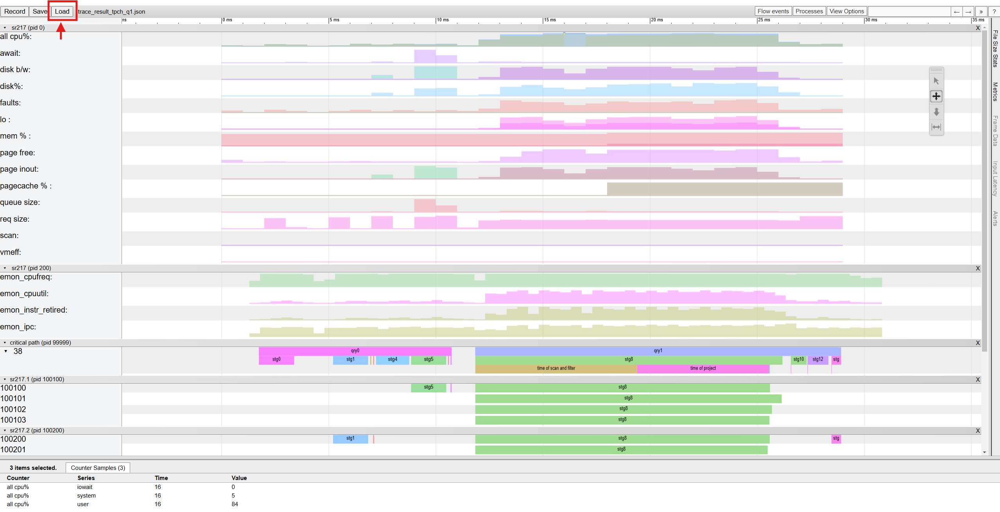

# Setup, Build and Benchmark Spark/Gluten with Jupyter Notebook

This guide provides notebooks and scripts for conducting performance testing in Gluten. The standard approach involves setting up the test environment on a bare-metal machine or cloud instance and running performance tests with TPC-H/TPC-DS workloads. These scripts enable users to reproduce our performance results in their own environment.

## Environment Setup

The recommended OS is ubuntu22.04 with kernel 5.15. To prepare the environment, run [initialize.ipynb](./initialize.ipynb), which will:

- Install system dependencies and set up jupyter notebook
- Configure Hadoop and Spark
- Configure kernel parameters
- Build Gluten using Docker
- Generate TPC-H/TPC-DS tables

## Running TPC-H/TPC-DS Benchmarks

To run TPC-H/TPC-DS benchmarks, use [tpc_workload.ipynb](./tpc_workload.ipynb). You can create a copy of the notebook and modify the parameters defined in this notebook to run different workloads. However, creating and modifying a copy each time you change workloads can be inconvenient. Instead, it's recommended to use Papermill to pass parameters via the command line for greater flexibility.

The required parameters are specified in [params.yaml.template](./params.yaml.template). To use it, create your own YAML file by copying and modifying the template. The command to run the notebook is:

```bash
papermill tpc_workload.ipynb --inject-output-path -f params.yaml gluten_tpch.ipynb
```
After execution, the output notebook will be saved as `gluten_tpch.ipynb`.

If you want to use different parameters, you can specify them via the `-p` option. It will overwrite the previously defined parameters in `params.yaml`. e.g. To switch to the TPC-DS workload, run:

```bash
papermill tpc_workload.ipynb --inject-output-path -f params.yaml -p workoad tpcds gluten_tpcds.ipynb
```

Please refer to the Papermill documentation for additional usage details.

We also provide a script [run_tpc_workload.sh](./run_tpc_workload.sh). This script wraps the Papermill command, automatically renaming the output notebook with a timestamp and application ID to prevent overwriting existing output files.

## Analyzing Performance Results

You can check the **Show Performance** section in the output notebook after execution. It shows the cpu% per query, and draws charts for the cpu%, memory throughput, disk throughput/util%, network throughput and pagefaults.

## Set up Performance Analysis Tools

Please check the **Set up perf analysis tools (optional)** section in [initialize.ipynb](./initialize.ipynb) to set up the environment required for running performance analysis scripts. Once the setup is complete, update the following variables in your YAML file (as documented in [params.yaml.template](./params.yaml.template)) before running TPC-H/TPC-DS Benchmarks:

- server: Hostname or IP to server for perf analysis. Able to connect via ssh. Can be localhost if you deploy the perf analysis scripts on the local cluster.
- base_dir: Specify the directory on perf analysis server. Usually a codename for this run.
- analyze_perf: Whether to upload profile to perf analysis server and run perf analysis scripts. Only takes effect if server is set. In this case set to `True`
- proxy: Proxy used to connect to server for perf analysis. Only needed if the perf analysis server is accessed via proxy.

After the workload completes, the tool generates a notebook, executes it automatically, and saves the output notebook in the `$HOME/PAUS/base_dir` directory with the name of `[APP_NAME]_[APP_ID].ipynb`. Additionally, the output notebook is converted into an HTML format for improved readability, with the same filename, and stored in the `html` sub-folder.

A sample generated notebook for TPCH Q1 and its corresponding HTML file are available for reference:
- Notebook: [tpch_q1.ipynb](./sample/tpch_q1.ipynb)
- HTML file: [tpch_q1.html](./sample/tpch_q1.html)

The notebook also produces a trace-viewer JSON file to analyze workload statistics. This includes SAR metrics and stage/task-level breakdowns. Using this tool, users can compare statistics across stages and queries, identify performance bottlenecks, and target specific stages for optimization.

You can explore the sample trace-viewer JSON file using the Google Chrome browser. To do so: 

1. Download the sample file [trace_result_tpch_q1.json](./sample/trace_result_tpch_q1.json)
2. Launch Google Chrome. In the address bar, enter "chrome://tracing/".
3. Use the "Load" button to upload the sample JSON file.

This will allow you to check the sample trace data interactively.


